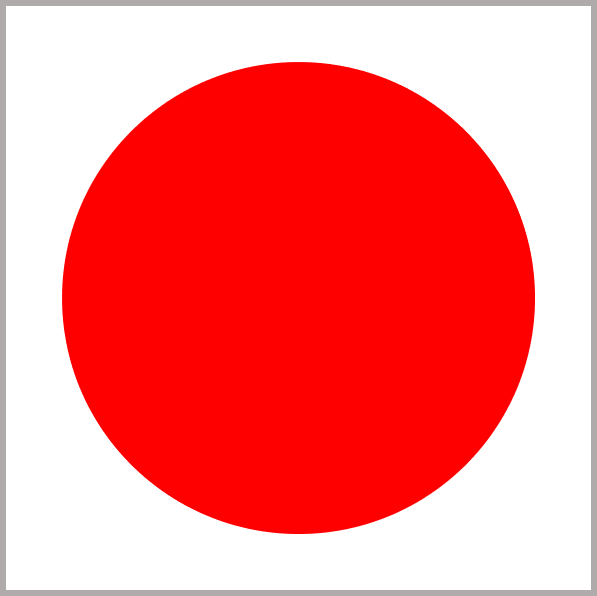
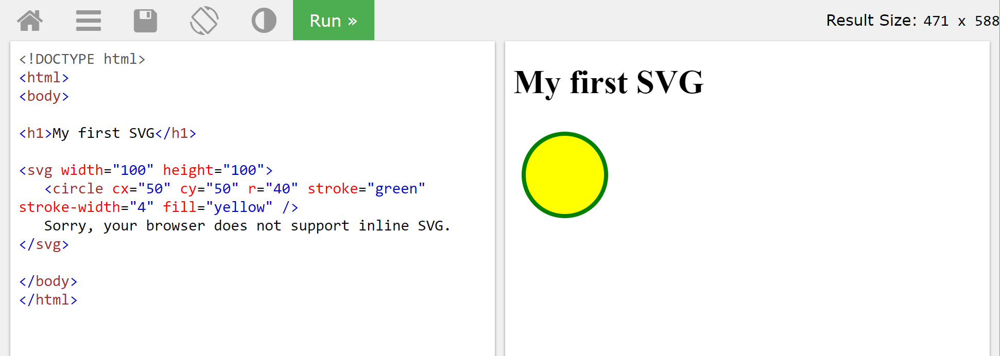
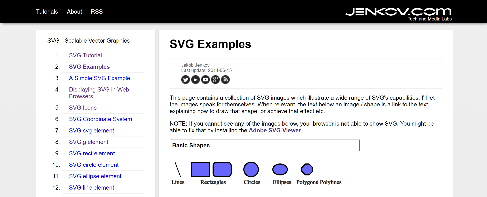



This post introduces the very basics of SVG. If you already know SVG, move along to my second post in this series.

## SVG Basics

Before I get into the technical details of what SVG is, let me explain why SVG images are important. If you enlarge many image formats enough, they become fuzzy and pixelated. Because an SVG image is made up of lines and shapes defined by points, sizes, and colours, you can stretch them as big as you like and they stay sharp.

SVG stands for Scalar Vector Graphics, which is an XML-based markup format that can contain two-dimensional vectors.

Elements can be defined with an opening tag and a closing tag, for example `<svg>...</svg>`, or in a single self-closing tag, for example `<rect ... />`.

### Example



```xml
<svg xmlns='http://www.w3.org/2000/svg'
   viewBox='0 0 100 100'>
       <circle cx='50' cy='50' r='40' fill='red' />
</svg>
```

The above example defines an area where the top-left is 0,0 and the bottom-right is 100,100. It contains a red circle with center at 50,50 and radius 40.

If an SVG statement contains more than one element, they are layered with the first item at the back and the last item at the front.

### SVG Paths

The previous example drew a circle, and you can draw rectangles with `<rect ... />` as well. The next step from SVG basics is drawing more complex shapes. For this, you need to define points, curves, and arcs. One method is the path element.

In a path element you can move the pen, draw lines, arcs, and curves. Below is a simple example that draws a green triangle.

```xml
<svg xmlns='http://www.w3.org/2000/svg'
   viewBox='0 0 100 100'>
   <path d='M10 90 L50 10 L90 90 Z' fill='green' />
</svg>
```

### SVG Icons

Lots of icons available on the web are written in SVG and many can be downloaded. Be aware of copyright and always give credit where credit is due.

If you have PowerPoint O365 you can insert icons onto a slide and save as a picture, which gives you SVG code.

### SVG Resources

This has been a very short introduction to SVG. There are plenty of resources to assist in composing SVG creations.

#### [W3Schools](https://www.w3schools.com/graphics/svg_intro.asp)

W3Schools is a great resource to get started in SVG. The reason I return again and again is the Try It Yourself button, which gives a simple place to test your SVG.



#### [Jenkov's SVG Tutorial](http://tutorials.jenkov.com/svg/index.html)

This is a great site for learning different parts of SVG and how it works, including videos.



## Conclusion

This was a brief introduction to SVG. It is a language worth understanding the basics of, and hopefully through this series you will find a new way to visualize your data.

[SVG in Power BI - Simple KPI shapes - Part 2](https://hatfullofdata.blog/svg-in-power-bi-part-2/)
