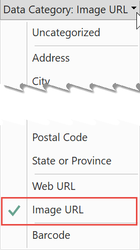
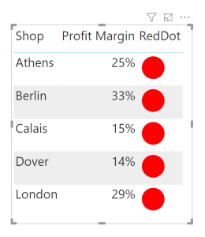
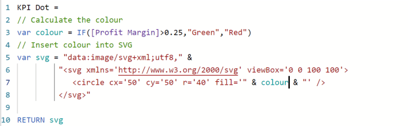
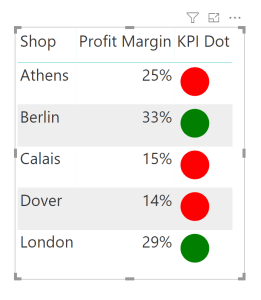
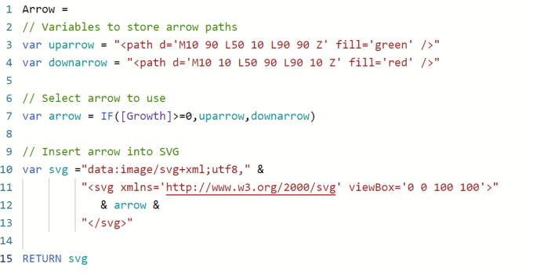
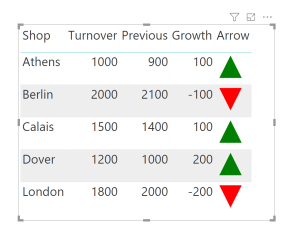



In this post I will show to use SVG to create simple KPI Indicators. In this example I have very simple data of a list of 5 shops with Turnover and Costs. I have added a measure for Profit Margin as a percentage.

## Create SVG Measure

We shall start with a simple SVG image of a dot and show how to create an SVG measure to use in a table.

- Create a measure to store the SVG in a string.

```xml
RedDot = "<svg xmlns='http://www.w3.org/2000/svg' viewBox='0 0 100 100'> 
                <circle cx='50' cy='50' r='40' fill='red' /> 
            </svg>"
```

2. Prefix the SVG with code to declare that it is an SVG image.

```xml
RedDot = "data:image/svg+xml;utf8," &
            "<svg xmlns='http://www.w3.org/2000/svg' viewBox='0 0 100 100'> 
                <circle cx='50' cy='50' r='40' fill='red' /> 
            </svg>"
```

3. On the Modelling ribbon tab, change the measure’s data category to Image URL.



4. Insert measure into a table. You will need to turn off the totals to make the total line not show svg code. I will fix this in a later post.



## Change to be Reactive

The above example puts a red dot on every line. We will now adapt the measure to change the colour depending upon the measure Profit Margin measure to make this into a KPI shape.

- We use a variable to store the colour and its value comes from an IF statement.

- We insert the colour into the SVG statement

- We return the SVG

```xml
KPI Dot = 
// Calculate the colour
var colour = IF([Profit Margin]>0.25,"Green","Red")
// Insert colour into SVG
var svg = "data:image/svg+xml;utf8," &
            "<svg xmlns='http://www.w3.org/2000/svg' viewBox='0 0 100 100'> 
                <circle cx='50' cy='50' r='40' fill='" & colour & "' /> 
            </svg>"

RETURN svg
```





## Up and Down Arrows

The above example changed a colour which is okay but it would be better if we could also change the shape of the icon. For this example I use another measure of Growth which compares Turnover to previous turnover. If the Growth is positive I want to display a green up arrow and if negative a red down arrow.

- Set up variables for an up and down arrow

- Select which arrow to use

- Insert the arrow into the svg

- Return the svg.

```xml
Arrow = 
// Variables to store arrow paths
var uparrow = "<path d='M10 90 L50 10 L90 90 Z' fill='green' />"
var downarrow = "<path d='M10 10 L50 90 L90 10 Z' fill='red' />"

// Select arrow to use
var arrow = IF([Growth]>=0,uparrow,downarrow)

// Insert arrow into SVG
var svg ="data:image/svg+xml;utf8," &
            "<svg xmlns='http://www.w3.org/2000/svg' viewBox='0 0 100 100'>"
            & arrow & 
            "</svg>"

RETURN svg
```





## Conclusion

This gives an introduction of using SVG within Power BI to create KPI shapes. There is lots more that could be done with SVG and this series will continue to add more features using svg.

