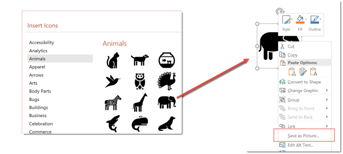
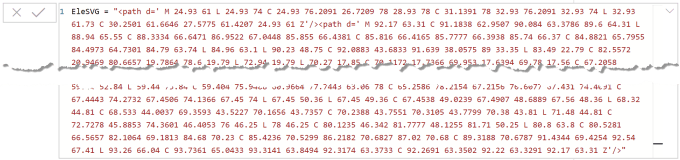
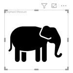
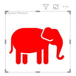
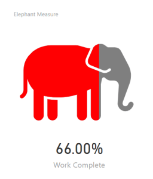
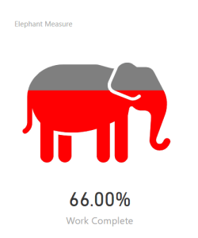

---
title: SVG in Power BI – Part 3 – Fill SVG Icon with Colour
description: In this post we will introduce using SVG icons and filling the icon with colour to show a percentage value.
slug: svg-in-power-bi-part-3-svg-icon
date: 2019-04-29 22:30:35+0000
lastmod: 2025-02-14 13:11:05+0000
image: cover.png
categories:
    - Intermediate
    - Power BI
    - SVG
---



In this post we will introduce using icons and filling the icon with colour to show a percentage value.

## Getting Icon Code

You can download icons from lots of web sites. Search for SVG icons or ask your marketing teams for company graphics as SVG. If you are using Office 2016 or above the icons in PowerPoint can be saved as SVG files. Icons can be found on the Insert ribbon and once inserted on a slide, right click and save as a picture.



Once you have the SVG icon take a look at the SVG code. There will be an open  tag with lots of attributes then one or more  elements and then a closing tag . You need to do a search replace the double quotes into single quotes, e.g.  and its long so I save it into a measure.



## Draw 2 Elephants

We are going to draw 2 elephants, one grey and one coloured one on top. The coloured one we will clip to size to show it being filled up.

Next task is to create a measure in our report. Inside the measure we create 2 variables, one to store the svg start and one for the svg end. As a quick test we return the concatenation of the variables and the previous created measure to draw our icon.

```xml
Elephant Measure = 
// svg essentials
    var svg_start = "data:image/svg+xml;utf8,"
    var svg_end = ""

return
    svg_start & [EleSVG] & svg_end
```

```xml
If you use the custom visual Image from Cloud Scope you can add the measure and the icon will be shown in Power BI.
```



In order to draw a grey and red elephant we will nest the elephant in a  group tag and give the  element properties that the nested elements will inherit.



I add 2 more variables one for the grey elephant and one for the red one. and tweak the return to use the new elephant variables. It will draw both elephants but they are exactly over each other so you only see the red one.

```xml
Elephant Measure = 
    // svg essentials
    var svg_start = "data:image/svg+xml;utf8,"
    var svg_end = ""

    // Coloured Elephants
    var grey_ele = "" & [EleSVG] & ""
    var red_ele = "" & [EleSVG] & ""

return
    svg_start & grey_ele & red_ele & svg_end
```

## Clip the Red Elephant

We now want to only show a percentage of the red elephant based off a percentage measure, e.g. work complete. For this we need to create a clip-path.  A clip-path defines which part of the shape will be visible. So in this case it will be a rectangle starting at 0,0 and will be height = 100 and width = percentage measure * 100.

So we create a variable to calculate the width and then a variable to store the defs tag that contains the clip-path. The red_ele variable is then tweaked to include a reference to the clip-path and the return is changed to include the defs variable.

```xml
Elephant Measure = 
    // svg essentials
    var svg_start = "data:image/svg+xml;utf8,"
    var svg_end = ""

    // defs
    var clip_width = [Work Complete] * 100 
    var defs = "
                    
                "

    // Coloured Elephants
    var grey_ele = "" & [EleSVG] & ""
    var red_ele = "" & [EleSVG] & ""

return
    svg_start & defs & grey_ele & red_ele & svg_end
```

Now we have 2 measures, one that calculates a percentage and one that shows that percentage in colour.



## Filling from the bottom up

The above example fills from the left. It is the easiest to calculate but if someone was asked to draw this idea they would probably fill in the colour from the bottom up.

Our icon is in a square which goes from 0,0 and is 100 wide and 100 tall. If we wanted to show 25% full the clip path would need to be 0,75 and 100 wide and 25 tall. So 2 values change the height is 25 = 100 * 25% and the starting y is 75 = 100 – height.

So to fill from the bottom I need to change the defs

```xml
Elephant Measure = 
    // svg essentials
    var svg_start = "data:image/svg+xml;utf8,"
    var svg_end = ""

    // defs
    var clip_height = [Work Complete] * 100 
    var clip_y = 100 - clip_height
    var defs = "
                    
                "

    // Coloured Elephants
    var grey_ele = "" & [EleSVG] & ""
    var red_ele = "" & [EleSVG] & ""

return
    svg_start & defs & grey_ele & red_ele & svg_end
```



## Conclusion

This gives us a quick visual measure to show a percentage using an SVG icon.

