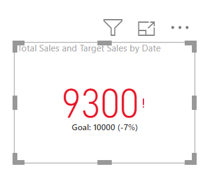
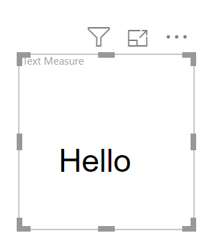
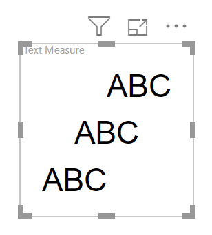
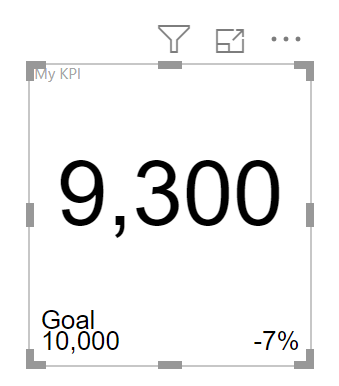
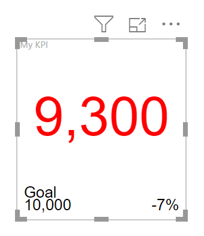
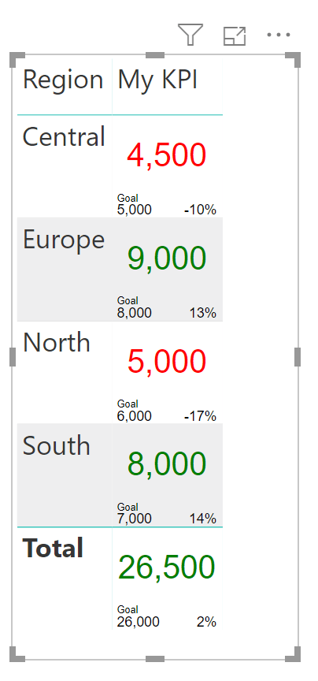

### Series

This is the fourth post in my series on using SVG in Power BI introducing adding SVG text and actually solves one of the niggles I had with doing KPI figures in Power BI. I didn’t get to do this part as part of my session which started this series. Here is the list of posts.

- [Introduction to SVG Basics](https://hatfullofdata.blog/svg-in-power-bi-part-1/)

- [KPI Shapes in Power BI](https://hatfullofdata.blog/svg-in-power-bi-part-2/)

- [Filling up with colour using SVG in Power BI](https://hatfullofdata.blog/svg-in-power-bi-part-3/)

- [Using Text in SVG](https://hatfullofdata.blog/svg-in-power-bi-part-4/)

- [Using SVG Rotate to create a dial in Power BI](https://hatfullofdata.blog/svg-in-power-bi-part-5/)

- [SVG Icons in Conditional Formatting](https://hatfullofdata.blog/svg-in-power-bi-part-6-new-icon-conditional-formatting/)

- [Using a Theme to add SVG Icons](https://hatfullofdata.blog/svg-in-power-bi-part-7-using-theme-svg-icons/)

- [Feb 2023 Update – 5 SVG Stars](https://hatfullofdata.blog/power-bi-5-stars-svg/)



My niggle was the KPI visual. It is a fast way to have a red or green measure displayed. BUT, it requires a trend axis even if you don’t want one and it includes a tiny red exclamation mark or green tick. So I wanted the red / green and the goal shown with no trend or ticks and exclamation marks.

### Simple Text Element

SVG Text elements need an x and y attributes to position the text and a style attribute that uses CSS notation to choose font properties. The example below has the word Hello where the bottom lower left corner is at 20,60.

Copy CodeCopiedUse a different Browser
```xml
Text Measure = 
// svg essentials
    var svg_start = "data:image/svg+xml;utf8,"
    var svg_end = ""
// text element including a style tag
    var svg_text ="Hello"
return
    svg_start & svg_text & svg_end
```



### Aligning SVG Text

If I am going to replace the KPI visual I need to place a number centred in the SVG graphic. The default alignment is the x and y are the bottom left. This can be changed using the text-anchor attribute for the text element; it can be set to start, middle or end.

Below is an example of the string ABC being aligned start, middle and end.

Copy CodeCopiedUse a different Browser
```xml
Text Measure = 
// svg essentials
    var svg_start = "data:image/svg+xml;utf8,"
    var svg_end = ""
// text element including a style tag
    var svg_text1 ="ABC"
    var svg_text2 ="ABC"
    var svg_text3 ="ABC"
return
    svg_start & svg_text1 & svg_text2 & svg_text3 & svg_end
```



### My KPI Visual

To replace the KPI shown at the start of this post I want a number in the middle of the square showing the measure, bottom left the goal and bottom right how close to the goal we were.

Copy CodeCopiedUse a different Browser
```xml
My KPI = 
// svg essentials
    var svg_start = "data:image/svg+xml;utf8,"
    var svg_end = ""
// 3 text elements, actual, goal and % close
    var svg_Indicator =""
                        & FORMAT([Total Sales],"#,##0") & ""
    var svg_goal =  "Goal"
                    & ""
                        & FORMAT([Target Sales],"#,##0") & ""
    var svg_close =""
                        & FORMAT([KPI Close],"0%") & ""
return
    svg_start & svg_Indicator & svg_goal & svg_close & svg_end
```



Format function is used to format the number into comma, #,##0 and percent, 0% formats.

The last part is to colour the number based on the Indicator reaching the target. This was covered in Part 2 of this series so I’ll just give the final code.

Copy CodeCopiedUse a different Browser
```xml
My KPI = 
// svg essentials
    var svg_start = "data:image/svg+xml;utf8,"
    var svg_end = ""
    
// calculate colour for element
    var ind_colour = IF([Total Sales]"
                        & FORMAT([Total Sales],"#,##0") & ""
    var svg_goal =  "Goal"
                    & ""
                        & FORMAT([Target Sales],"#,##0") & ""
    var svg_close =""
                        & FORMAT([KPI Close],"0%") & ""
return
    svg_start & svg_Indicator & svg_goal & svg_close & svg_end
```



### My KPI in a Table

One advantage of the SVG text KPI over the KPI visual is it can be embedded within a table. The total line will work as long as the number measures work.



### Conclusion

Adding SVG text to a visual does make the visual more informative and the above example makes conditional formatting and data layout possible in a table.

## More Power BI Posts

- [Conditional Formatting Update](https://hatfullofdata.blog/power-bi-conditional-formatting-update/)

- [Data Refresh Date](https://hatfullofdata.blog/power-bi-data-refresh-date/)

- [Using Inactive Relationships in a Measure](https://hatfullofdata.blog/power-bi-inactive-relationships-in-a-measure/)

- [DAX CrossFilter Function](https://hatfullofdata.blog/power-bi-dax-crossfilter-function/)

- [COALESCE Function to Remove Blanks](https://hatfullofdata.blog/power-bi-coalesce-function-to-remove-blanks/)

- [Personalize Visuals](https://hatfullofdata.blog/power-bi-personalize-visuals/)

- [Gradient Legends](https://hatfullofdata.blog/power-bi-gradient-legends/)

- [Endorse a Dataset as Promoted or Certified](https://hatfullofdata.blog/power-bi-endorse-a-dataset/)

- [Q&A Synonyms Update](https://hatfullofdata.blog/power-bi-qa-synonyms-update/)

- [Import Text Using Examples](https://hatfullofdata.blog/power-bi-import-text-using-examples/)

- [Paginated Report Resources](https://hatfullofdata.blog/paginated-report-resources/)

- [Refreshing Datasets Automatically with Power BI Dataflows](https://hatfullofdata.blog/refreshing-datasets-automatically-with-dataflow/)

- [Charticulator](https://hatfullofdata.blog/charticulator-simple-custom-chart/)

- [Dataverse Connector – July 2022 Update](https://hatfullofdata.blog/power-bi-dataverse-connector-july-2022-update/)

- [Dataverse Choice Columns](https://hatfullofdata.blog/power-bi-dataverse-choices-and-choice-column/)

- [Switch Dataverse Tenancy](https://hatfullofdata.blog/power-bi-switch-dataverse-tenancy/)

- [Connecting to Google Analytics](https://hatfullofdata.blog/power-bi-connecting-to-google-analytics/)

- [Take Over a Dataset](https://hatfullofdata.blog/power-bi-take-over-a-dataset/)

- [Export Data from Power BI Visuals](https://hatfullofdata.blog/export-data-from-power-bi-visuals/)

- [Embed a Paginated Report](https://hatfullofdata.blog/power-bi-embed-a-paginated-report/)

- [Using SQL on Dataverse for Power BI](https://hatfullofdata.blog/using-sql-on-dataverse-for-power-bi/)

- [Power Platform Solution and Power BI Series](https://hatfullofdata.blog/power-platform-solution-and-power-bi-part-1/)

- [Creating a Custom Smart Narrative](https://hatfullofdata.blog/power-bi-creating-a-custom-smart-narrative/)

- [Power Automate Button in a Power BI Report](https://hatfullofdata.blog/power-automate-button-in-a-power-bi-report/)

## Power BI Series

- [SVG in Power BI series](https://hatfullofdata.blog/svg-in-power-bi-part-1-svg-basics/)

- [Power BI and Project Online series](https://hatfullofdata.blog/power-bi-connecting-to-project-online/)

- [Slicers series](https://hatfullofdata.blog/power-bi-slicers-introduction/)

- [Dataflow series](https://hatfullofdata.blog/power-bi-create-a-dataflow/)

- [Power BI SVG series](https://hatfullofdata.blog/svg-in-power-bi-part-1-svg-basics/)

- [Power Automate and Power BI Rest API series](https://hatfullofdata.blog/power-automate-and-power-bi-rest-api/)

- [Power BI and DevOps series](https://hatfullofdata.blog/devops-data-into-power-bi/)

