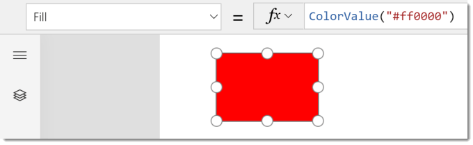
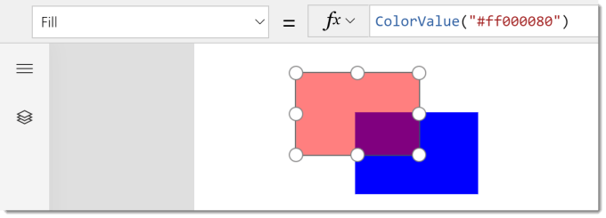
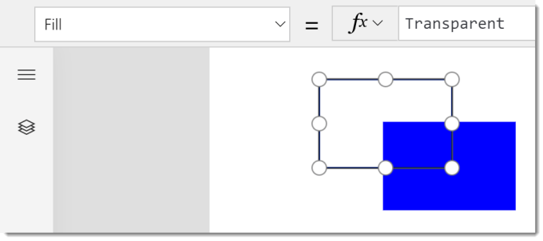

A small update was sneaked in this week to help handling transparency with colours in PowerApps.

### ColorValue Function Update

ColorValue function takes a colour value as a hex string and converts it into a colour values. In the example below #FF0000 fills a rectangle in Red.

The update now allows another 2 characters to the string to specify transparency. Like the red,green and blue values the transparency ranges from 0 to 255 or in hex 00 to FF

In the example below the red is made 50% transparent, 80 in HEX is 128 in decimal which is 255 / 2, hence 50%.

### Transparent Colour

In the list of available preset colours such as AliceBlue, Aqua etc now includes a colour Transparent.

### Conclusion

Small update but one thats very welcome! Now I just want to be able to use ColorFade or similar function to take an existing fill and give a more or less transparent version.

## More Power Apps Posts

- [Transparency Update](https://hatfullofdata.blog/powerapps-transparency-update/)

- [Using JSON Feature to Save Pictures](https://hatfullofdata.blog/powerapps-using-json-function-to-save-pictures/)

- [AI Builder Object Detect Model](https://hatfullofdata.blog/ai-builder-object-detect-model/)

- [Function Component](https://hatfullofdata.blog/powerapps-function-component/)

- [SVG in Power Apps series](https://hatfullofdata.blog/powerapps-svg-introduction/)

- [12 Days of Components](https://hatfullofdata.blog/power-apps-12-days-of-components/)

- [Build a Responsive App series](https://hatfullofdata.blog/power-apps-build-a-responsive-app-planning/)

- [Embed a Power BI Chart](https://hatfullofdata.blog/power-apps-embed-a-power-bi-chart/)

