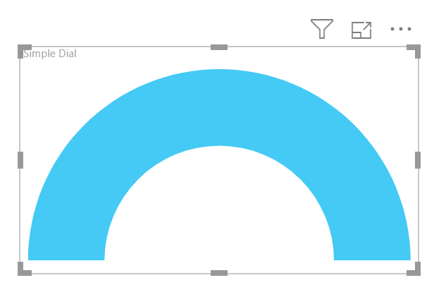
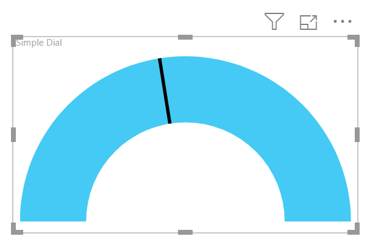
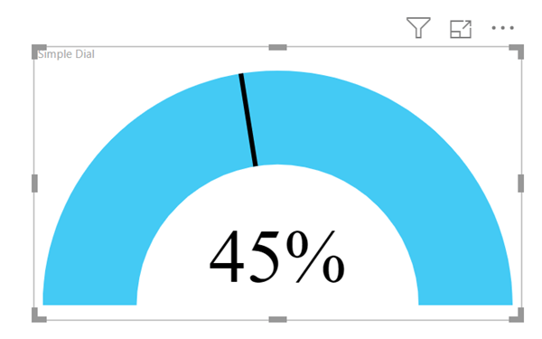
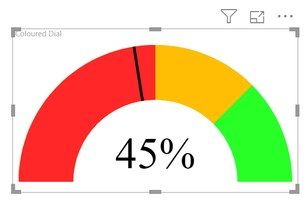

---
title: SVG in Power BI – Part 5 – Using SVG Rotate
description: In this post I will introduce the possibilities that SVG rotate gives. This post will walk through creating a dial.
slug: svg-in-power-bi-part-5-svg-rotate
date: 2019-06-08 21:36:23+0000
lastmod: 2025-02-14 13:08:32+0000
image: cover.png
categories:
    - Power BI
    - SVG
---

### SVG in Power BI Series

This post is the fifth in my series of exploring using SVG in Power BI to create visuals. Here are links to the complete series.

- [Introduction to SVG Basics](https://hatfullofdata.blog/svg-in-power-bi-part-1/)

- [KPI Shapes in Power BI](https://hatfullofdata.blog/svg-in-power-bi-part-2/)

- [Filling up with colour using SVG in Power BI](https://hatfullofdata.blog/svg-in-power-bi-part-3/)

- [Using Text in SVG](https://hatfullofdata.blog/svg-in-power-bi-part-4/)

- [Using SVG Rotate to create a dial in Power BI](https://hatfullofdata.blog/svg-in-power-bi-part-5/)

- [SVG Icons in Conditional Formatting](https://hatfullofdata.blog/svg-in-power-bi-part-6-new-icon-conditional-formatting/)

- [Using a Theme to add SVG Icons](https://hatfullofdata.blog/svg-in-power-bi-part-7-using-theme-svg-icons/)

- [Feb 2023 Update – 5 SVG Stars](https://hatfullofdata.blog/power-bi-5-stars-svg/)

In this post I will introduce the possibilities that SVG rotate gives. This post will walk through creating a dial. This post will be done in 2 stages, first a simple dial and then add colours.

### Simple Dial

We will start with a simple dial, made up of an arch with a line to indicate a percentage.

The arch is made using a path which combines 2 arcs to make an arch. The arch is then nested in a group  element that applies a fill.

```xml
Simple Dial = 
// svg essentials
    var svg_start = "data:image/svg+xml;utf8,"
    var svg_end = ""
// arch shape
    var svg_arch = ""
// light blue arch
    var svg_blue_arch = "" & svg_arch & ""
return
    svg_start & svg_blue_arch & svg_end
```



We now need to add a line that will move based on a measure called Score using SVG rotate. So I start by calculating the rotation angle and drawing a line that matches the bottom left of the arch and then rotate it centered on the center point of the arch.

The rotation will be 0 to 180 degrees and the measure Score is a percentage so the calculation is [Score] * 180.

The line is drawn from 0,50 to 20,50 and then a transform is applied of a rotate which has 3 parameters, angle to rotate, x and y for the centre of the rotation. So the bottom part of my measure becomes

```xml
// light blue arch
    var svg_blue_arch = "" & svg_arch & ""
// draw line and rotate
    var svg_rotate = [Score] * 180
    var svg_line = "- "
return
    svg_start & svg_blue_arch & svg_line & svg_end
```



### Show the Value

To make it very obvious what value is shown I’m going to add the value of the Score measure. The centre of the arch is 50,50 so I’ll put the middle of the text at 50,40. I used the FORMAT function to apply a percentage, “0%”, format to the score. (See the previous post in this series to look at SVG text)

The bottom part of the measure now becomes

```xml
var svg_line = ""
// Show Score value
    var svg_score = ""&FORMAT([Score],"0%")&""
return
    svg_start & svg_blue_arch & svg_line & svg_score & svg_end
```



### Adding Colours

For this I researched being able to draw parts of an arch. In order to do that I would need to calculate the end points of each arch, which was possible but involved way more mathematics than I was willing to re-learn. My days of using Cos, Sin and Tan have long gone.

So I the trick I used was to draw the arch upside down out of sight and rotate the arch around into view. Different coloured arches can be rotated into view to show different colours.

To draw the arch up the other way I just changed 2 values in svg_arch variable.  When drawing an arc in SVG the 5th number after the A specifies which way round the to reach the final point. So the svg_arch variable becomes.

```xml
// arch shape
    var svg_arch = " "
```

Then we add a coloured arch rotated for each part of the gauge.  In my example I am going to show Green upto 100%, Amber starts at 75% and Red at 50%.  So the complete measure code now is

```xml
Coloured Dial = 
// svg essentials
    var svg_start = "data:image/svg+xml;utf8,"
    var svg_end = ""
// arch shape
    var svg_arch = " "
// coloured arches
    var svg_green_arch = "" & svg_arch & ""
    var svg_amber_arch = "" & svg_arch & ""
    var svg_red_arch = "" & svg_arch & ""
// draw line and rotate
    var svg_rotate = [Score] * 180
    var svg_line = ""
// Show Score value
    var svg_score = ""&FORMAT([Score],"0%")&""
return
    svg_start & svg_green_arch & svg_amber_arch & svg_red_arch & svg_line & svg_score & svg_end
```



### Conclusion to SVG Rotate

This post ended up being longer than I expected so my series will expand to make use of a table to store the colour values in another post and drawing a clock into another post.

## More Power BI Posts

[Conditional Formatting Update](https://hatfullofdata.blog/power-bi-conditional-formatting-update/)

- [Data Refresh Date](https://hatfullofdata.blog/power-bi-data-refresh-date/)

- [Using Inactive Relationships in a Measure](https://hatfullofdata.blog/power-bi-inactive-relationships-in-a-measure/)

- [DAX CrossFilter Function](https://hatfullofdata.blog/power-bi-dax-crossfilter-function/)

- [COALESCE Function to Remove Blanks](https://hatfullofdata.blog/power-bi-coalesce-function-to-remove-blanks/)

- [Personalize Visuals](https://hatfullofdata.blog/power-bi-personalize-visuals/)

- [Gradient Legends](https://hatfullofdata.blog/power-bi-gradient-legends/)

- [Endorse a Dataset as Promoted or Certified](https://hatfullofdata.blog/power-bi-endorse-a-dataset/)

- [Q&A Synonyms Update](https://hatfullofdata.blog/power-bi-qa-synonyms-update/)

- [Import Text Using Examples](https://hatfullofdata.blog/power-bi-import-text-using-examples/)

- [Paginated Report Resources](https://hatfullofdata.blog/paginated-report-resources/)

- [Refreshing Datasets Automatically with Power BI Dataflows](https://hatfullofdata.blog/refreshing-datasets-automatically-with-dataflow/)

- [Charticulator](https://hatfullofdata.blog/charticulator-simple-custom-chart/)

- [Dataverse Connector – July 2022 Update](https://hatfullofdata.blog/power-bi-dataverse-connector-july-2022-update/)

- [Dataverse Choice Columns](https://hatfullofdata.blog/power-bi-dataverse-choices-and-choice-column/)

- [Switch Dataverse Tenancy](https://hatfullofdata.blog/power-bi-switch-dataverse-tenancy/)

- [Connecting to Google Analytics](https://hatfullofdata.blog/power-bi-connecting-to-google-analytics/)

- [Take Over a Dataset](https://hatfullofdata.blog/power-bi-take-over-a-dataset/)

- [Export Data from Power BI Visuals](https://hatfullofdata.blog/export-data-from-power-bi-visuals/)

- [Embed a Paginated Report](https://hatfullofdata.blog/power-bi-embed-a-paginated-report/)

- [Using SQL on Dataverse for Power BI](https://hatfullofdata.blog/using-sql-on-dataverse-for-power-bi/)

- [Power Platform Solution and Power BI Series](https://hatfullofdata.blog/power-platform-solution-and-power-bi-part-1/)

- [Creating a Custom Smart Narrative](https://hatfullofdata.blog/power-bi-creating-a-custom-smart-narrative/)

- [Power Automate Button in a Power BI Report](https://hatfullofdata.blog/power-automate-button-in-a-power-bi-report/)

## Power BI Series

- [SVG in Power BI series](https://hatfullofdata.blog/svg-in-power-bi-part-1-svg-basics/)

- [Power BI and Project Online series](https://hatfullofdata.blog/power-bi-connecting-to-project-online/)

- [Slicers series](https://hatfullofdata.blog/power-bi-slicers-introduction/)

- [Dataflow series](https://hatfullofdata.blog/power-bi-create-a-dataflow/)

- [Power BI SVG series](https://hatfullofdata.blog/svg-in-power-bi-part-1-svg-basics/)

- [Power Automate and Power BI Rest API series](https://hatfullofdata.blog/power-automate-and-power-bi-rest-api/)

- [Power BI and DevOps series](https://hatfullofdata.blog/devops-data-into-power-bi/)

