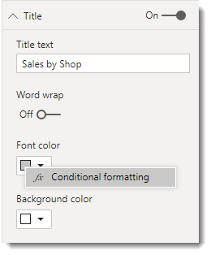
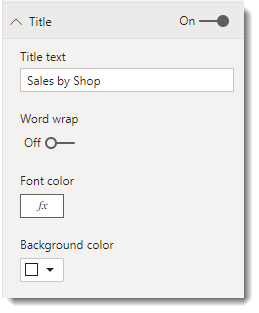
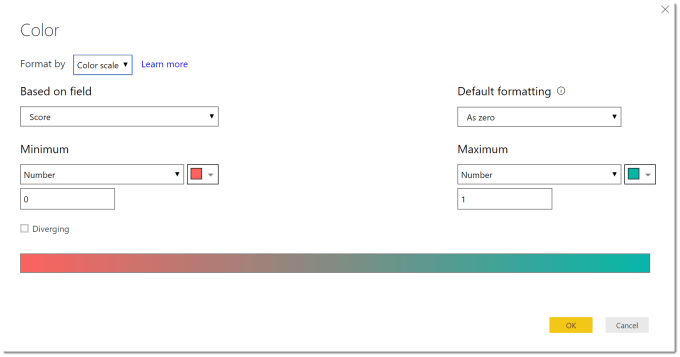
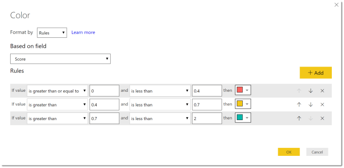
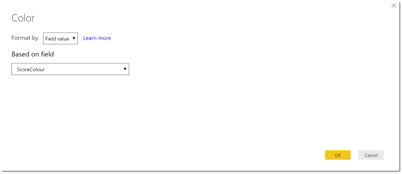
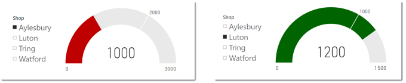

---
title: Power BI – Conditional Formatting Update
description: The June 2019 update for Power BI included a few updates for conditional formatting, for visual backgrounds, titles, cards and gauges. This post is my take on the updates and on how I prefer to do the logic behind choosing a colour. Full details of the June 2019 update can be found at https://powerbi.microsoft.com/en-us/blog/power-bi-desktop-june-2019-feature-summary/ Applying Conditional Colour Formatting This update...
slug: power-bi-conditional-formatting-update
date: 2019-06-13 19:26:40+0000
lastmod: 2025-02-14 13:03:20+0000
image: cover.png
categories:
    - Power BI
---

The June 2019 update for Power BI included a few updates for conditional formatting, for visual backgrounds, titles, cards and gauges. This post is my take on the updates and on how I prefer to do the logic behind choosing a colour.

Full details of the June 2019 update can be found at [https://powerbi.microsoft.com/en-us/blog/power-bi-desktop-june-2019-feature-summary/](https://powerbi.microsoft.com/en-us/blog/power-bi-desktop-june-2019-feature-summary/)

## Applying Conditional Colour Formatting

This update added to the places conditional colour formatting can be applied. In every place, the method of applying it is the same, the trick is working out which visuals will let you do what.

When you look at a visual’s formatting properties, right click on a colour selector. If Conditional Formatting appears then you can add rules if nothing appears then you can’t.



When it is applied, the colour is shown as Fx symbol.



## List of Locations

|Visual|Section|Property|
|---|---|---|
|Most Visuals|Title|Font color|
|Most Visuals|Title|Background color|
|Most Visuals|Background|Color|
|Stacked Bar Chart|Data colors|Default color*|
|Clustered Bar Chart|Data colors|Default color*|
|Stacked Column Chart|Data colors|Default color*|
|Clustered Column Chart|Data colors|Default color*|
|Line and Stacked Column Chart|Data colors|Default color*|
|Line and Clustered Column Chart|Data colors|Default color*|
|Scatter Chart|Data colors|Default color*|
|Treemap|Data colors|Advanced Controls|
|Funnel|Data colors|Default color|
|Gauge|Data colors|Fill|
|Card|Data label|Color|
|Card|Category label|Color|
|Table|Conditional Formatting|Background Color|
|Table|Conditional formatting|Font color|
|Matrix|Conditional formatting|Background Color|
|Matrix|Conditional formatting|Font color|
|Matrix|Conditional formatting|Data bars|

## Methods of Applying Conditional Formatting

There are three methods of applying conditional formatting: color scale, rules, and field value.

### Colour Scale



### Rules



### Field Value



## Colour Measures

One of my issues with Color scale or Rules is you cannot use multiple column values or measures in the colour choice. Field Value gives a work around for this by allowing you to use a Measure.

I have a very simple example of a list of Stores which have a Target and Sales value. So I create a measure that calculates a colour string based on Sales and Target using an IF function.

```C++
SalesColour = IF(
    SUM(Sales[Sales]) >= SUM(Sales[Target]), 
    "#006400", // Green
    "#BF0000"  // Red
)
```

I then used Field Value conditional formatting to format a gauge fill.



### Conclusion

Conditional formatting is getting there but it is still limited, and we have been spoiled by Excel. I expect more updates will come and I will need to update the table above.

