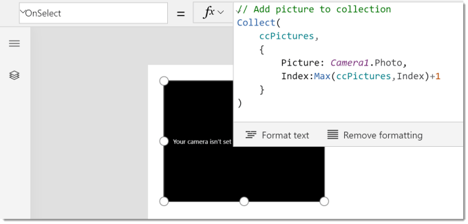
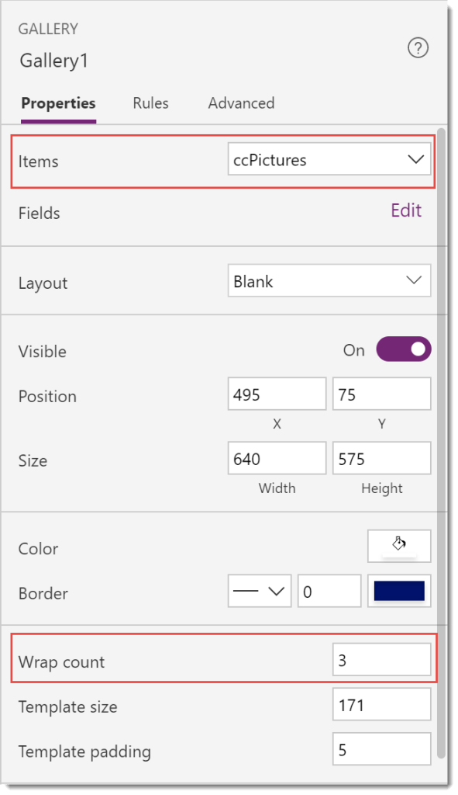
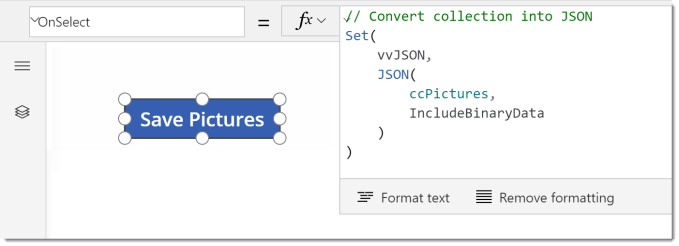
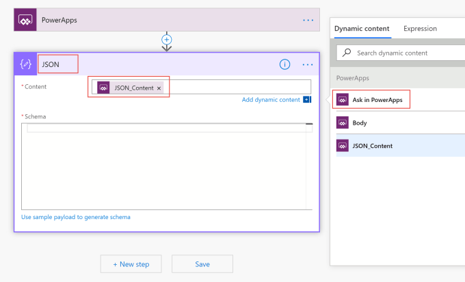
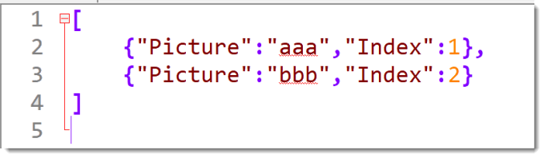
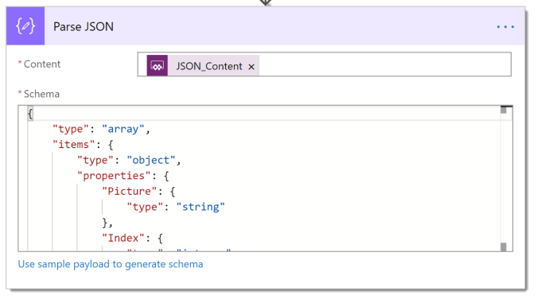
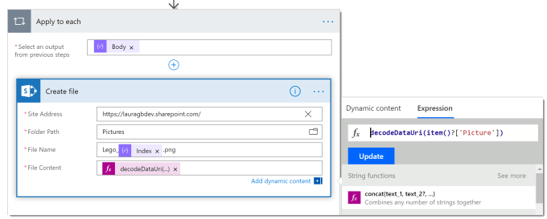
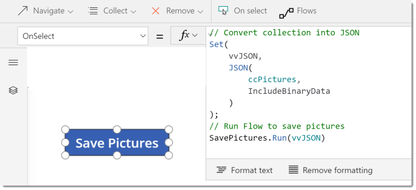
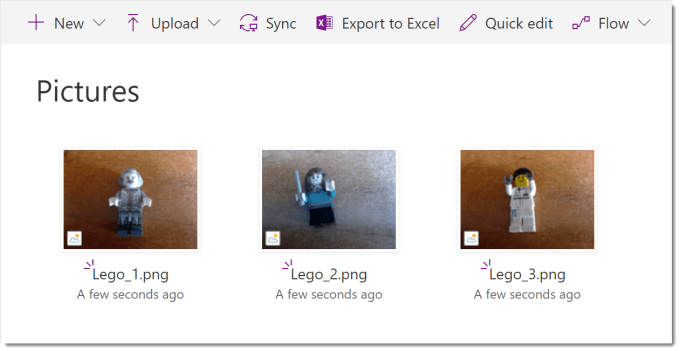

In this post I will be explaining how to use the JSON Function to simplify the saving of multiple pictures from a PowerApp to a SharePoint library using Flow. There have been many wonderful workarounds to do this, finally we now have a slightly less Heath-Robinson method.

### Set up the PowerApp

I start with a blank app, canvas or phone layout. Because my main client uses Windows 10 tablet / laptops to take the pictures I add a camera control. Then I change the OnSelect property to store the picture into a collection. I include an index column so Flow can calculate a unique filename later.

I then add a blank gallery and change the Items to be the collection populated by the camera, e.g. ccPictures and to make a grid I change the wrap to be 3. I add an Image control to the gallery so as I take pictures it will populate the grid.

Then I take some pictures to populate my collection. Obviously everyone needs photos of their Lego character collection.

In order for the pictures to be passed to Flow to be saved to SharePoint I need to convert the collection into JSON. So I add a button with the following code. Please note the second parameter of the JSON function is IncludeBinaryData as we want to include the pictures which are binary data.

### Building the Flow

In the previous section, I created the app to make the JSON string to be processed by a Flow. So I now I will create a new flow with a PowerApp trigger.

The first step to add is a Parse JSON action to convert the JSON into an array. In order for the parameter requested by Flow to be named nicely I rename the step to just “JSON” and then in the Content box I click on Ask in PowerApps. Now the parameter is called JSON_Content. Afterwards you can rename the action back to Parse JSON and it won’t rename the parameter.

For the Schema you need to understand JSON a little. The JSON you return will be multiple rows each with 2 columns, Picture which is a string and Index which is a number. So in a text editor I create small example JSON string with multiple rows of data and copy it.

Then in the Parse JSON action I click on Use sample payload to generate schema and I paste my example in, clicking Done will create the schema.

The next step is for every item in the array to save a picture. So we start with an Apply to each action which will use the Body from the Parse JSON step.

Then we add a SharePoint action to Create file. Site address and path you will need to get from the SharePoint destination. The File Name I create using the Index value.

The File Content uses an Expression. So click on Expression and find the function decodeDataUri. The parameter for the function is the Picture value, which doesn’t appear in the offered Dynamic content, so we need to use the Item() function and then add ?[‘Picture’].

### Connecting PowerApp to the Flow

We now have a Flow ready to receive JSON data and save pictures. So we now just need to connect them. In my experience adding a flow to a button that already has code does not end well, I usually loose the existing code. So I add a second button and from the Action ribbon click Flows and connect up my Flow and pass in as the parameter the variable containing the JSON, e.g. vvJSON. Then I copy and paste this code into the button that creates the JSON string.

The app is now ready to test.

### Conclusion

The above solution is a very simple example of how the JSON function could be used. Before this went into production I would do better file naming. I have tested the above app to take 30 photos and save them to SharePoint and it worked fine. I assume there is a limit to the size of the JSON.

The JSON function does allow a whole collection to be passed to Flow easily. I will be looking for other possible uses.

## More Power Apps Posts

- [Transparency Update](https://hatfullofdata.blog/powerapps-transparency-update/)

- [Using JSON Feature to Save Pictures](https://hatfullofdata.blog/powerapps-using-json-function-to-save-pictures/)

- [AI Builder Object Detect Model](https://hatfullofdata.blog/ai-builder-object-detect-model/)

- [Function Component](https://hatfullofdata.blog/powerapps-function-component/)

- [SVG in Power Apps series](https://hatfullofdata.blog/powerapps-svg-introduction/)

- [12 Days of Components](https://hatfullofdata.blog/power-apps-12-days-of-components/)

- [Build a Responsive App series](https://hatfullofdata.blog/power-apps-build-a-responsive-app-planning/)

- [Embed a Power BI Chart](https://hatfullofdata.blog/power-apps-embed-a-power-bi-chart/)

