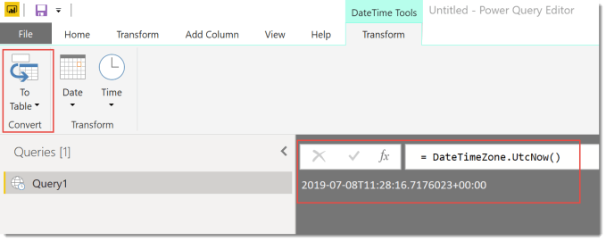
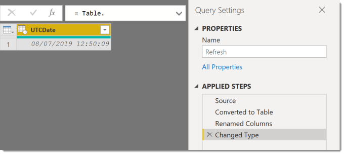
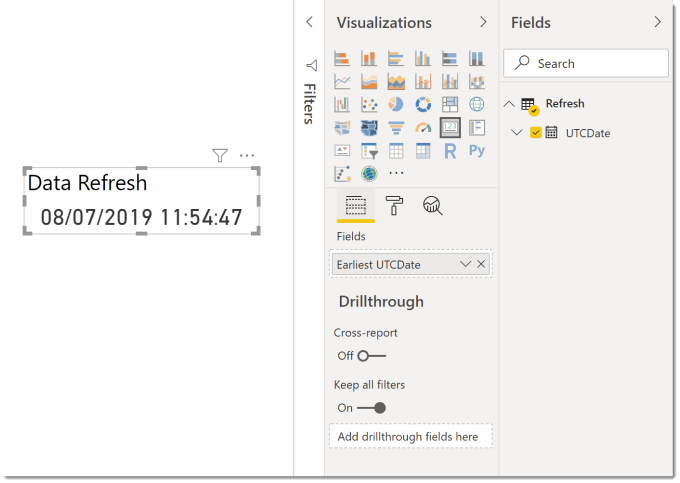

---
title: Power BI – Data Refresh Date
description: In this quick post I will walk through adding a data refresh date on a report page in Power BI.
slug: power-bi-data-refresh-date
date: 2019-07-09 07:55:29+0000
lastmod: 2025-02-14 12:54:33+0000
image: RefreshDate_03.png
categories:
    - Power BI
---

In this post I will walk through adding a data refresh date on a report page. This is a vital part of the report as it will show the report consumers when the dataset was last refreshed and so how up-to date the report is.

We need a date that will only get updated on a refresh so it needs to be defined in Power Query. So under Get Data select Blank Query and Power Query editor will open.

Into the formula bar enter the following and press return.

```xml
=DateTimeZone.UtcNow()
```

The = and () are vital, I spent a good 30 minutes one late evening wasting time due to missing out the brackets. You will get a result of the time in UTC.



The next step is to convert the answer into Table, so click on To Table on the DateTime Tools – Transform ribbon.

Rename your query and the column and change the type of the column to Date/Time/Timezone and you now have a table with a single row of a refresh date in UTC.



After you select Close & Apply you will be able to add the Refresh UTCDate to a card to show the data refresh date.



## Conclusion to Data Refresh Date

This date will only show the date of the last refresh, this does not validate your data as being accurate if you have some other processes happening to prepare the data outside of the Power BI environment.

