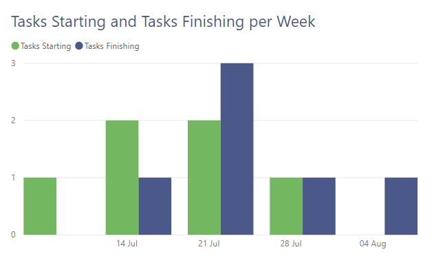

---
title: Power BI – Using Inactive Relationships in a Measure
description: In this post I will show a simple example of how to use a different relationship between two tables in a measure. The example I will use is a list of tasks with start and finish dates. The request is for how many tasks start per week and how many finish per week to be plotted on a column chart.
slug: power-bi-inactive-relationships-in-a-measure
date: 2019-07-25 09:54:02+0000
lastmod: 2025-02-14 12:53:36+0000
categories:
    - Intermediate
    - Power BI
---

In this post I will show a simple example of how to use an inactive relationship between two tables in a measure. The example I will use is a list of tasks with start and finish dates. The request is for how many tasks start per week and how many finish per week to be plotted on a column chart.



### YouTube Version

[](https://www.youtube.com/watch?v=HHfzwaD4NtA)

### Data Setup

The data for this report is a list of tasks in an Excel spreadsheet with an Task Id, Task Name, Start Date, and Finish Date columns. I have also added a calendar table with a Date column and a Start of Week column.

In the relationships view I drag Date from Calendar onto Start Date in Tasks and a 1 to many relationship appears as expected. That will allow me to count the tasks starting.

I also want to be able to count the finishing tasks, so I need a relationship to Finish Date from the calendar as well. So I drag the Date from Calendar onto Finish Date in Tasks. A relationship appears but this time it is dotted, which shows it is not the active relationship.


If you look in Manage relationships it will list both relationships but only one will be ticked as Active.


### Creating the Measures

Now the relationships have been setup we can create the two measures to do the 2 different counts.

The first measure is the simplest and will use the active relationship between Calendar[Date] and Tasks[Start Date]. It is just a count of the Tasks Id column.


For the second measure to count the number of tasks finishing we need to use the other other relationship. We can do this by using the Calculate function and the UseRelationship function. The UseRelationship function allows you to use an inactive relationship by specifying the two related columns. It must be an existing relationship in the model.


```xml
Tasks Finishing = 
    CALCULATE(
        COUNT( Tasks[Task ID] ),
        USERELATIONSHIP( 'Calendar'[Date], Tasks[Finish Date] )
    )
```

We can now add these measures to a column chart to get a plot to compare starting to finishing tasks.


### Conclusion

The USERELATIONSHIP function is a powerful addition to your creating measures tool-set. It does have some restrictions and these are detailed in the official documentation at  [https://docs.microsoft.com/en-us/dax/userelationship-function-dax](https://docs.microsoft.com/en-us/dax/userelationship-function-dax)

## More Power BI Posts

- [Conditional Formatting Update](https://hatfullofdata.blog/power-bi-conditional-formatting-update/)

- [Data Refresh Date](https://hatfullofdata.blog/power-bi-data-refresh-date/)

- [Using Inactive Relationships in a Measure](https://hatfullofdata.blog/power-bi-inactive-relationships-in-a-measure/)

- [DAX CrossFilter Function](https://hatfullofdata.blog/power-bi-dax-crossfilter-function/)

- [COALESCE Function to Remove Blanks](https://hatfullofdata.blog/power-bi-coalesce-function-to-remove-blanks/)

- [Personalize Visuals](https://hatfullofdata.blog/power-bi-personalize-visuals/)

- [Gradient Legends](https://hatfullofdata.blog/power-bi-gradient-legends/)

- [Endorse a Dataset as Promoted or Certified](https://hatfullofdata.blog/power-bi-endorse-a-dataset/)

- [Q&A Synonyms Update](https://hatfullofdata.blog/power-bi-qa-synonyms-update/)

- [Import Text Using Examples](https://hatfullofdata.blog/power-bi-import-text-using-examples/)

- [Paginated Report Resources](https://hatfullofdata.blog/paginated-report-resources/)

- [Refreshing Datasets Automatically with Power BI Dataflows](https://hatfullofdata.blog/refreshing-datasets-automatically-with-dataflow/)

- [Charticulator](https://hatfullofdata.blog/charticulator-simple-custom-chart/)

- [Dataverse Connector – July 2022 Update](https://hatfullofdata.blog/power-bi-dataverse-connector-july-2022-update/)

- [Dataverse Choice Columns](https://hatfullofdata.blog/power-bi-dataverse-choices-and-choice-column/)

- [Switch Dataverse Tenancy](https://hatfullofdata.blog/power-bi-switch-dataverse-tenancy/)

- [Connecting to Google Analytics](https://hatfullofdata.blog/power-bi-connecting-to-google-analytics/)

- [Take Over a Dataset](https://hatfullofdata.blog/power-bi-take-over-a-dataset/)

- [Export Data from Power BI Visuals](https://hatfullofdata.blog/export-data-from-power-bi-visuals/)

- [Embed a Paginated Report](https://hatfullofdata.blog/power-bi-embed-a-paginated-report/)

- [Using SQL on Dataverse for Power BI](https://hatfullofdata.blog/using-sql-on-dataverse-for-power-bi/)

- [Power Platform Solution and Power BI Series](https://hatfullofdata.blog/power-platform-solution-and-power-bi-part-1/)

- [Creating a Custom Smart Narrative](https://hatfullofdata.blog/power-bi-creating-a-custom-smart-narrative/)

- [Power Automate Button in a Power BI Report](https://hatfullofdata.blog/power-automate-button-in-a-power-bi-report/)

## Power BI Series

- [SVG in Power BI series](https://hatfullofdata.blog/svg-in-power-bi-part-1-svg-basics/)

- [Power BI and Project Online series](https://hatfullofdata.blog/power-bi-connecting-to-project-online/)

- [Slicers series](https://hatfullofdata.blog/power-bi-slicers-introduction/)

- [Dataflow series](https://hatfullofdata.blog/power-bi-create-a-dataflow/)

- [Power BI SVG series](https://hatfullofdata.blog/svg-in-power-bi-part-1-svg-basics/)

- [Power Automate and Power BI Rest API series](https://hatfullofdata.blog/power-automate-and-power-bi-rest-api/)

- [Power BI and DevOps series](https://hatfullofdata.blog/devops-data-into-power-bi/)

