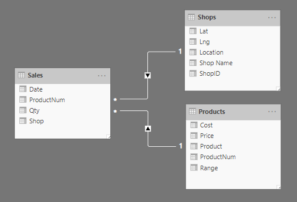
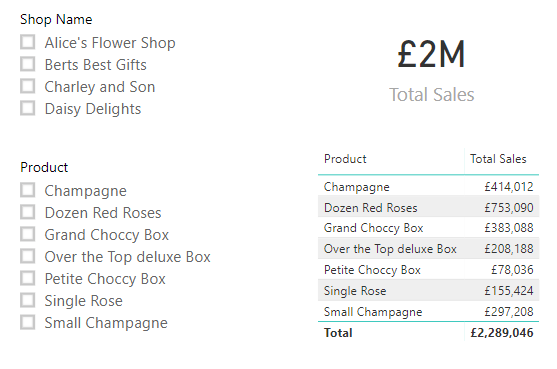
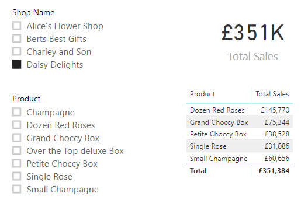
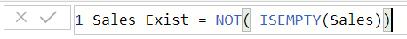
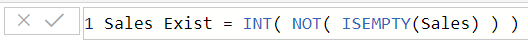
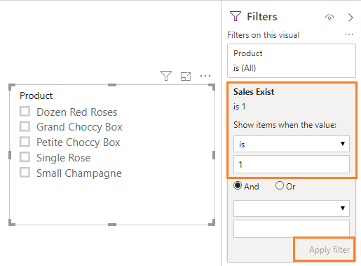

In this post I will look at filtering one slicer based a selection in another slicer a.k.a. cascading slicers. June 2019 Power BI Update included an update to allow a slicer to be filtered based on a measure, which means that you no longer need to use bi-directional relationships.

## Slicer Series

This series will cover different topics regarding slicers.

- [Slicers Introduction](https://hatfullofdata.blog/power-bi-slicer-introduction/)

- [Resetting Slicers with a Bookmark Button](https://hatfullofdata.blog/power-bi-resetting-slicers-with-a-bookmark-button/)

- [Cascading Slicers](https://hatfullofdata.blog/power-bi-cascading-slicers/)

- [Hierarchy Slicer](https://hatfullofdata.blog/power-bi-hierarchy-slicer/)

- [Sync Slicers](https://hatfullofdata.blog/power-bi-introducing-sync-slicers/)

- [Clear all Slicers Button](https://hatfullofdata.blog/power-bi-clear-all-slicers-button/)

- Relative Date Slicer

### Problem Overview

My simple example is a report showing sales of a product in different shops.  The example report contains three tables, Products, Shops and Sales and I’ve related the tables as shown below.

Note the relationships show using arrows that Products can filter Sales and Shops can also filter Sales, and Sales cannot filter either Shops or Products. So I create a report with 2 slicers, a table showing product sales and a card showing total sales.

If I use the Shop Name slicer to filter to Daisy Delights the card and table filter to only show the sales of the 5 products that Daisy Delights sell. BUT the slicer of products does not get filtered.

### Creating the Measure

So we want to create a measure to indicate if there are sales records. My initial reaction was to create a boolean (True / False) measure using ISEMPTY on the Sales table something similar to

Puzzled I went looking, and of course the best site SQLBI gave me the answer to use. The links I used were:

[https://www.sqlbi.com/articles/syncing-slicers-in-power-bi/](https://www.sqlbi.com/articles/syncing-slicers-in-power-bi/)

[https://www.sqlbi.com/articles/check-empty-table-condition-with-dax/](https://www.sqlbi.com/articles/check-empty-table-condition-with-dax/)

That measure would be True if Sales records exist and False if no Sales records exist. Sadly this measure doesn’t work as a slicer filter so we need to convert the True and False to numbers 1 and 0, the fastest way to do this INT function. So the above measure becomes

### Filtering the Slicer

We then need to add the measure to the slicer filters. I select the slicer and drag the measure into the filter pane. I then set the operator to is and the value to 1. Then I click Apply Filter and the list of products is now filtered to only 5 products. The Product slicer is now a cascading slicer and will filter based on shop selected.

### Conclusion to Cascading Slicers

Even though I would prefer to use the boolean filter as that makes logical sense to me, this is a cool update and it reduces those nasty bi-directional filters.

## More Power BI Posts

- [Conditional Formatting Update](https://hatfullofdata.blog/power-bi-conditional-formatting-update/)

- [Data Refresh Date](https://hatfullofdata.blog/power-bi-data-refresh-date/)

- [Using Inactive Relationships in a Measure](https://hatfullofdata.blog/power-bi-inactive-relationships-in-a-measure/)

- [DAX CrossFilter Function](https://hatfullofdata.blog/power-bi-dax-crossfilter-function/)

- [COALESCE Function to Remove Blanks](https://hatfullofdata.blog/power-bi-coalesce-function-to-remove-blanks/)

- [Personalize Visuals](https://hatfullofdata.blog/power-bi-personalize-visuals/)

- [Gradient Legends](https://hatfullofdata.blog/power-bi-gradient-legends/)

- [Endorse a Dataset as Promoted or Certified](https://hatfullofdata.blog/power-bi-endorse-a-dataset/)

- [Q&A Synonyms Update](https://hatfullofdata.blog/power-bi-qa-synonyms-update/)

- [Import Text Using Examples](https://hatfullofdata.blog/power-bi-import-text-using-examples/)

- [Paginated Report Resources](https://hatfullofdata.blog/paginated-report-resources/)

- [Refreshing Datasets Automatically with Power BI Dataflows](https://hatfullofdata.blog/refreshing-datasets-automatically-with-dataflow/)

- [Charticulator](https://hatfullofdata.blog/charticulator-simple-custom-chart/)

- [Dataverse Connector – July 2022 Update](https://hatfullofdata.blog/power-bi-dataverse-connector-july-2022-update/)

- [Dataverse Choice Columns](https://hatfullofdata.blog/power-bi-dataverse-choices-and-choice-column/)

- [Switch Dataverse Tenancy](https://hatfullofdata.blog/power-bi-switch-dataverse-tenancy/)

- [Connecting to Google Analytics](https://hatfullofdata.blog/power-bi-connecting-to-google-analytics/)

- [Take Over a Dataset](https://hatfullofdata.blog/power-bi-take-over-a-dataset/)

- [Export Data from Power BI Visuals](https://hatfullofdata.blog/export-data-from-power-bi-visuals/)

- [Embed a Paginated Report](https://hatfullofdata.blog/power-bi-embed-a-paginated-report/)

- [Using SQL on Dataverse for Power BI](https://hatfullofdata.blog/using-sql-on-dataverse-for-power-bi/)

- [Power Platform Solution and Power BI Series](https://hatfullofdata.blog/power-platform-solution-and-power-bi-part-1/)

- [Creating a Custom Smart Narrative](https://hatfullofdata.blog/power-bi-creating-a-custom-smart-narrative/)

- [Power Automate Button in a Power BI Report](https://hatfullofdata.blog/power-automate-button-in-a-power-bi-report/)

## Power BI Series

- [SVG in Power BI series](https://hatfullofdata.blog/svg-in-power-bi-part-1-svg-basics/)

- [Power BI and Project Online series](https://hatfullofdata.blog/power-bi-connecting-to-project-online/)

- [Slicers series](https://hatfullofdata.blog/power-bi-slicers-introduction/)

- [Dataflow series](https://hatfullofdata.blog/power-bi-create-a-dataflow/)

- [Power BI SVG series](https://hatfullofdata.blog/svg-in-power-bi-part-1-svg-basics/)

- [Power Automate and Power BI Rest API series](https://hatfullofdata.blog/power-automate-and-power-bi-rest-api/)

- [Power BI and DevOps series](https://hatfullofdata.blog/devops-data-into-power-bi/)

