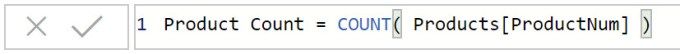
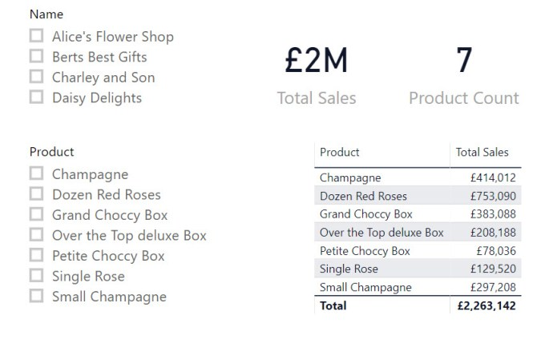
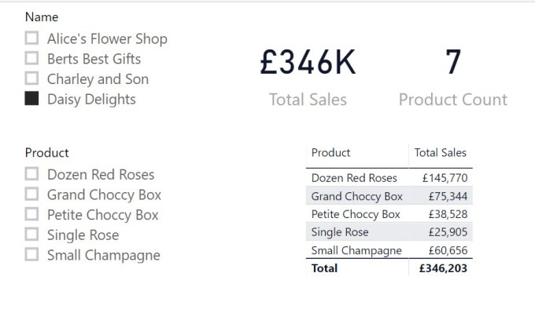
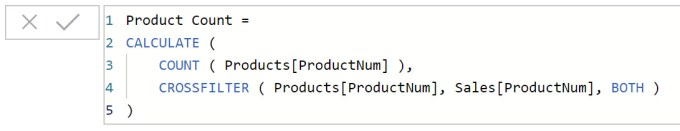
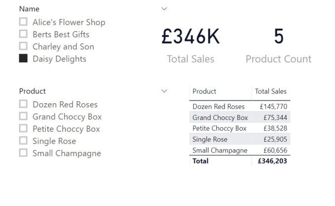

In this post I am continuing my campaign against bi-directional relationships. This is an introduction of the CROSSFILTER function, which can be used to simulate the bi-directional relationship in a calculation.

## The Problem

Yesterday I posted regarding [Cascading Filters](https://hatfullofdata.blog/power-bi-cascading-slicers/) and removing the need for bi-directional joins to filter slicers. Another reason I’ve seen users using the bi-directional filter is to do a calculation.

Using the same example as yesterday, see the link above, I created a measure  to count the number of products.

Then added a card to count the number of products. With no filters applied it shows 7 products which matches the table and the slicer.

Selecting Daisy Delights from the Shop slicer, the table reduces to 5 rows, and after yesterday’s post, the Product slicer also reduces to 5 rows, but the Product Count card still shows 7.

The big bad bi-directional join would be one method to solve this, but that is not good practice and I’m not suggesting that.

## CROSSFILTER Function

The CROSSFILTER function can be used within a CALCULATE function to specify a direction for relationship to be used between 2 tables. The options for the directions are None, One or Both. So I use this in the measure

Now when I select Daisy Delights on the report, the measure shown in the card changes to 5. The card value matches the other filtered elements.

## Conclusion

Keeping data models as simple is vital to allow for reports to be kept maintained in the future. CROSSFILTER function is a great addition to the options for calculating measures.

Microsoft’s documentation can be found at  [https://docs.microsoft.com/en-us/dax/crossfilter-function](https://docs.microsoft.com/en-us/dax/crossfilter-function)