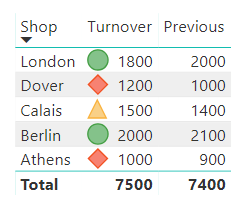
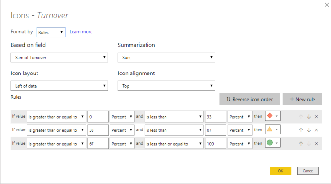
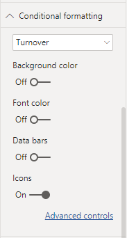
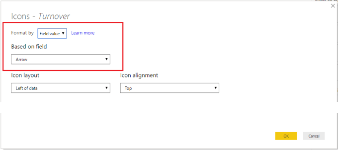
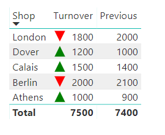

In July 2019 Power BI Desktop update they included new conditional formatting on table and matrix to include icons. These icons can be defined using SVG which is pretty cool. So this is a new post in my Power BI SVG series looking how we can use SVG icons in conditional formatting.

- [Introduction to SVG Basics](https://hatfullofdata.blog/svg-in-power-bi-part-1/)

- [KPI Shapes in Power BI](https://hatfullofdata.blog/svg-in-power-bi-part-2/)

- [Filling up with colour using SVG in Power BI](https://hatfullofdata.blog/svg-in-power-bi-part-3/)

- [Using Text in SVG](https://hatfullofdata.blog/svg-in-power-bi-part-4/)

- [Using SVG Rotate to create a dial in Power BI](https://hatfullofdata.blog/svg-in-power-bi-part-5/)

- [SVG Icons in Conditional Formatting](https://hatfullofdata.blog/svg-in-power-bi-part-6-new-icon-conditional-formatting/)

- [Using a Theme to add SVG Icons](https://hatfullofdata.blog/svg-in-power-bi-part-7-using-theme-svg-icons/)

- [Feb 2023 Update – 5 SVG Stars](https://hatfullofdata.blog/power-bi-5-stars-svg/)

### Quick Overview of Icon Conditional Formatting

Once you have added a table or matrix visual to your report you can in formatting in the Conditional Formatting Section turn on Icons. This will immediately add icons to the selected column. In the example below icons were added to Turnover column.



Clicking on Advanced controls link opens options behind the selection of icons. The default rules are for 3 icons at 


In this post though I’m looking at using SVG to define and select the icon. So I will not be using rules but will be using a measure. The example is going to be based on a measure written in a previous post, [KPI Shapes in Power BI](https://hatfullofdata.blog/svg-in-power-bi-part-2/) The measure decides on an up or down arrow based on another measure called Growth.

Copy CodeCopiedUse a different Browser
```xml
Arrow = 
// Variables to store arrow paths
var uparrow = ""
var downarrow = ""

// Select arrow to use
var arrow = IF([Growth]>=0,uparrow,downarrow)

// Insert arrow into SVG
var svg ="data:image/svg+xml;utf8," &
         ""
            & arrow & 
         ""

RETURN svg
```


The arrow is in its own column and doesn’t resize with font sizes. With the Icon update we can add the icon to any column.



- Select your table visual

- In visual format, expand Conditional Formatting

- Select the column and turn on Icons

- Click on Advanced Controls

- Change Format to Field Value

- Change Based on Field to the measure, eg Arrow

- Click OK





### Conclusion

Icons update is an exciting one and much needed. It cuts out the need for SVG for many, which is great. Now with a little SVG we can add some conditional formatting without having to add the extra column.

## More Power BI Posts

- [Conditional Formatting Update](https://hatfullofdata.blog/power-bi-conditional-formatting-update/)

- [Data Refresh Date](https://hatfullofdata.blog/power-bi-data-refresh-date/)

- [Using Inactive Relationships in a Measure](https://hatfullofdata.blog/power-bi-inactive-relationships-in-a-measure/)

- [DAX CrossFilter Function](https://hatfullofdata.blog/power-bi-dax-crossfilter-function/)

- [COALESCE Function to Remove Blanks](https://hatfullofdata.blog/power-bi-coalesce-function-to-remove-blanks/)

- [Personalize Visuals](https://hatfullofdata.blog/power-bi-personalize-visuals/)

- [Gradient Legends](https://hatfullofdata.blog/power-bi-gradient-legends/)

- [Endorse a Dataset as Promoted or Certified](https://hatfullofdata.blog/power-bi-endorse-a-dataset/)

- [Q&A Synonyms Update](https://hatfullofdata.blog/power-bi-qa-synonyms-update/)

- [Import Text Using Examples](https://hatfullofdata.blog/power-bi-import-text-using-examples/)

- [Paginated Report Resources](https://hatfullofdata.blog/paginated-report-resources/)

- [Refreshing Datasets Automatically with Power BI Dataflows](https://hatfullofdata.blog/refreshing-datasets-automatically-with-dataflow/)

- [Charticulator](https://hatfullofdata.blog/charticulator-simple-custom-chart/)

- [Dataverse Connector – July 2022 Update](https://hatfullofdata.blog/power-bi-dataverse-connector-july-2022-update/)

- [Dataverse Choice Columns](https://hatfullofdata.blog/power-bi-dataverse-choices-and-choice-column/)

- [Switch Dataverse Tenancy](https://hatfullofdata.blog/power-bi-switch-dataverse-tenancy/)

- [Connecting to Google Analytics](https://hatfullofdata.blog/power-bi-connecting-to-google-analytics/)

- [Take Over a Dataset](https://hatfullofdata.blog/power-bi-take-over-a-dataset/)

- [Export Data from Power BI Visuals](https://hatfullofdata.blog/export-data-from-power-bi-visuals/)

- [Embed a Paginated Report](https://hatfullofdata.blog/power-bi-embed-a-paginated-report/)

- [Using SQL on Dataverse for Power BI](https://hatfullofdata.blog/using-sql-on-dataverse-for-power-bi/)

- [Power Platform Solution and Power BI Series](https://hatfullofdata.blog/power-platform-solution-and-power-bi-part-1/)

- [Creating a Custom Smart Narrative](https://hatfullofdata.blog/power-bi-creating-a-custom-smart-narrative/)

- [Power Automate Button in a Power BI Report](https://hatfullofdata.blog/power-automate-button-in-a-power-bi-report/)

## Power BI Series

- [SVG in Power BI series](https://hatfullofdata.blog/svg-in-power-bi-part-1-svg-basics/)

- [Power BI and Project Online series](https://hatfullofdata.blog/power-bi-connecting-to-project-online/)

- [Slicers series](https://hatfullofdata.blog/power-bi-slicers-introduction/)

- [Dataflow series](https://hatfullofdata.blog/power-bi-create-a-dataflow/)

- [Power BI SVG series](https://hatfullofdata.blog/svg-in-power-bi-part-1-svg-basics/)

- [Power Automate and Power BI Rest API series](https://hatfullofdata.blog/power-automate-and-power-bi-rest-api/)

- [Power BI and DevOps series](https://hatfullofdata.blog/devops-data-into-power-bi/)

