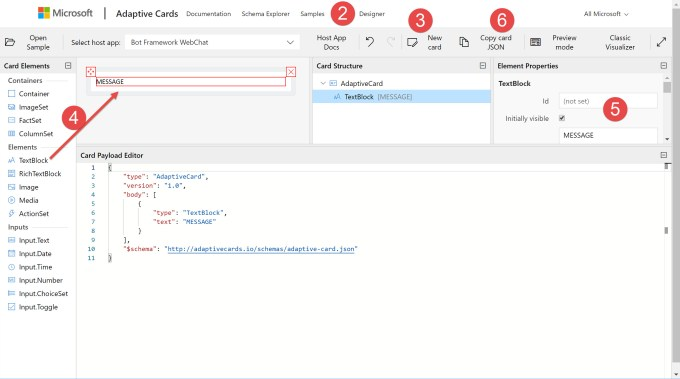
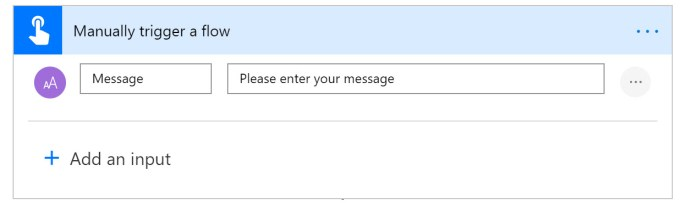
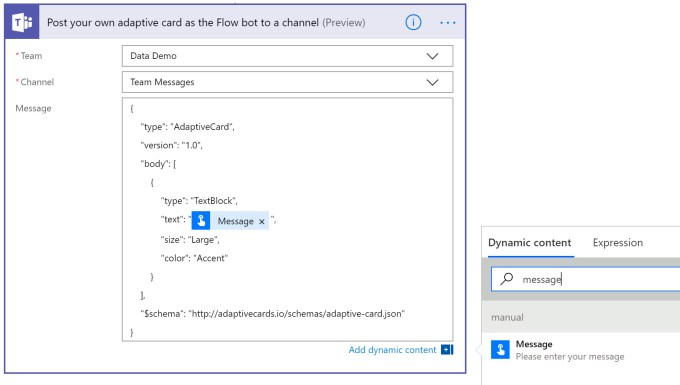
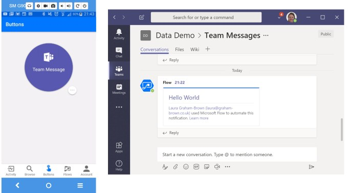

This post is to support a video posted on YouTube regarding creating adaptive cards for Microsoft Teams using Power Automate.

## Designing an Adaptive Card

Before you can post an adaptive card to a team you need to design the card. Cards are designed online on an interactive website that will build the JSON definition for you. In this post we will create a very simple card.

::: info Instructions
- Visit  [https://adaptivecards.io/](https://adaptivecards.io/)

- Click on Designer on the top navigation

- Click on New Card
- Drag TextBlock elements from the options on the left into the Card. Double 
click on the text to change the text.

- Make changes to the layout and style as required. The JSON defining the card will be updated.

- Click Copy card JSON to copy the code to the clipboard.

:::

Other elements could be added to the card and formatted as required.

## Writing the Flow

For this post the flow is going to be very simple. I start by adding a button trigger with a single string input called Message.

Under the Teams connector, I find the Post your own adaptive card as the Flow bot to a channel. I select the Team and Channel that I want the message to go to.

In the message I paste the Adaptive cards code copied earlier. I double click on the MESSAGE and then click in the Dynamic Content pane on Message to replace the text.

## Running the Flow

The flow can be run from your phone and the Flow app. Typing in a message will add the card to the channel in Teams.

## Conclusion

This is a very simple example of an adaptive card being posted in Teams. The possibilities are endless and are a great next step up from sending email notifications to multiple people.