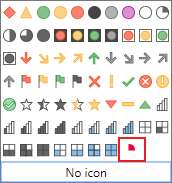
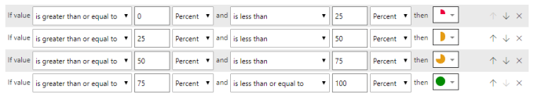
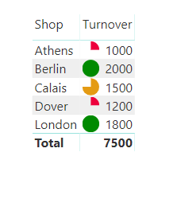

---
title: SVG in Power BI Part 7 – Using a Theme File to add SVG Icons
description: As part of the July 2019 update there were changes to conditional formatting. In this post I am going to cover adding to or swapping the built in icons using a theme file and some SVG.
slug: svg-in-power-bi-7-using-theme-file-svg-icons
date: 2019-08-13 13:01:24+0000
lastmod: 2025-02-14 12:46:47+0000
image: cover.png
categories:
    - Power BI
    - SVG
    - Updates
---



As part of the July 2019 update there were changes to conditional formatting and I covered the use of SVG based measures to add icons in part 6 of this series. In this post I am going to cover adding to or swapping the built in icons using a theme file and some SVG.

### Overview of Theme Files

Theme files are a JSON file with instructions for formatting your visuals. The formatting can include colours, fonts and now icons. Details of how to construct and use a theme file can be found in the links below.

[https://docs.microsoft.com/en-us/power-bi/desktop-report-themes](https://docs.microsoft.com/en-us/power-bi/desktop-report-themes)

[https://powerbi.tips/tools/report-theme-generator-v3/](https://powerbi.tips/tools/report-theme-generator-v3/)

### Adding New SVG Icons

Icons is a new section for the theme file. It is at the same level as the name. You need a name, url and description for the icon. I can see no evidence of the name or description being used. Please correct me if I am wrong.

The url can be SVG code in a similar format to the measures from previous posts. So in this example my first icon is a red quarter of a circle. Below is the SVG code for the shape.

```xml
data:image/svg+xml;utf8, 

```

A simple theme file to create one extra icon would look like

```xml
{
    "name": "New Icons",
     "icons": {
          "complete025": {
               "url": "data:image/svg+xml;utf8, ",
               "description": "25% Complete"
          }
	}
}
```

This adds a single icon to the icons available in conditional formatting. It will be listed at the end of the icon list.



I then expanded the list of icons to cope with 25%, 50%, 75% and 100% going from red through amber to green.After applying the the theme to my report I created conditional formatting rules to a table to use my new icons.

```xml
{
     "name": "Percent Icons",
     "icons": {
          "complete025": {
               "url": "data:image/svg+xml;utf8, ",
               "description": "25% Complete"
          },
          "complete050": {
               "url": "data:image/svg+xml;utf8,  ",
               "description": "50% Complete"
          },
		  "complete075": {
				"url":"data:image/svg+xml;utf8,  ",
				"description":"75% Complete"
		  },
         "complete100": {
               "url": "data:image/svg+xml;utf8,  ",
               "description": "100% Complete"
         }
     }
}
```





## Conclusion

Adding a few extra icons to report is great. I am concerned that adding lots of complex icons will just make the report slow.

In Microsoft’s announcement they say you can replace existing icons using a theme file. For this you need the resourceKey for the icons. I have not been able to find a list of icons and the example they give didn’t work for me.

