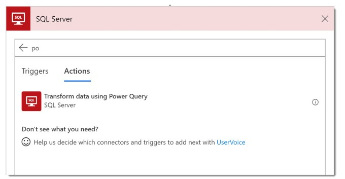
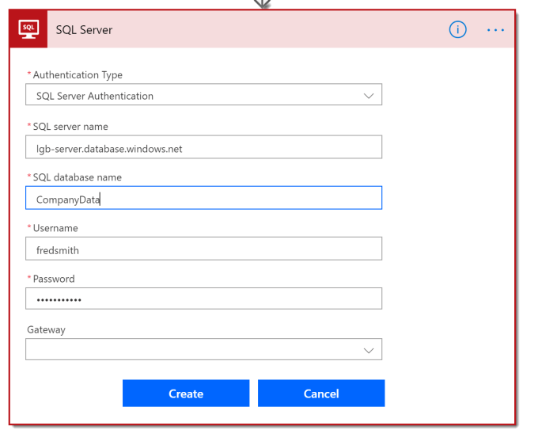
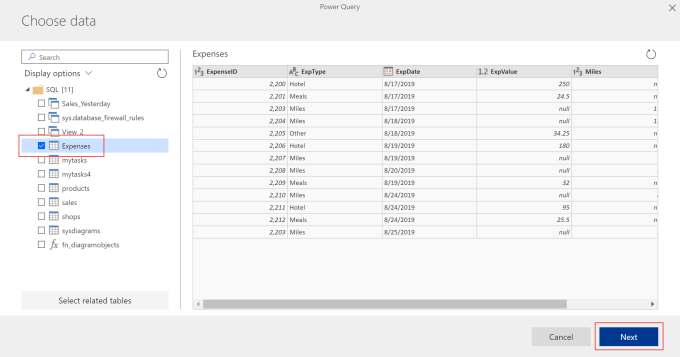
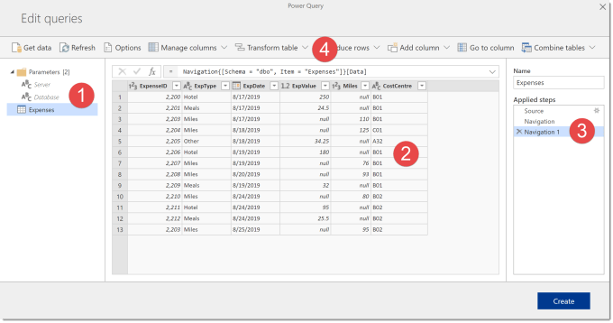
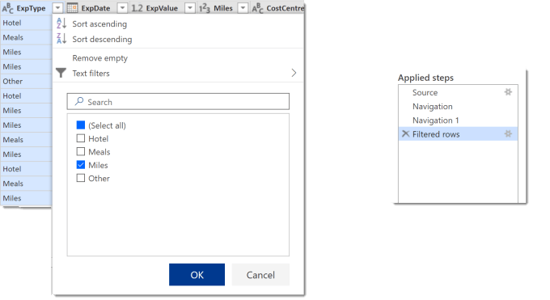
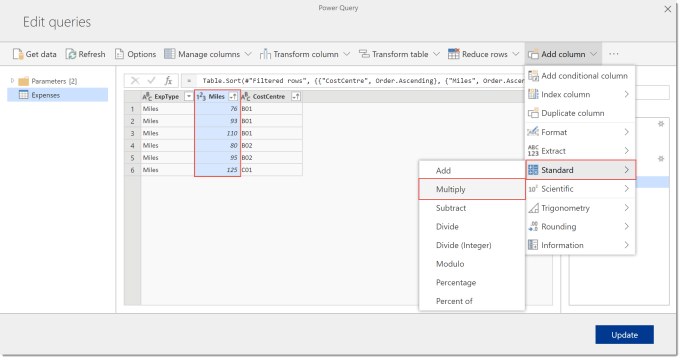
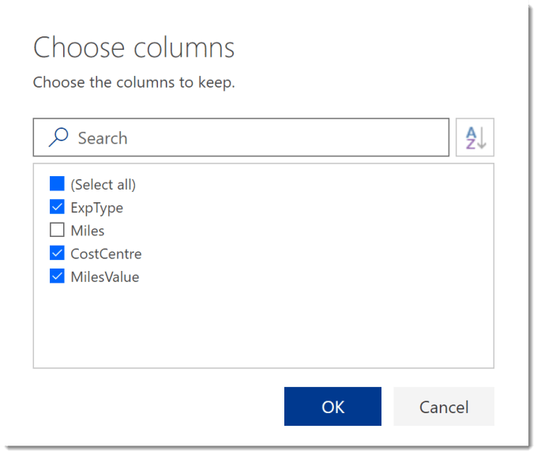

This is the first post in a new series regarding Power Query in Microsoft Flow. In this post I will cover the basics of connecting to SQL Server and using Power Query to filter and sort the data and finally add calculated columns.

This series assumes that you are not a user of Power Query desktop from Excel or Power BI.

Here is a list of all the posts in the series so far.

- [Introducing Power Query in Microsoft Flow](https://hatfullofdata.blog/power-query-in-microsoft-flow-1/)
- [Joining tables of data in Flow’s Power Query](https://hatfullofdata.blog/power-query-in-microsoft-flow-2/)
- [Summarising Data in Flow’s Power Query](https://hatfullofdata.blog/power-query-in-flow-3/)

### Introduction to Power Query in Microsoft Flow

In September 2018 Microsoft announced the integration of Power Query Online for Microsoft Flow. The reasons were to offer an alternative to OData and SQL for getting data from SQL Server connector. They included a hint that other data sources will come in the future but no details when or what.

For those coming from Power Query for Excel or Power BI you need to understand you are currently limited to data stored in SQL Server online or server via a gateway. Also the Power Query Online environment is not as powerful as the desktop app version. It is still written in M, so you can do many of the transformations you can in Excel and Power BI’s Power Query.

### Connecting to the Database

Our first action is to connect Power Query to the data. Power Query action is from the SQL Server connector.

If this is the first time you’ve connected to the database you will be prompted for database details and the user id to use with a password.

Then the action then changes to just show a button. This means you have connected to the database successfully.

### Selecting Data to Transform

When you click the Edit Query button for the first time, you will be presented with the tables and views in the database. You need to tick the tables and views that you need. For this post I’m just going select a single table Expenses and then click Next.

The next window is the main Online Power Query window, where we will add steps to transform your data.

- List of parameters and tables

- View of the data at the current step

- List of steps

- Toolbar used to add new steps

### Filtering Data

One of the most common requests on data is to filter the values. Clicking on the arrow next to column header will show you a list of values with tick boxes. Un-tick the unrequired values to filter your data. When you do this it will add a new step to the applied steps.

When you want to change the filtered value, you need to click the cog wheel next to the step. You can click on X to remove any step.

### Sorting Data

When you click the drop down arrow next the column heading, you can select Sort ascending or Sort descending. The first time you select sort, the data gets sorted and a new step is added to the applied steps.

If you then sort another column, the existing step is just extended to add the next column to the sort. This is similar to adding a new sort level in Excel.

### Adding Columns

One of the most powerful parts of Power Query is to add columns using calculations. The interface can be really clever and also limited and drives me nuts which is perhaps a blog post all of its own.

If you select a column and then click Add Column from the top ribbon you will get offered choices based on the column type. For example, if you have selected a number column you get offered Standard, Scientific and Trigonometry functions and rounding plus others.

The result of the calculation is placed in a new column.

When you select multiple columns before selecting Add column, calculations to combine the columns are offered, such as difference between dates.

### Renaming and Selecting Columns

You can rename any column by double clicking on the column header and typing in a new name. The first column you rename will add a new step to the query. If you rename another column straight after the Renamed Columns step is extended.

It is always a good idea to only return the columns that are required by the Flow. Under Manage Columns you can select Choose columns. When the dialog is selected, you can tick or un-tick any column.

The choose columns step has a cog wheel so can be modified at any point. I recommend you use this step rather than delete columns as that cannot be tweaked using the cog wheel.

### Finishing

When you have finished transforming your data you can click Create on a new query or Update if you are editing an existing query. You can now use the data returned just as you would for getting items from any source.

### Resources for Power Query in Microsoft Flow

As always there are a selection of resources out on the web.

•Microsoft [https://flow.microsoft.com/en-us/blog/powerquery-flow/](https://flow.microsoft.com/en-us/blog/powerquery-flow/)

Chris Webb[https://blog.crossjoin.co.uk/2018/09/26/using-power-query-and-microsoft-flow-to-automate-the-creation-of-csv-files/](https://blog.crossjoin.co.uk/2018/09/26/using-power-query-and-microsoft-flow-to-automate-the-creation-of-csv-files/)

Erik Svensen[https://eriksvensen.wordpress.com/2018/09/25/powerquery-everywhere-now-in-microsoftflow-as-well/](https://eriksvensen.wordpress.com/2018/09/25/powerquery-everywhere-now-in-microsoftflow-as-well/)

### Conclusion

Power Query is a great addition to the Flow tool set. I am really hoping for more data sources to be allowed and for the online Power Query to include more features from the desktop version.

This is just an introduction so I will include best practices and further features.

