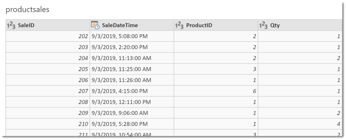
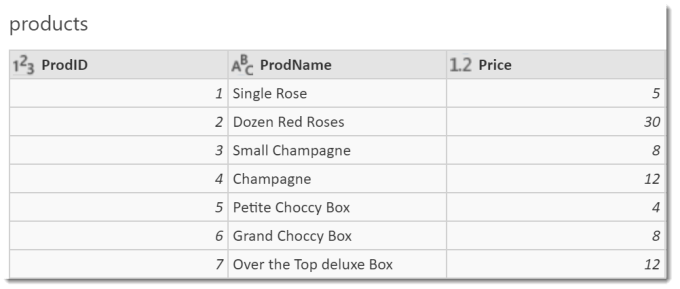
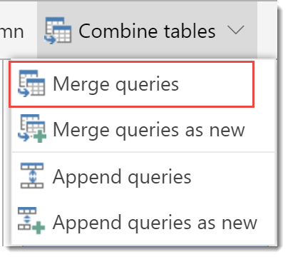
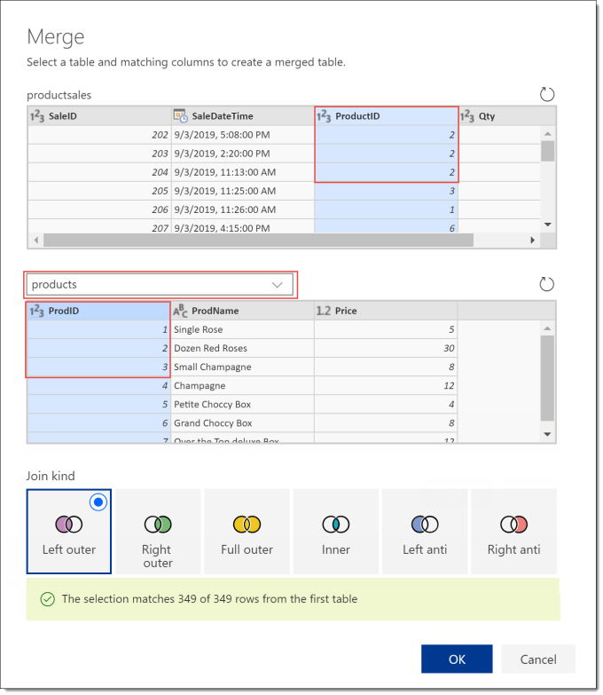
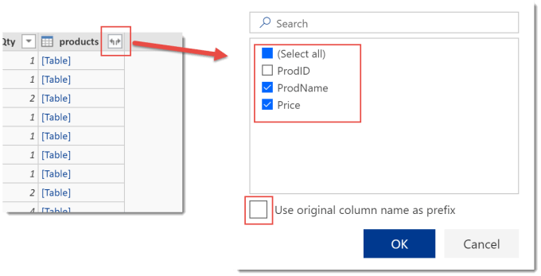
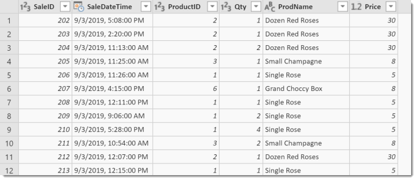

This is the second post in my series regarding Power Query in Flow. In this post I will introduce one of the most powerful parts of Power Query, joining tables. Its the vlookup part of Power Query.

Here is a list of all the posts in the series so far.

- [Introducing Power Query in Microsoft Flow](https://hatfullofdata.blog/power-query-in-microsoft-flow-1/)
- [Joining tables of data in Flow’s Power Query](https://hatfullofdata.blog/power-query-in-microsoft-flow-2/)
- [Summarising Data in Flow’s Power Query](https://hatfullofdata.blog/power-query-in-flow-3/)

### Introduction

If you have made best buddy friends with your dba (database administrator) then this post is possibly not required because if your dba will write a view to do the join for you, that is always better. BTW in my experience, dbas like biscuits.

For those who don’t have access to their dba or haven’t bought enough biscuits this what we are going to do. My database contains a table called productsales.

In the Product Sales table is a ProductID column. I am going to use this value to merge in the values from the Product table (i.e. joining tables) so I can get the name and price.

### Multiple Tables

We start by adding both tables to our query. If multiple tables are in a query, Power Query only returns one table. You can tell which table will be returned by looking at the list of tables. The tables with italic names will not be returned, therefore the un-italicised table will be returned.

Right click on a table name to open the menu. Then select Enable Load to change the table that will be loaded. In this example I will select that productsales will be loaded.

### Merging tables

We want to add the product name and product price to product sales tables. We will do this by merging the two tables.

Select the productsales table. Then from the toolbar, select Combine Tables and Merge Queries.

In the Merge dialog that appears select table you wish to merge with in the drop down, in my example I select products table. Then click on the columns that match, in my example I select product id in both tables.

Leave the join kind as Left Outer as this will keep all the sales records and find matching products. Further details of join types can be found on Radacad’s site.  [https://radacad.com/choose-the-right-merge-join-type-in-power-bi](https://radacad.com/choose-the-right-merge-join-type-in-power-bi)

### Expanding the table column

Clicking OK will update the table to include a column which contains Tables.

Click on the icon in top right of the new column to display the columns available in the tables. Unselect any un-required columns. Unselect the Use original column name as prefix to prevent the new columns being named long names for example products.ProdName. Then click OK to add the new columns.

### Conclusion to Joining Tables

Merging is a powerful addition to transforming data. It is better if a view can added to the database by your dba as that will always be more efficient. Power Query merges do offer a great alternative.

