This series of posts is to introduce using an AI Builder Object detect model with Power Automate to get and save predictions and then display these predictions over the images in a Power App.

- [Build the Model](https://hatfullofdata.blog/ai-builder-with-flow-and-power-apps-building-the-model/)

- Save Predictions

- Use Predictions in a PowerApp

### Introduction

In this post I will document building an AI Builder object detect model. We will create the list of items to detect, upload images, identify each image and then train and publish the model. I will be using 2 different types of Lego bricks, 1×2 block and 2×2 block.

This post will be split into multiple parts

- Create Entity to store object names

- Create Model

- Upload and Tag images

- Train Model

### Create Entity to store object names

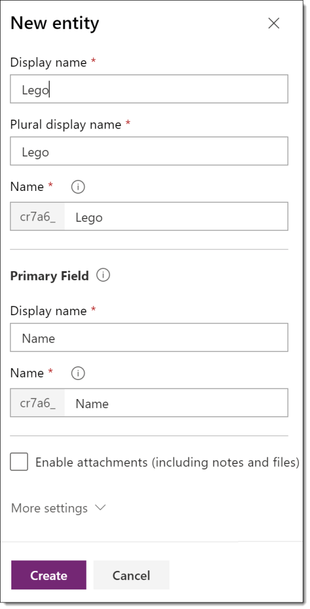

Before we can start building model we need to create a list of object names stored in the Common Data Store (CDS) in an entity.  We need to create the entity and load object names.

We start in Flow.Microsoft.com and then on the left hand menu click Data and then Entities.

From the top ribbon select New entity which will open a pane on the right hand side. Enter a Display Name for the entity. It will complete the other fields for you.

Click Create to create the entity.

The next stage is to add data to the entity. The easiest way to do this is via Excel. Click on the Edit Data in Excel. A file will be downloaded which you need to open in Excel.

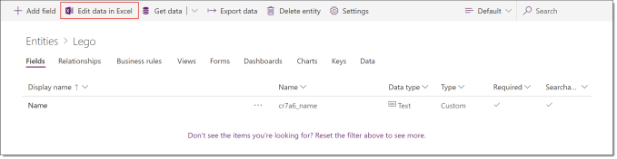

You might need to enable the feature to get the pane to the feature in Excel. Enter in the Object Names and then click Publish to save the values to your entity.

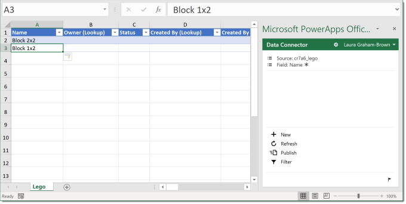

Once the values have been published you can check back in your entity by back on the website and clicking on Data.

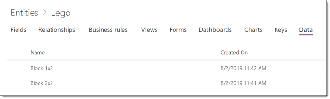

If Excel won’t play ball, and for one client it just won’t, then you can use a very simple flow to add the entries.

### Create the AI Builder Object Detect Model

On the left hand menu select AI Builder and then Build. The AI Builder currently offers 4 types of model. For this post we are going to build an Object detection model, so click on Object Detection. Then enter a name for your model and click Create.

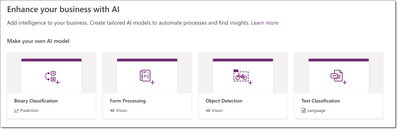

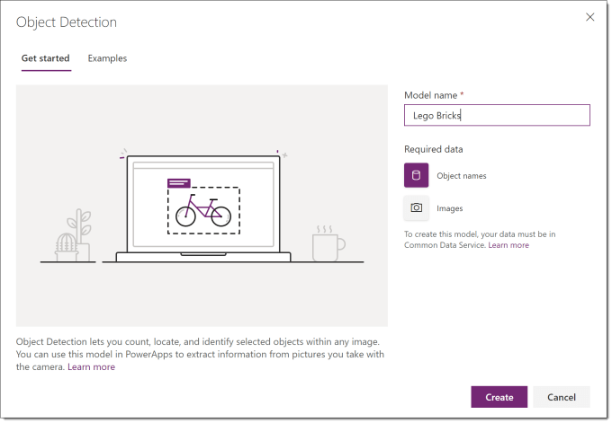

### Select Object Names

The next stage in building the model, is to select the names to be used in the model. Click on select object names. From the panel select the entity you created and tick the Name column and click Select Fields.

On the next screen select the values and click Next.

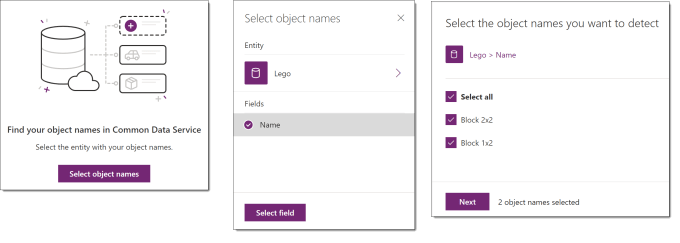

### Add Images

After the object names have been selected you then need to add images for the model to be trained from. Click on the Add Images and this will open a file selection window, select files and click Open.

On the next window it will show all the selected files. Click on Upload to start the upload. When the upload has completed click Close to move onto the next stage.

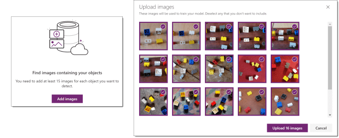

The next window will show you a summary of your uploads. You can click on +Add Images to add more images to improve your model. You need at least 15 images but more is recommended. Click Next to start tagging your images.

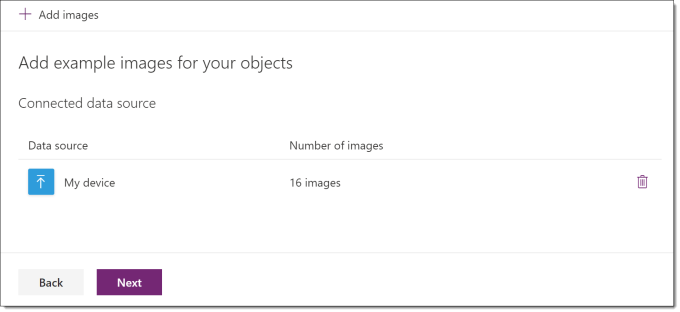

### Tagging Images

The next stage is tagging the images. I recommend a cup of tea, some music because this takes time.

Click Next to start the tagging. Thumbnails of the images will be shown. Click on an image to enlarge that image and start the tagging. You can drag a box of an object or it will suggest objects with a white dotted box. Select the tag to apply.

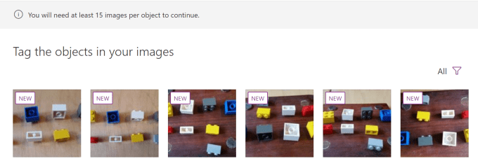

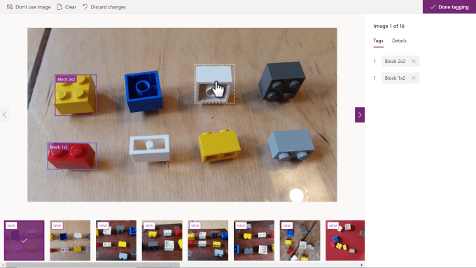

On the right is a summary for this image and on the top ribbon you can choose to not use an image. When you click on the arrow it will move you onto the next image.

When you have tagged all the images, click on Done Tagging in the top right hand corner.

### Train Object Detect Model

When you click Next you get shown the details of your model so far. Click on the Train button to start the training.

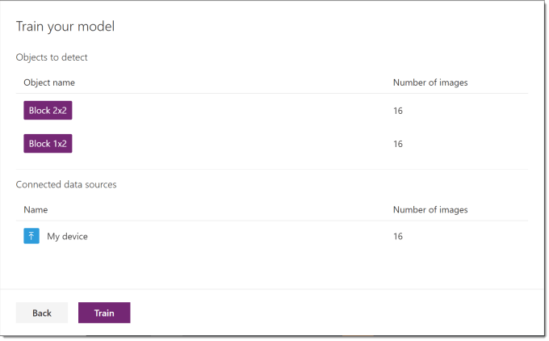

Training takes a while, the above one took 5 minutes to train. I assume its longer when there are more images and more tags. Eventually your list of models will show a time of being trained.

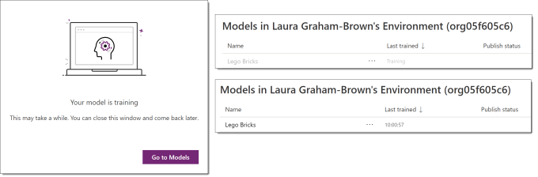

The last step is to publish your object detect model. Click on the model name in the model list and it will show you a score for the training and give you a Publish button. Click the button to publish your model ready to use.

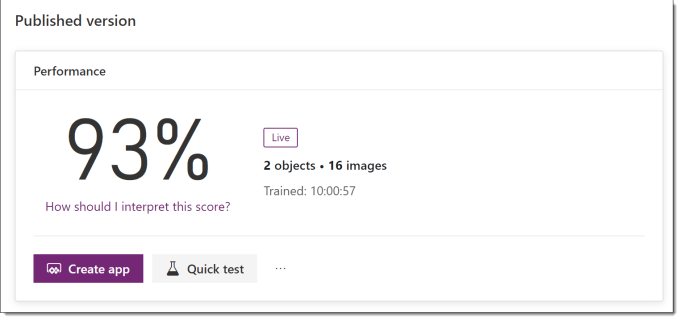

### Conclusion to Object Detect Model

This is a new feature still in preview, so it has its clunky parts, but it brings machine learning firmly into the hands of the citizen developer without any Azure bills.

I really hope in 6 months time I need to write this post again because they’ve added new features and made it slightly less clunky.

## More Power Apps Posts

- [Transparency Update](https://hatfullofdata.blog/powerapps-transparency-update/)

- [Using JSON Feature to Save Pictures](https://hatfullofdata.blog/powerapps-using-json-function-to-save-pictures/)

- [AI Builder Object Detect Model](https://hatfullofdata.blog/ai-builder-object-detect-model/)

- [Function Component](https://hatfullofdata.blog/powerapps-function-component/)

- [SVG in Power Apps series](https://hatfullofdata.blog/powerapps-svg-introduction/)

- [12 Days of Components](https://hatfullofdata.blog/power-apps-12-days-of-components/)

- [Build a Responsive App series](https://hatfullofdata.blog/power-apps-build-a-responsive-app-planning/)

- [Embed a Power BI Chart](https://hatfullofdata.blog/power-apps-embed-a-power-bi-chart/)

