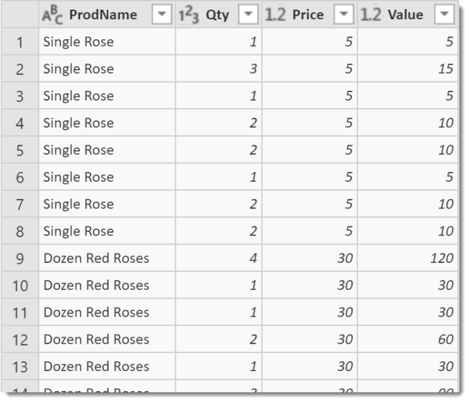
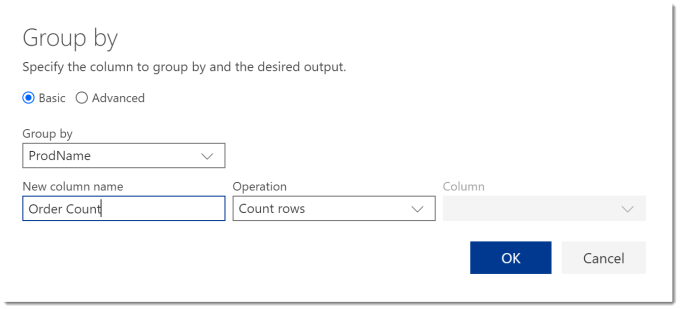
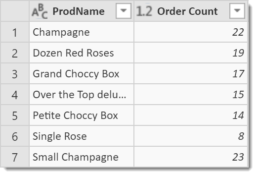
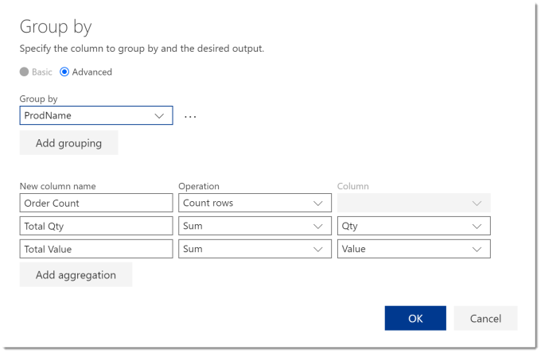
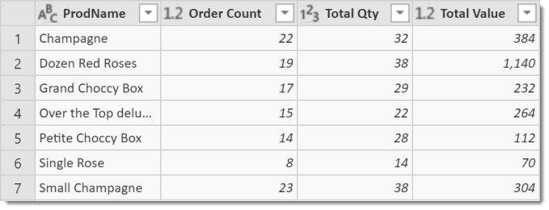
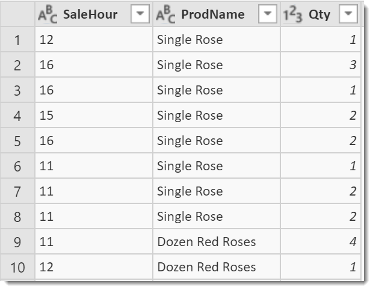
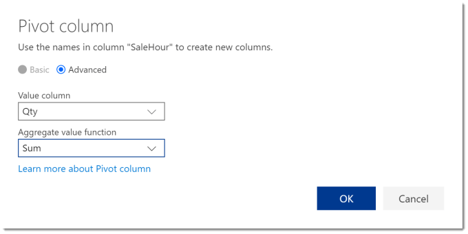
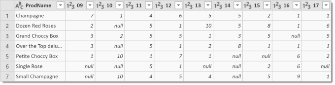

This is the third post in my series regarding Power Query in Flow. In this post I will look at the different options we have for summarising the data using grouping and pivoting with Power Query.

Here is a list of all the posts in the series so far.

- [Introducing Power Query in Microsoft Flow](https://hatfullofdata.blog/power-query-in-microsoft-flow-1/)
- [Joining tables of data in Flow’s Power Query](https://hatfullofdata.blog/power-query-in-microsoft-flow-2/)
- [Summarising Data in Flow’s Power Query](https://hatfullofdata.blog/power-query-in-flow-3/)

### Introduction

Again this post might be redundant if you’ve followed my advice and found out your dba’s favourite biscuits and got them to write you some awesome views in the database.

For those that haven’t got access to the dba lets look at how we can summarise the data. We will look at two different types of summarising the data, firstly grouping and then pivoting. I have assumed you’ve got your data into a simple table using merges etc.

### Using Grouping

In this example we will group by a column and include some summary values. We will group by Product and then summary values of count of orders, total quantity and total value.

This is how the data starts.

On the toolbar click Transform Table and select Group By. We will start with a basic grouping of just one column to group by and one summary column of Order Count.

I selected ProdName for the group by , entered a name for the summary column to give Order Count by counting the rows.

To add more columns to the summary I click on the cog wheel on the Grouped rows step to re-open the group by dialog.

I click on Advanced to open up options to add extra grouping and aggregation options. I click on Add aggregation to add extra columns and change Operation to Sum and Column to total up Qty and Value. Clicking OK updates the table.

### Using Pivoting

Pivoting is a form of grouping that splits the data across a number of columns, for example total sales for each product across hours of the day. The first step is to reduce your table into just the data you need. So include the data for each row title, one set of data to be the column headings and one to be the data summarised.

So I do Select Columns to reduce down to just Product, Hour of Sale and Qty of items sold.

Next, select the column of data that will make the column headings in your pivot. In my example I select the SaleHour column. Then from Transform Column, select Pivot Column.

In the Pivot column dialog, click on Advanced to reveal more options. In the Value column select the value you want to summarise and select the function you to use. Click OK to pivot the data.

### Conclusion

Power Query provides a powerful way for summarising the data ready to process within the flow. As I stated earlier a view written by a dba would be more useful and quicker.

