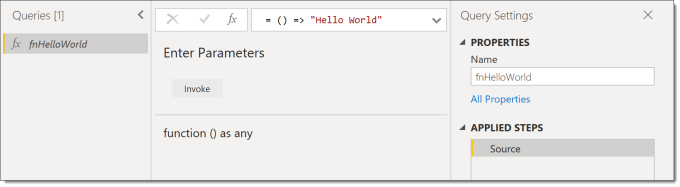
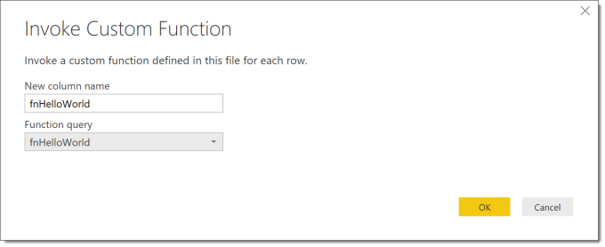
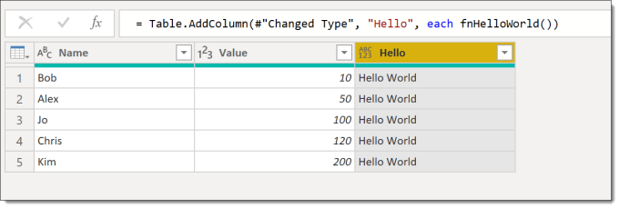
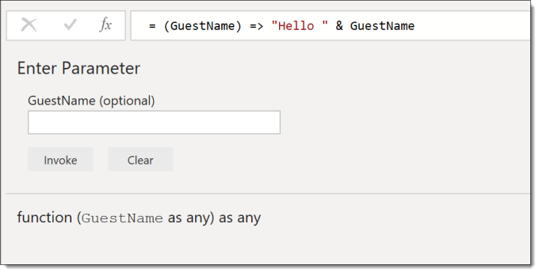
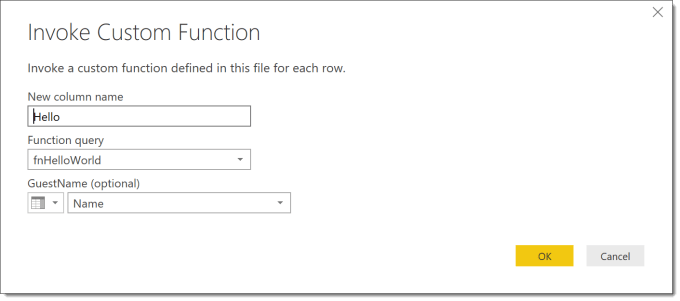
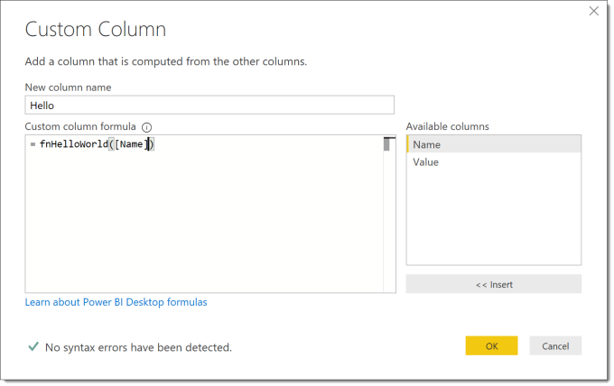
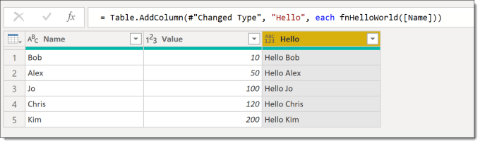
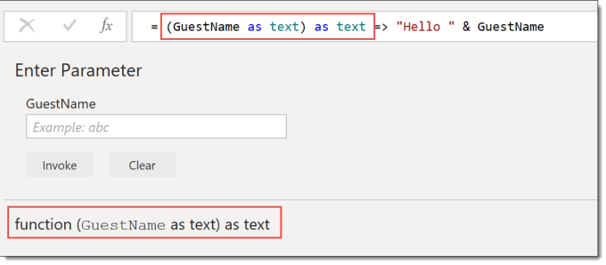
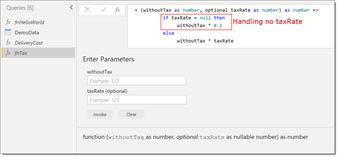
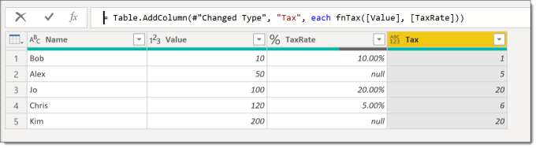

---
title: Power Query – Custom Handwritten Function
description: In this post I will write a simple custom handwritten function to perform a calculation, which can then be used in your queries.
slug: power-query-handwritten-function
date: 2019-09-27 17:50:43+0000
lastmod: 2025-02-13 12:31:52+0000
categories:
    - Intermediate
    - M
    - Power BI
    - Power Query
---

### Introduction

In this post I will write a simple custom handwritten function to perform a calculation based off a parameter. We will then expand that function to include data types and optional parameters.

For those who are new to programming  a function is a piece of code that returns some data, which could be a single value, record or table of data. If you ever need to duplicate a calculation more that twice then it is worth considering writing a function.

This series is to support my sessions at Data Relay 2019 and will cover the topics in the session.

- [Handwritten Functions](https://hatfullofdata.blog/power-query-handwritten-function/)
- [Multi-step Functions and Parameters](https://hatfullofdata.blog/power-query-multi-step-function/)
- [Using functions to fetch web data](https://hatfullofdata.blog/power-query-fetch-web-data/)
- [Executing SQL procedures from functions](https://hatfullofdata.blog/power-query-function-to-execute-a-procedure/)

### The Hello World function

Every programming 101 course includes some sort of Hello World function as the introduction. I would hate to break tradition.

In Power Query we add a Blank Query and we get a blank formula bar. Enter in the following code.

```xml
= () => "Hello World"
```

When you press return the blank query will be converted into a custom function. It gains an fx in the Queries list. It can be renamed in the Query Settings just like a query.



The function can then be used to create a column in a table. From the Add Column ribbon tab, click Invoke Custom Function. Enter in a name for the new column and select the new function from the list.



This will add a column to your data. This example is a pretty useless example of just Hello World but tradition has been done and we are now ready to move to the next stage.



### Adding a parameter to our Handwritten Function

The Hello World function just returned one value, which has a very limited use. So now we will add a parameter to our function and use that value to change our result to include that message.

Parameter definitions go between the brackets in the definition. I’ve updated the function to be this code and on pressing return will now have details of the parameter required.

```xml
= (GuestName) => "Hello " & GuestName
```



If the function is being used anywhere you will need to modify the function. You can either remove and re-add the function or click the cog wheel on the relevant step. There are two possible windows you will get on clicking the cog wheel.

Editing a working custom function column

Editing a custom function column that returns an error

Your table will now show the result of your updated handwritten function.



### Data Types

I can feel my degree lectures turning in their graves as the above function has no data types specified. You can find many online references as to why adding data types into code is good practice, for this post please accept it is good practice and good practice usually leads to cleaner and faster code.

The fnHelloWorld has a parameter that is text and it returns some text. So we can adjust the code with “as text” after the GuestName parameter and also after the ). It won’t change the function much but it will in the long term be a great habit to adopt.



### Quick Look at If

One of the most used constructs in programming in any language must be the if statement. In order to help you build quick easy functions it is worth noting the syntax.

```xml
if [TEST] then [TRUE RESULT] else [FALSE RESULT]
```

So here is a very simple example of a function that calculates a delivery cost based on if the value is over 100 the delivery is free.


### Optional Parameters

Last topic in this post is to make parameter optional and handling when it is not provided. Optional parameters must be the last parameters defined in your function.

So in my example I’m going to add a column that calculates tax based on the value and the optional tax rate. If no tax rate is given 20% is assumed.

The parameters have to be withoutTax value followed by taxRate as the taxRate is optional. We can test for no taxRate being given by testing for taxRate = null. So our function is

```xml
= (withoutTax as number, optional taxRate as number) as number => 
          if taxRate = null then 
               withoutTax * 0.1 
          else 
               withoutTax * taxRate
```



Adding a tax column to example data shows how Alex’s tax rate is null so the tax is calculated at 10% and Jo’s tax is calculated at the given rate of 20%.



### Conclusion on Handwritten Functions

These are very simple examples of functions but even these can save hours of repeating calculations. When your data has the same cleanup calculations being done to your data over many queries this allows for one function to be used repeatably.

### Resources

I am not the first, and hopefully not the last to write blog posts on writing functions in M for Power Query. Here are a list of the resources I found useful. (If you know of any good ones I’ve missed please let me know!)

- [Chris Webb’s Creating M Functions From Parameterised Queries In Power BI](https://blog.crossjoin.co.uk/2016/05/15/creating-m-functions-from-parameterised-queries-in-power-bi/)
- [Chris Webb presenting at Skills Matter on Working with Parameters and Functions in Power Query/Excel and Power BI](https://skillsmatter.com/skillscasts/10210-working-with-parameters-and-functions-in-power-query-excel-and-power-bi)
- [Lars Schreiber’s Writing documentation for custom M-functions](https://ssbi-blog.de/writing-documentation-for-custom-m-functions/)
- [Ben Gribaudo’s Power Query M Primer](https://bengribaudo.com/blog/2017/11/17/4107/power-query-m-primer-part1-introduction-simple-expressions-let)

