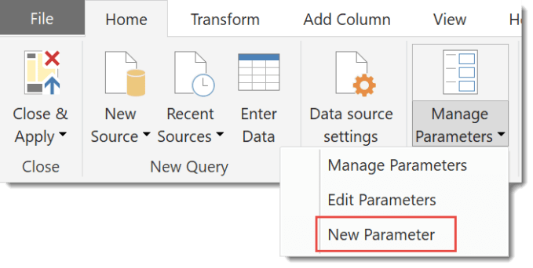
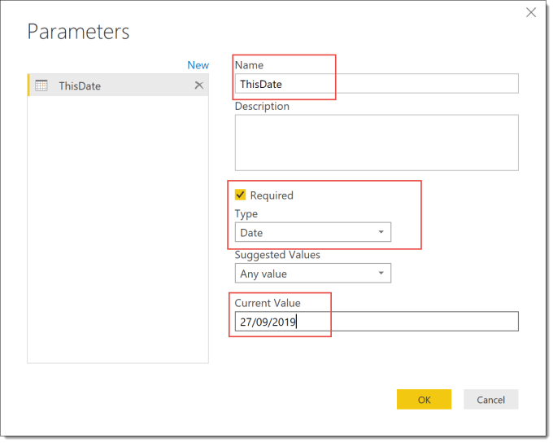
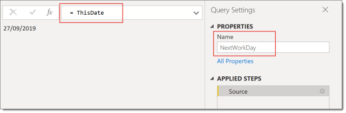
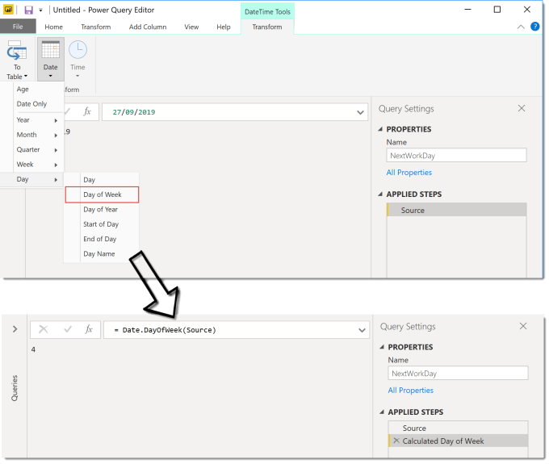
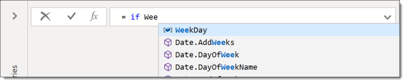
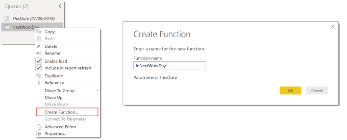
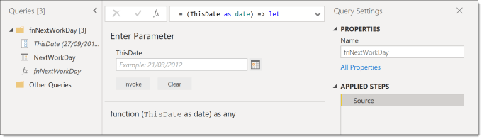
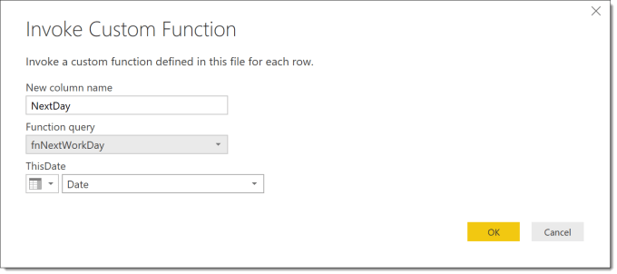
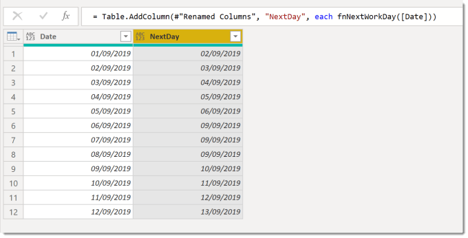

---
title: Power Query – Multi-step Function
description: This post describes how to build a multiple step function in M using a parameter and using create function to build the function code.
slug: power-query-multi-step-function
date: 2019-09-29 17:28:40+0000
lastmod: 2025-02-13 12:29:13+0000
categories:
    - M
    - Power BI
    - Power Query
---

This is the second post in my Writing Functions in M series. This post describes how to build a multi-step function in M to allow for a more complex function. We will create a parameter to base the calculations on and then build a function.

This series is to support my sessions at Data Relay 2019 and will cover the topics in the session.

- [Handwritten Functions](https://hatfullofdata.blog/power-query-handwritten-function/)
- [Multi-step Functions and Parameters](https://hatfullofdata.blog/power-query-multi-step-function/)
- [Using functions to fetch web data](https://hatfullofdata.blog/power-query-fetch-web-data/)
- [Executing SQL procedures from functions](https://hatfullofdata.blog/power-query-function-to-execute-a-procedure/)

### Introduction

In the first post of this series we built a different functions and all of them were a single step calculation. Some functions need to be made up of multiple steps.  The example we will use in this example is to calculate the next working day based on Saturday and Sunday being non-working days.

In simple terms the calculation is simple, if today is a Friday add 3 days, Saturday add 2 days, otherwise just add one day. I realise this could be done with a nested if, I’m using this example as a nice easy one to walk through.

### Creating a Parameter

In order to make writing functions easier we create parameters to store the values passed into our multi-step function. This function will only require a single parameter to store the date which we want to calculate the next working day.



From the Home ribbon tab, select Manage Parameters and the New Parameter. Then enter in a name for the parameter, e.g. ThisDate and select a Type, e.g. Date. Finally add in a Current Value and press OK.



### Calculation Steps

Now we can start creating the function in with a blank query which I have renamed to NextWorkDay. This first step I am going to make equal to the parameter we created, ThisDate. (Remember the = , I have forgotten it too many times)



The first calculation step I am going to add is to calculate the day of the week of the given date. This can be done from the ribbon tab DateTime Tools. Select Date – Day – Day of Week and a new step gets added using the function Date.DayOfWeek.



Rename the step just added to something shorter, e.g. WeekDay.

The next step will be to calculate how many days to add to the date. You can add a new step by clicking on the fx next to the formula bar.

We use an If statement based on the previous step. There is no quick way to add this so you will need to type in formula. The editor does now have intellisense so you should get some assistance in typing in names.



Using the logic described in the second paragraph of the introduction the complete formula is

```xml
= if WeekDay=4 then 3 else 
    if WeekDay=5 then 2 
    else 1
```

And I rename the step to be DaysToAdd to make the next step easier and it should return 1,2 or 3. You can click on any step and see the result, for example clicking on Source gives you the date.

So the final step is to use Source and DaysToAdd to calculate the next working day. We use the function Date.AddDays which requires 2 parameters, a date which is Source and the number of days to add which is DaysToAdd.


We can change the date in the parameter ThisDate to test different dates and check the calculation logic. Now we are ready to convert this to function.

### Creating the Multi-step Function

Power Query includes a quick method to convert a query that uses a parameter into a function.

Right click on the NextWorkDay function and from the menu select Create Function. Enter in a name for the function in the Create Function dialog and press OK.



This will move both NextWorkDay query and ThisDate parameter into a separate group with the new function. If you want to edit the function you need to edit NextWorkDay and it will update the function fnNextWorkDay. You can edit the function directly but it will break the connection with NextWorkDay so debugging will be harder and is not recommended.

### Using your Multi-step Function



The function can now be used in any query in your report by clicking Invoke Custom Column from the Add Column ribbon.





### Conclusion

The quick Create Function ability makes creating and editing the functions much easier. It makes building functions worth doing and not a huge development process.

### Resources

I am not the first, and hopefully not the last to write blog posts on writing functions in M for Power Query. Here are a list of the resources I found useful. (If you know of any good ones I’ve missed please let me know!)

- [Chris Webb’s Creating M Functions From Parameterised Queries In Power BI](https://blog.crossjoin.co.uk/2016/05/15/creating-m-functions-from-parameterised-queries-in-power-bi/)
- [Chris Webb presenting at Skills Matter on Working with Parameters and Functions in Power Query/Excel and Power BI](https://skillsmatter.com/skillscasts/10210-working-with-parameters-and-functions-in-power-query-excel-and-power-bi)
- [Lars Schreiber’s Writing documentation for custom M-functions](https://ssbi-blog.de/writing-documentation-for-custom-m-functions/)
- [Ben Gribaudo’s Power Query M Primer](https://bengribaudo.com/blog/2017/11/17/4107/power-query-m-primer-part1-introduction-simple-expressions-let)

