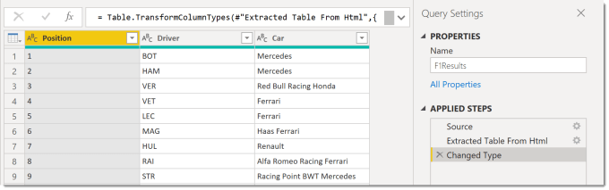
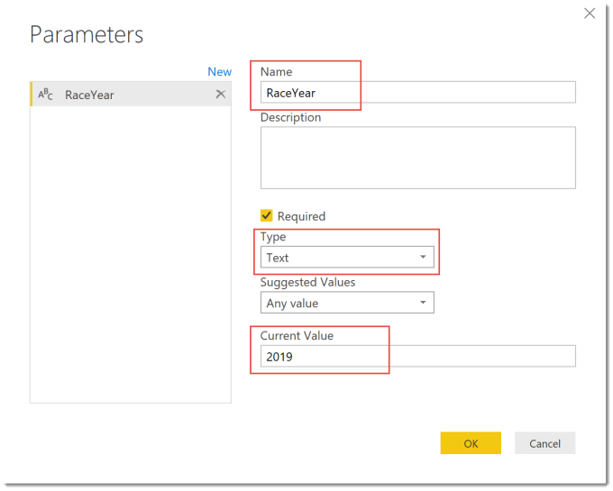
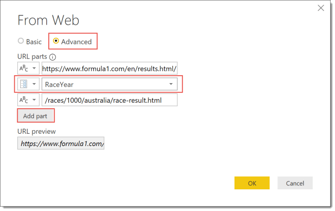
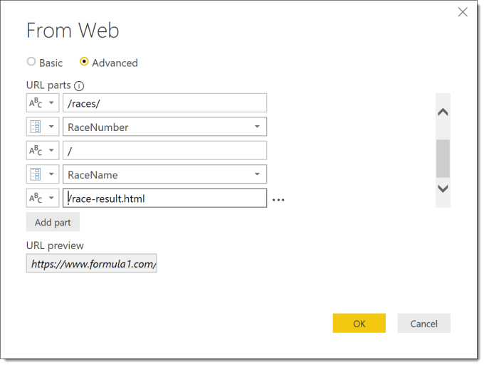
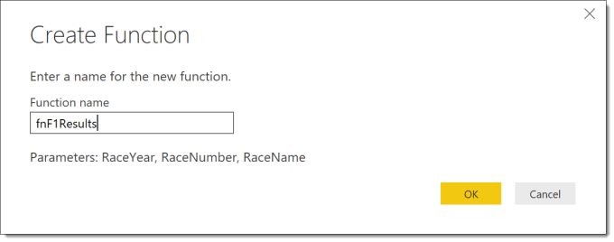
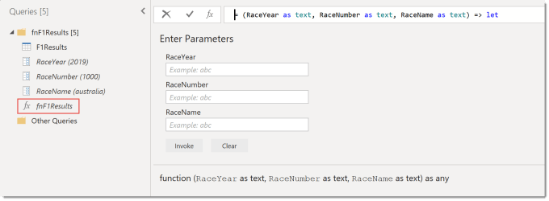
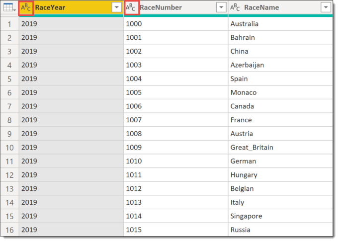
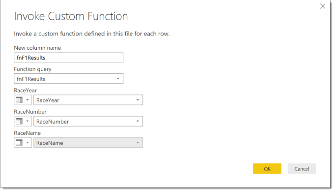
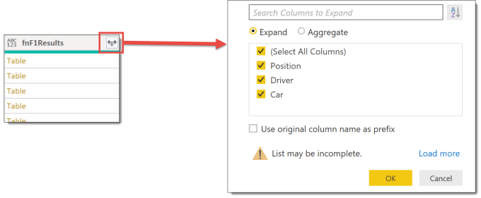
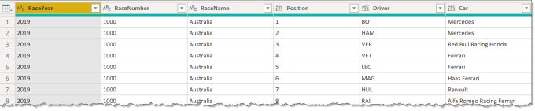

This is the third post in my Custom functions in Power Query series. Often web based data is split across multiple pages using the url to select the data. This post describes how to build a function that populates the parts of the url so multiple pages can be used to fetch web data can be combined.

This series is to support my sessions at Data Relay 2019 and will cover the topics in the session.

- [Handwritten Functions](https://hatfullofdata.blog/power-query-handwritten-function/)
- [Multi-step Functions and Parameters](https://hatfullofdata.blog/power-query-multi-step-function/)
- [Using functions to fetch web data](https://hatfullofdata.blog/power-query-fetch-web-data/)
- [Executing SQL procedures from functions](https://hatfullofdata.blog/power-query-function-to-execute-a-procedure/)

### Initial Query to Fetch Web Data

We start the whole process by fetching data from one page of the web site. for my example in this post I am going to use data from Formula 1 racing. The page I am using as my initial page if for the first race in 2019 in Australia. The url is

```xml
https://www.formula1.com/en/results.html/2019/races/1000/australia/race-result.html
```


I’ve used table by example to extract the data I need. (There is a blog post coming cover table by example.) So I end up with three step query.



### Adding First Parameter to Web Query

The next step is to replace parts of the url with parameters in the Source step. If we look at the url it has three parts that could be made into parameters. The Race Year, Race Number and Race Name. For the the first race in 2019 the values would be :

- RaceYear – 2019

- RaceNumber – 1000

- RaceName – Australia

The first parameter needs to be created before you change the Source step. From the Home ribbon tab, select Manage Parameters, New Parameter.  Then you need to enter in a name for the parameter, a type of text and the current value.  The type has to be text for the parameter to get included in the next step.  Finally click OK to create the parameter.



Now we can start to change the source step in the query. Start by clicking on the cog wheel of the Source step which will open a dialog. Then click on Advanced to give the option to break the URL into parts. You can click on Add Part to add extra rows. The first drop down allows offers Text or Parameter.  If you don’t get the drop down on the left it means you don’t have any text parameters.



### Adding Extra Parameters

Earlier I stated that the url had three parts that could be put into parameters. We can create and add the new parameters inside the From Web dialog. Click Add Part to add a new row. From the new drop down select New Parameter and enter in the details of your new parameter, remember they need to be text.



When you have finished adding new parameter and breaking the url up, click OK to save your changes. Check you still get the correct data from your query.

### Creating Function from Query

We now have a query that can fetch web data which we now need to use to build a function from it..

Right click on your query and select Create Function. Type in a name for the query.



The query and the parameters are all moved into a group and a function is created. If any changes are required in the function, the changes need to be made to the query. If changes are made to the function it will break the link with the query.



### Fetch web data from Multiple pages

I have a list of races with year, number and name in an Excel file which I load into a new query. In order for the function to work the RaceYear and RaceNumber columns need to be text.



From the Add Column click Invoke Function. Type in a New column name and select the function in the drop. Then the parameters for the function will appear. Change the first drop down for each parameter to Column Name and select the column.



When you click the OK button the function will run for every row of the table. This will create a column that contains tables. Click on the icon in the top right of the new column. In the dialog box that appears it will show the columns in the table. I un-ticked the Use original column name as prefix to keep the column names short,



After OK is clicked the column of tables is replaced by the three columns from the table.



### Conclusion

If your data is web based this provides an efficient method of fetching web data into one table only using a few queries and a function.

### Resources

I am not the first, and hopefully not the last to write blog posts on writing functions in M for Power Query. Here are a list of the resources I found useful. (If you know of any good ones I’ve missed please let me know!)

- [Chris Webb’s Creating M Functions From Parameterised Queries In Power BI](https://blog.crossjoin.co.uk/2016/05/15/creating-m-functions-from-parameterised-queries-in-power-bi/)
- [Chris Webb presenting at Skills Matter on Working with Parameters and Functions in Power Query/Excel and Power BI](https://skillsmatter.com/skillscasts/10210-working-with-parameters-and-functions-in-power-query-excel-and-power-bi)
- [Lars Schreiber’s Writing documentation for custom M-functions](https://ssbi-blog.de/writing-documentation-for-custom-m-functions/)
- [Ben Gribaudo’s Power Query M Primer](https://bengribaudo.com/blog/2017/11/17/4107/power-query-m-primer-part1-introduction-simple-expressions-let)

