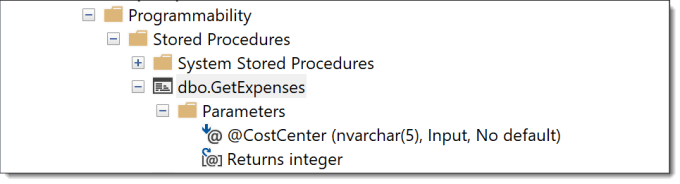
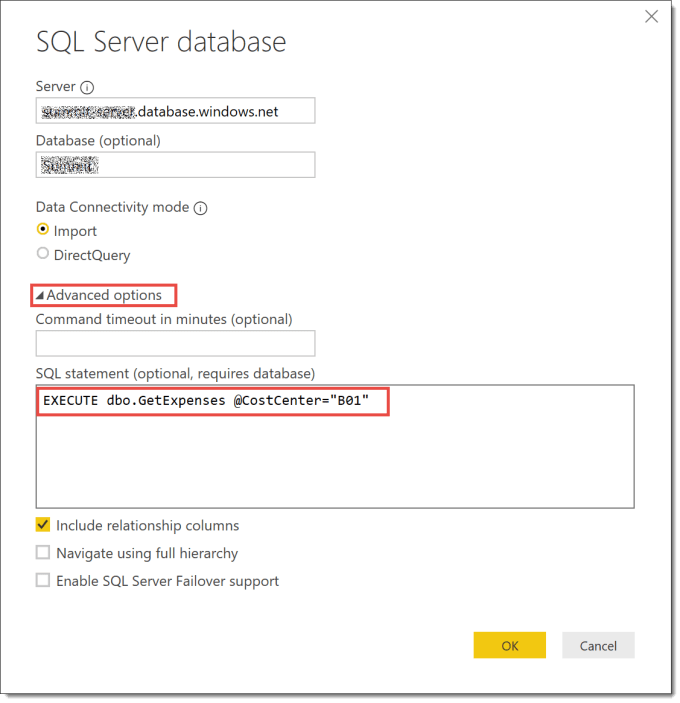
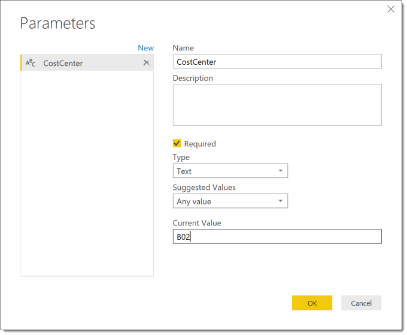
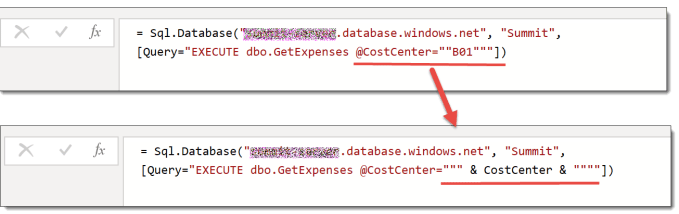
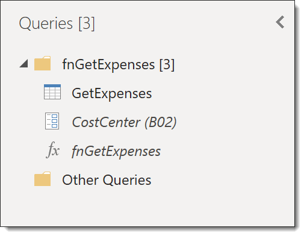
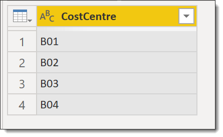
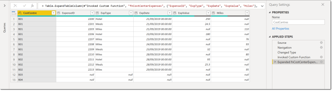
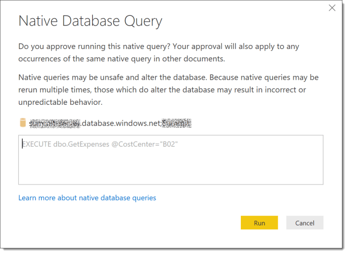
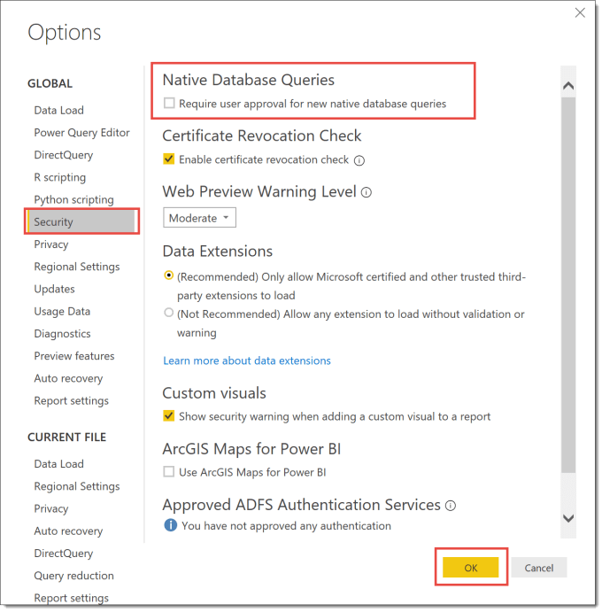

This is the fourth post in my series regarding writing custom functions in Power Query. This post describes how to create a function that will execute an SQL procedure, passing in a parameter.

This series is to support my sessions at Data Relay 2019 and will cover the topics in the session.

- [Handwritten Functions](https://hatfullofdata.blog/power-query-handwritten-function/)
- [Multi-step Functions and Parameters](https://hatfullofdata.blog/power-query-multi-step-function/)
- [Using functions to fetch web data](https://hatfullofdata.blog/power-query-fetch-web-data/)
- [Executing SQL procedures from functions](https://hatfullofdata.blog/power-query-function-to-execute-a-procedure/)

### Stored Procedure

My database contains a very simple procedure that given a cost center returns all the expense records.



It can be run with the following SQL

```xml
EXECUTE dbo.GetExpenses @CostCenter="B01"
```

### Create Initial Query

The initial query will excute a procedure with a fixed parameter being passed to the procedure using the SQL in the previous section.

Add a new source of SQL Server. Fill in the Server and Database and then click on Advanced options to reveal the SQL statement box where you enter the SQL statement to execute the procedure.



Click OK to and then Transform Data to edit the query.  When the query opens it has only one step called Source.

### Create Parameter and Function

After creating the query, we need to create a parameter to store the value to pass into the procedure. So from the Home ribbon tab select Manage Parameters – New Parameter. You need to give the parameter a name and the type Text and lastly a value.



Then we need to edit the Source step of the query to use the above parameter. Remember to get the number of ” correct, you need 2 ” if the ” is inside a string.



When you alter the query you might get a prompt asking for permission to run the query. For now let it run the query, further on in this post I will discuss this further.

After we have included the parameter into the query it is ready to be converted into a function, just as we have done in previous posts. Right click on the query and select Create Function, then enter in a name for the function. As before the query and parameter get moved into a group with the new function.



This function can now be invoked on a table of cost centers to give all the related expenses.





### Changing Security

When you invoke the query you will get a prompt asking for permission to run a native database query. This is a caution to warn you that some SQL is being run which could makes changes to the database.


When you click on Edit Permission you will be shown the SQL that is going to be executed, so you can check it carefully.



This request for permission can be turned off. Click on File and then Options, and then Security. The first option in the dialog is regarding Native Database Queries, by default the require approval is ticked. Be aware this changes it for all queries.



### Conclusion

SQL procedures are a great way to make use of the dba to build the queries you need to fetch the data using your parameters. Obviously this will require many biscuits for the dba. I think there is plenty of scope for functions that execute an SQL procedure.

### Resources

I am not the first, and hopefully not the last to write blog posts on writing functions in M for Power Query. Here are a list of the resources I found useful. (If you know of any good ones I’ve missed please let me know!)

- [Chris Webb’s Creating M Functions From Parameterised Queries In Power BI](https://blog.crossjoin.co.uk/2016/05/15/creating-m-functions-from-parameterised-queries-in-power-bi/)
- [Chris Webb presenting at Skills Matter on Working with Parameters and Functions in Power Query/Excel and Power BI](https://skillsmatter.com/skillscasts/10210-working-with-parameters-and-functions-in-power-query-excel-and-power-bi)
- [Lars Schreiber’s Writing documentation for custom M-functions](https://ssbi-blog.de/writing-documentation-for-custom-m-functions/)
- [Ben Gribaudo’s Power Query M Primer](https://bengribaudo.com/blog/2017/11/17/4107/power-query-m-primer-part1-introduction-simple-expressions-let)

