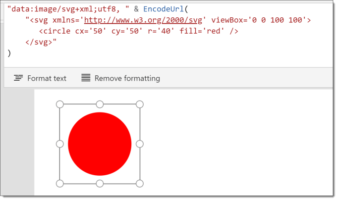
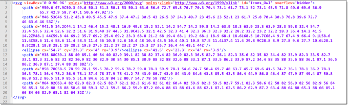
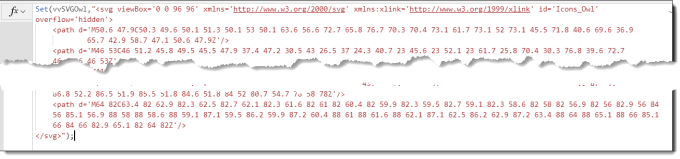
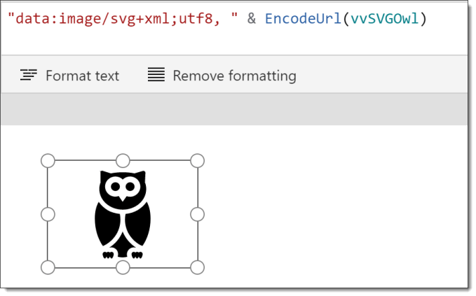

This is the first post in the PowerApps SVG series. In this SVG Introduction post we will cover adding a simple SVG drawing to a PowerApp screen. Future posts will show how to manipulate that image.

### Series

This series is to introduce ideas for using SVG within PowerApps to add graphics to your Apps.

- [Introduction to SVG in a PowerApp](https://hatfullofdata.blog/powerapps-svg-introduction/)
- [Animating SVG colours and sizes](https://hatfullofdata.blog/power-apps-animating-svg-fill-colour-and-size/)
- Multi-part SVGs
- Rotation and Clip Paths

### SVG Introduction

SVG stands for Scalable Vector Graphics and is a language to define a drawing. The drawings are defined by co-ordinates and dimensions which means they can be stretched without loosing definition.

I am not going to give a full introduction to SVG here in this post. I recommend you look at my intro SVG post at  [https://hatfullofdata.blog/svg-in-power-bi-part-1/](https://hatfullofdata.blog/svg-in-power-bi-part-1/) for resources and a brief overview.

### Using SVG in a PowerApp

Given the resources in the post above we can write a very simple SVG statement that would work on a web page with the following code.

```xml

       

```

The above code draws a circle filled in with red. It is centered in the drawing area and if the area is 100px its radius will 40px, and if expanded to to 400px square the radius will expand to 160px.

In order to use the above code we need to do two things, firstly encode the code using the function EncodeUrl and then add a string onto the front stating the format of the image data. So the above code becomes

```xml
"data:image/svg+xml;utf8, " & EncodeUrl(
    "
       
    "
)
```

We use the above code by adding an image control to the app and replacing SampleImage with the above code.



The image can be re-sized and moved and it will remain a sharp red circle.

### More Complex SVG images.

The above example is a very simple red circle. SVG is a complex language that can define very detailed shapes using paths. You can search online or use latest version of Microsoft Office’s Icons saved to disk to get SVG images. For this example I’m going to draw an owl. I saved an icon from PowerPoint as a picture to create this one but I could have found one on the internet.

When I open the SVG in a text editor I can see I have similar top part and bottom parts  and  and between them multiple paths and other drawing elements. I have replaced all double quotes ” with single quotes ‘.



In order to keep my image code simple I am creating a variable, vvSVGOwl, to store the SVG, in the start code of the app.



We can then use the variable in an image to draw the owl in the app. (Remember to execute your start code, I always forget!)



### Conclusion

This post is a quick SVG introduction for PowerApps. Due to the SVG code being flexible and including lots of other options the possibilities for using SVG are endless.

## More Power Apps Posts

- [Transparency Update](https://hatfullofdata.blog/powerapps-transparency-update/)

- [Using JSON Feature to Save Pictures](https://hatfullofdata.blog/powerapps-using-json-function-to-save-pictures/)

- [AI Builder Object Detect Model](https://hatfullofdata.blog/ai-builder-object-detect-model/)

- [Function Component](https://hatfullofdata.blog/powerapps-function-component/)

- [SVG in Power Apps series](https://hatfullofdata.blog/powerapps-svg-introduction/)

- [12 Days of Components](https://hatfullofdata.blog/power-apps-12-days-of-components/)

- [Build a Responsive App series](https://hatfullofdata.blog/power-apps-build-a-responsive-app-planning/)

- [Embed a Power BI Chart](https://hatfullofdata.blog/power-apps-embed-a-power-bi-chart/)

