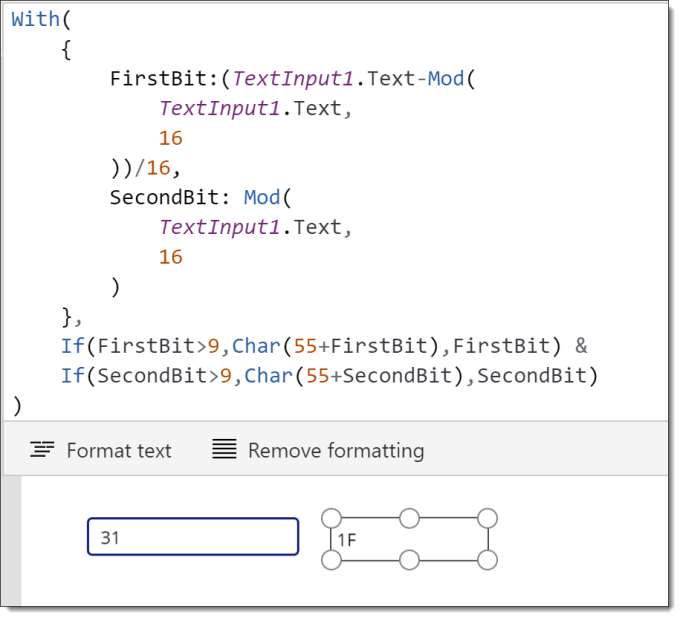
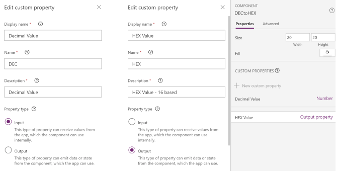
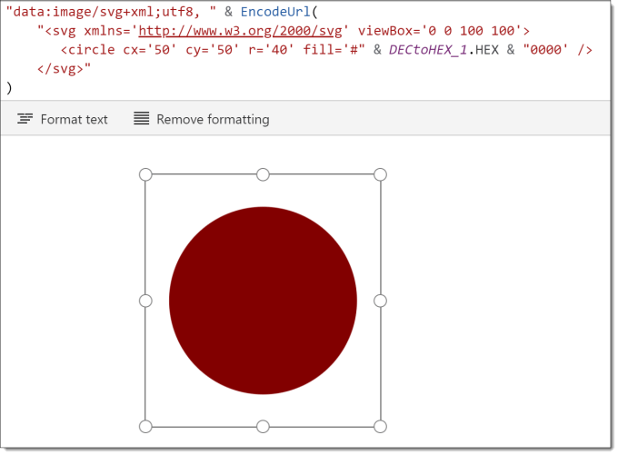

This post is to describe how I solved a problem using a component. The problem was I wanted to have calculation I could reuse. In a more traditional programming environment I would write a function. Components are reusable so it kind of made sense to use one of them as a function component..

### Calculation Details

The calculation I wanted to do was convert a decimal number to a hex number. PowerApps doesn’t have a function to do this so I worked out the calculation. I added a text input to take the decimal number and then a label to contain the calculation.



### Create the Function Component

In my app I had already turned on components and added a new component. [Shane Young does a great intro to components found here](https://www.youtube.com/watch?time_continue=1&v=AqZkUQ78e50). I then added 2 custom properties. DEC is the decimal value as an input to my component like a parameter to a function and HEX as the returned value.



I then clicked on the HEX Value to enter in a the formula as the following code.

Copy CodeCopiedUse a different Browser
```xml
With(
    {
        FirstBit:(DECtoHEX.DEC-Mod(
            DECtoHEX.DEC,
            16
        ))/16,
        SecondBit: Mod(
            DECtoHEX.DEC,
            16
        )
    },
    If(FirstBit>9,Char(55+FirstBit),FirstBit) &
    If(SecondBit>9,Char(55+SecondBit),SecondBit)
)
```

### Using the Function Component

Back on the screen of my app I can use the component using a slider value as the input. I can hide the component as it doesn’t need to be seen.

I needed a HEX value to use in some SVG for an image. In this example I used a slider to determine red value from 0 to 255. I add the component and pass in the slider value into the DEC. I then use the HEX in the SVG code I’m using in an image. See my [Introduction to SVG](https://hatfullofdata.blog/powerapps-svg-introduction/) to explain the SVG part.



I could then add a slider and component for green, blue and transparency to make my image fully adjustable.

### Conclusion

Components as function opens many possibilities and as 2 of my favourite PowerApp builders Hiro and Brian Dang use them I’m going to explore them some more.

### Update

Thanks to [Brian Dang](https://twitter.com/8bitclassroom) for giving me a tidier version of the calculation using nested WITH functions. So the calculation inside the component is now:

Copy CodeCopiedUse a different Browser
```xml
With(
    {
        CalcValue: Mod(DECtoHEX.DEC,16)
    },
    With(
        {
            FirstBit: (DECtoHEX.DEC-CalcValue)/16,
            SecondBit: CalcValue
        },
    If(FirstBit>9,Char(55+FirstBit),FirstBit) &
    If(SecondBit>9,Char(55+SecondBit),SecondBit)
)
```

## More Power Apps Posts

- [Transparency Update](https://hatfullofdata.blog/powerapps-transparency-update/)

- [Using JSON Feature to Save Pictures](https://hatfullofdata.blog/powerapps-using-json-function-to-save-pictures/)

- [AI Builder Object Detect Model](https://hatfullofdata.blog/ai-builder-object-detect-model/)

- [Function Component](https://hatfullofdata.blog/powerapps-function-component/)

- [SVG in Power Apps series](https://hatfullofdata.blog/powerapps-svg-introduction/)

- [12 Days of Components](https://hatfullofdata.blog/power-apps-12-days-of-components/)

- [Build a Responsive App series](https://hatfullofdata.blog/power-apps-build-a-responsive-app-planning/)

- [Embed a Power BI Chart](https://hatfullofdata.blog/power-apps-embed-a-power-bi-chart/)

