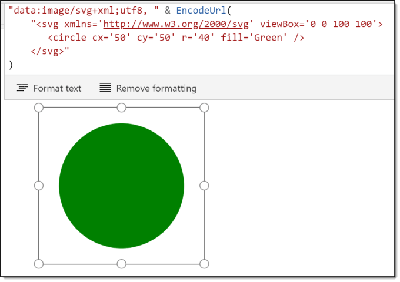
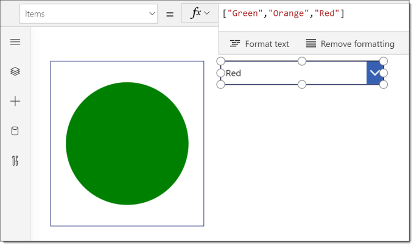
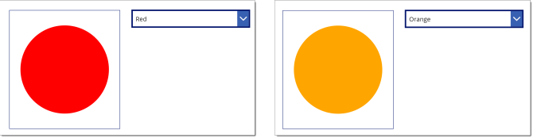
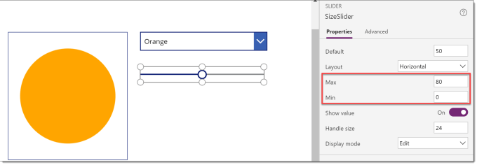
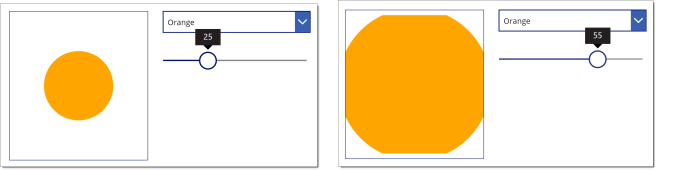
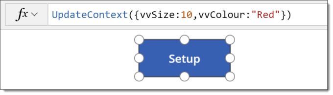
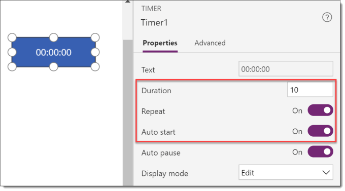

---
title: Power Apps – Animating SVG Fill Colour and Size
description: In this post I will introduce animating SVG by altering the colour and size of the SVG graphic using variables and a timer control.
slug: power-apps-animating-svg-fill-colour-and-size
date: 2019-11-23 23:54:27+0000
lastmod: 2025-02-14 13:41:06+0000
categories:
    - Power Apps
    - SVG
---

This is the second post in the SVG in Power Apps series. In this post I will introduce animating SVGs by altering the colour and size of the SVG graphic using variables and a timer control.

### Series

This series is to introduce ideas for using SVG within PowerApps to add graphics to your Apps.

- [Introduction to SVG in a PowerApp](https://hatfullofdata.blog/powerapps-svg-introduction/)
- [Animating SVG colours and sizes](https://hatfullofdata.blog/power-apps-animating-svg-fill-colour-and-size/)
- Multi-part SVGs
- Rotation and Clip Paths

### Selecting Fill Colour

For this post we shall start with a simple circle SVG shape to modify using controls. The code shall start as one circle and the image control will have a border.



The first control will be a drop down to select the colour. We add a drop down with a list of colours as the items and rename it to ColourDropDown.



We then modify the SVG code of the shape to use the selected colour in drop down. The code is now as follows.

```xml
"data:image/svg+xml;utf8, " & EncodeUrl(
    "
       
    "
)
```

Now the circle changes colour based on the drop down value.



### Animating SVG Size

The next stage to use a slider to resize the circle. We add a slider and change the Min and Max values to match the requirements and renamed the slicer to SizeSlicer.



We then modify the code to use the slicer value as the radius.

```xml
"data:image/svg+xml;utf8, " & EncodeUrl(
    "
       
    "
)
```



### Animating SVG Colour

Getting a user to select a colour or size is a simple introduction idea to modifying the SVG image. The next step is to create a simple animation using a timer to modify the size. On another screen we will add a SVG shape with the fill colour and size based on two variables.

First step is to add a button to setup the variables. Then we change the SVG code to use the 2 variables



```xml
"data:image/svg+xml;utf8, " & EncodeUrl(
    "
       
    "
)
```

The next step is to add a timer. In order to make the shape resize smooth I change the duration to 10, ie 10 milli-seconds. Also change the Repeat and Auto start to be on, so the animation will start automatically and continue to repeat.



The next step is calculate what will happen every 10 milliseconds. The size of the shape should increase by one until it reaches a maximum value and then reduce by one until it reaches a minimum. We will need to change the code behind the setup button to set the vvChange to 1.

```xml
If(
    // Reaches maximum so start decreasing
    vvSize >= 60,
    UpdateContext({vvChange: -1}),
    // Reaches minimum so start increasing
    vvSize 

### Colour Animation

The colour of animating SVG can be specified using a hex rgb string. For example #FF0000 is red and #CCCCCC is grey. Power Apps do not include a function to translate from a number to a hex string so in a separate post I explain how to use a component as a function which can be found [here](https://hatfullofdata.blog/powerapps-function-component/) . I add this component and name it DECtoHEX_Blue.

So the we add code to the setup button to create variables vvBlueValue set to 0 and vvBlueChange set to 1. The component is to convert the vvBlueValue into a HEX string, so we put into the component custom property DEC to be vvBlueValue.

Then we add very similar code to the size changing. The final step in the code builds the colour string ready for the SVG.

```xml
If(
    // Reaches maximum so start decreasing
    vvSize >= 60,
    UpdateContext({vvChange: -1}),
    // Reaches minimum so start increasing
    vvSize = 255,
    UpdateContext({vvBlueChange: -2}),
    vvBlueValue 

The animation will now have a circle that grows and shrinks and cycles from black to blue and back again.

### Conclusion

This introduces a concept of using SVG and a timer to create animations for any app. These methods could be expanded to modify the position of elements within the SVG.

## More Power Apps Posts

- [Transparency Update](https://hatfullofdata.blog/powerapps-transparency-update/)

- [Using JSON Feature to Save Pictures](https://hatfullofdata.blog/powerapps-using-json-function-to-save-pictures/)

- [AI Builder Object Detect Model](https://hatfullofdata.blog/ai-builder-object-detect-model/)

- [Function Component](https://hatfullofdata.blog/powerapps-function-component/)

- [SVG in Power Apps series](https://hatfullofdata.blog/powerapps-svg-introduction/)

- [12 Days of Components](https://hatfullofdata.blog/power-apps-12-days-of-components/)

- [Build a Responsive App series](https://hatfullofdata.blog/power-apps-build-a-responsive-app-planning/)

- [Embed a Power BI Chart](https://hatfullofdata.blog/power-apps-embed-a-power-bi-chart/)

