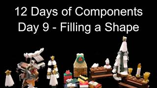

Madly I decided I was going to do 12 videos on Power App components and they have had a heavy focus using SVG. This post is to provide the code and resources for each video.

### Day 1 – Create a Component

[](https://youtu.be/xsp26IgPuTc)

Video walks through turning on components, adding an SVG image and then adding the component to a screen within the app.

SVG Code

Copy CodeCopiedUse a different Browser
```xml
"data:image/svg+xml;utf8, " & EncodeUrl(
    "
        "
)
```

### Day 2 – Add an Input

[](https://www.youtube.com/watch?v=xMdYtTxN42E)

This video adds an input, called BaubleColour which is a HEX string, to the Christmas tree component to allow the component user to select a colour for the baubles.

SVG Code

Copy CodeCopiedUse a different Browser
```xml
"data:image/svg+xml;utf8, " & EncodeUrl(
    "
        "
)
```

### Day 3 – Use Table Input

[](https://www.youtube.com/watch?v=4kwXlsMqLrc)

This video uses a table of HEX strings called BaubleColours to provide a list of colours for the baubles. The colours are cycled through using a timer control.

SVG Code

Copy CodeCopiedUse a different Browser
```xml
"data:image/svg+xml;utf8, " & EncodeUrl(
    "
        "
)
```

### Day 4 – Use SVG Transform


This video does a simple transform in SVG to make the star on the top of the tree rotate.

SVG Code

Copy CodeCopiedUse a different Browser
```xml
"data:image/svg+xml;utf8, " & EncodeUrl(
    "
        "

)
```

### Day 5 – Flexible Resizing of SVG

[](https://youtu.be/T5hG0QtiVow)

Using percentage values within the SVG make the image flexible when the component is resized.

SVG Code

Copy CodeCopiedUse a different Browser
```xml
"data:image/svg+xml;utf8, " & EncodeUrl(
    "
        
        
            
            
        
    "
)
```

### Day 6 – Patterned Presents


Using SVG patterns and a list of patterns we can add patterns to the present wrappings.

Copy CodeCopiedUse a different Browser
```xml
"data:image/svg+xml;utf8, " & EncodeUrl(
    "
        
            " & LookUp(Parent.Patterns,PatternName=Parent.PatternName,Pattern) & "
            
        
        
        
            
            
        
    "
)
```

[Excel File for SVG Patterns](https://hatfullofdata.blog/wp-content/uploads/2020/01/SVG-patterns.xlsx)

### Day 7 – Add a Tag using SVG Text and Rotate

[](https://youtu.be/RjdVo6OF11g)

Using SVG Text and rotate we can create another component to draw a tag that uses an input of the name to label each present.

Copy CodeCopiedUse a different Browser
```xml
"data:image/svg+xml;utf8, " & EncodeUrl(
    "
        " & Parent.TagName & "
    "
)
```

## Day 8 – Star Rating

[](https://youtu.be/ZK0Y-Jvk-_k)

Rate your New Year Resolution progress with a star rating drawn with a little SVG and a gallery.

Copy CodeCopiedUse a different Browser
```xml
With(
    {StarColour:If(
        ThisItem.Value
        "
    )
)
```

### Day 9 – Fill a shape using SVG Clip

[](https://youtu.be/zEWa0oBc9oQ)

Fill up a heart in colour to visualise a percentage value using a component containing SVG using a clip path.

SVG Code

Copy CodeCopiedUse a different Browser
```xml
With(
    {
        SVG: "",
        ClipWidth: 100 * Parent.Score
    },
    "data:image/svg+xml;utf8, " & EncodeUrl(
        "
            
                
            
            " & SVG & "
            " & SVG & "
            " & ClipWidth & "%
    "
    )
)
```

SVG Code to fill from the bottom up

Copy CodeCopiedUse a different Browser
```xml
With(
    {
        SVG: "",
        ClipHeight: 100 * Parent.Score,
        ClipY: 100 - 100 * Parent.Score
    },
    "data:image/svg+xml;utf8, " & EncodeUrl(
        "
            
                
            
            " & SVG & "
            " & SVG & "
            " & ClipHeight & "%
    "
    )
)
```

### Day 10 – Fill Part stars using SVG Clip

[](https://youtu.be/OmLEJRGXpAw)

Combining the star rating from Day 9 with the clip path from Day 10 we can improve the star rating to show part stars for a score of 2.5 etc.

SVG Code

Copy CodeCopiedUse a different Browser
```xml
With(
    {
        StarSVG: "",
        ClipWidth: 100 * ('Day10 Star Rating Improved'.Score - ThisItem.Value + 1)
    },
    "data:image/svg+xml;utf8, " & EncodeUrl(
        "
            
                
            
        " & StarSVG & "
        " & StarSVG & "
    "
    )
)
```

### Day 11 – Draw a Gauge

[](https://youtu.be/OAJ_dGFld7w)

 Draw a simple gauge to show a percentage value using an arch and rotating a line with a simple transform.

SVG Code

Copy CodeCopiedUse a different Browser
```xml
With(
    {
        SVGArch: " ",
        SVGRotate: 180 * Parent.Score
    },
    "data:image/svg+xml;utf8, " & EncodeUrl(
        "
            " & SVGArch & "
            - "
    )
)
```

### Day 12 – Add Colours to that Gauge

[](https://youtu.be/xb2--2xhvOI)

 Lets add some colour to the gauge from day 11 of this series. We look at rotate again and how moving items partly outside the view box hides that part. 

SVG Code

Copy CodeCopiedUse a different Browser
```xml
With(
    {
        SVGArch: " ",
        SVGRotate: 180 * Parent.Score,
        RedRotate: -180 * (1 - Parent.RedScore),
        AmberRotate: -180 * (1 - Parent.AmberScore)
    },
    "data:image/svg+xml;utf8, " & EncodeUrl(
        "
            " & SVGArch & "
            " & SVGArch & "
            " & SVGArch & "
            
    "
    )
)
```

### Conclusion

I thoroughly enjoyed building the different components and working out the SVG code to use. I hope you have enjoyed watching. Below is the link to download a zip of the MSApp file for the components.

[https://hatfullofdata.blog/wp-content/uploads/2020/01/12-Days-of-Components.zip](https://hatfullofdata.blog/wp-content/uploads/2020/01/12-Days-of-Components.zip)

## More Power Apps Posts

[Transparency Update](https://hatfullofdata.blog/powerapps-transparency-update/)

- [Using JSON Feature to Save Pictures](https://hatfullofdata.blog/powerapps-using-json-function-to-save-pictures/)

- [AI Builder Object Detect Model](https://hatfullofdata.blog/ai-builder-object-detect-model/)

- [Function Component](https://hatfullofdata.blog/powerapps-function-component/)

- [SVG in Power Apps series](https://hatfullofdata.blog/powerapps-svg-introduction/)

- [12 Days of Components](https://hatfullofdata.blog/power-apps-12-days-of-components/)

- [Build a Responsive App series](https://hatfullofdata.blog/power-apps-build-a-responsive-app-planning/)

- [Embed a Power BI Chart](https://hatfullofdata.blog/power-apps-embed-a-power-bi-chart/)

