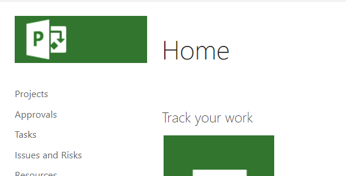
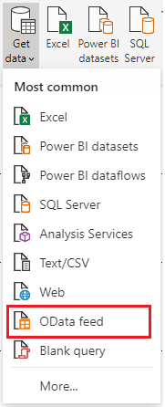
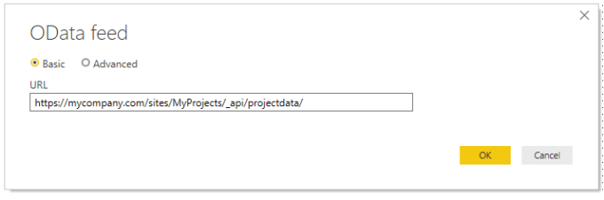
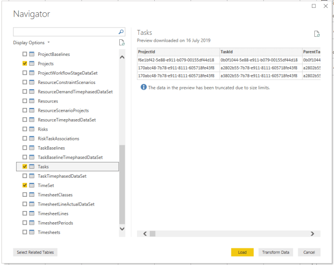
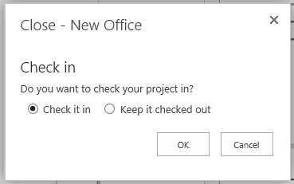
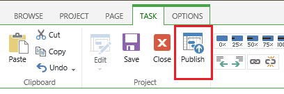

I have spent 12 months working with a client building a Power BI report as part of their roll out of Project Online. This post walks through connecting to Project Online to visualise the data in Power BI. And the full series will document the stages and lessons learned in the past 12 months.

### Power BI and Project Online Series

- [Connecting Power BI to Project Online data](https://hatfullofdata.blog/power-bi-connecting-to-project-online/)
- Reducing columns returned by Project Online
- Adding Relationships into Project Online Data

### Connecting to Project Online

Navigate to your Project Online site. It will have a URL similar to:

```xml
https://mycompany.com/sites/MyProjects/default.aspx
```





Start Power BI Desktop, which will open a new report.From the home ribbon click “Get Data” and find and select OData.

It will prompt you for a url to the data. From the above url, replace default.aspx with _api/projectdata/. My example url becomes:

```xml
https://mycompany.com/sites/MyProjects/_api/projectdata/
```



If required sign in with the correct details, it probably is an organizational account you need and click Connect.

From the long list of tables select the tables you need. For the start of this series I’m going to just import Projects, Tasks and TimeSet. TimeSet is the calendar table.



Click Load ready to build your report.

### Missing Data

When you edit a project in project online it prompts you to check in when you close.



But when you go load the data into project your updates will not be visible. If you have only checked in a project the whole project will be missing. You need to publish the project for the data to be visible within Power BI.

The Publish button can be found on the Tasks ribbon when editing the schedule of your project. (Why is it not on the Project ribbon? Another mystery!)



### Conclusion

The Project Online database is huge and can contain a fascinating source of data. Due to a company being able to add extra columns and select which parts of project they use connecting to Project online can create useful reporting to enhance Project.

## More Power BI Posts

- [Conditional Formatting Update](https://hatfullofdata.blog/power-bi-conditional-formatting-update/)

- [Data Refresh Date](https://hatfullofdata.blog/power-bi-data-refresh-date/)

- [Using Inactive Relationships in a Measure](https://hatfullofdata.blog/power-bi-inactive-relationships-in-a-measure/)

- [DAX CrossFilter Function](https://hatfullofdata.blog/power-bi-dax-crossfilter-function/)

- [COALESCE Function to Remove Blanks](https://hatfullofdata.blog/power-bi-coalesce-function-to-remove-blanks/)

- [Personalize Visuals](https://hatfullofdata.blog/power-bi-personalize-visuals/)

- [Gradient Legends](https://hatfullofdata.blog/power-bi-gradient-legends/)

- [Endorse a Dataset as Promoted or Certified](https://hatfullofdata.blog/power-bi-endorse-a-dataset/)

- [Q&A Synonyms Update](https://hatfullofdata.blog/power-bi-qa-synonyms-update/)

- [Import Text Using Examples](https://hatfullofdata.blog/power-bi-import-text-using-examples/)

- [Paginated Report Resources](https://hatfullofdata.blog/paginated-report-resources/)

- [Refreshing Datasets Automatically with Power BI Dataflows](https://hatfullofdata.blog/refreshing-datasets-automatically-with-dataflow/)

- [Charticulator](https://hatfullofdata.blog/charticulator-simple-custom-chart/)

- [Dataverse Connector – July 2022 Update](https://hatfullofdata.blog/power-bi-dataverse-connector-july-2022-update/)

- [Dataverse Choice Columns](https://hatfullofdata.blog/power-bi-dataverse-choices-and-choice-column/)

- [Switch Dataverse Tenancy](https://hatfullofdata.blog/power-bi-switch-dataverse-tenancy/)

- [Connecting to Google Analytics](https://hatfullofdata.blog/power-bi-connecting-to-google-analytics/)

- [Take Over a Dataset](https://hatfullofdata.blog/power-bi-take-over-a-dataset/)

- [Export Data from Power BI Visuals](https://hatfullofdata.blog/export-data-from-power-bi-visuals/)

- [Embed a Paginated Report](https://hatfullofdata.blog/power-bi-embed-a-paginated-report/)

- [Using SQL on Dataverse for Power BI](https://hatfullofdata.blog/using-sql-on-dataverse-for-power-bi/)

- [Power Platform Solution and Power BI Series](https://hatfullofdata.blog/power-platform-solution-and-power-bi-part-1/)

- [Creating a Custom Smart Narrative](https://hatfullofdata.blog/power-bi-creating-a-custom-smart-narrative/)

- [Power Automate Button in a Power BI Report](https://hatfullofdata.blog/power-automate-button-in-a-power-bi-report/)

## Power BI Series

- [SVG in Power BI series](https://hatfullofdata.blog/svg-in-power-bi-part-1-svg-basics/)

- [Power BI and Project Online series](https://hatfullofdata.blog/power-bi-connecting-to-project-online/)

- [Slicers series](https://hatfullofdata.blog/power-bi-slicers-introduction/)

- [Dataflow series](https://hatfullofdata.blog/power-bi-create-a-dataflow/)

- [Power BI SVG series](https://hatfullofdata.blog/svg-in-power-bi-part-1-svg-basics/)

- [Power Automate and Power BI Rest API series](https://hatfullofdata.blog/power-automate-and-power-bi-rest-api/)

- [Power BI and DevOps series](https://hatfullofdata.blog/devops-data-into-power-bi/)

