## Slicer Series

This series will cover different topics regarding slicers.

- [Slicers Introduction](https://hatfullofdata.blog/power-bi-slicer-introduction/)

- [Resetting Slicers with a Bookmark Button](https://hatfullofdata.blog/power-bi-resetting-slicers-with-a-bookmark-button/)

- [Cascading Slicers](https://hatfullofdata.blog/power-bi-cascading-slicers/)

- [Hierarchy Slicer](https://hatfullofdata.blog/power-bi-hierarchy-slicer/)

- [Sync Slicers](https://hatfullofdata.blog/power-bi-introducing-sync-slicers/)

- [Clear all Slicers Button](https://hatfullofdata.blog/power-bi-clear-all-slicers-button/)

- Relative Date Slicer

Power BI reports can be made more flexible using simple slicers to allow your report consumers to slice and dice the data down to what they are interested in. This post will look at the various options for formatting slicers in different ways.

#### YouTube Version

[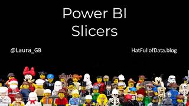](https://youtu.be/3PmYflb9Odc)YouTube version

### Simple Slicer

Click on the slicer from Visualizations pane to add a slicer to your report.

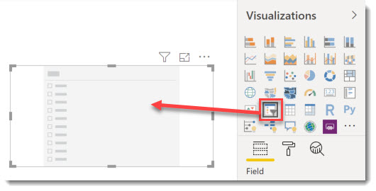

Then you need to drag in the value you would like to slice by, for example Shop Name. Your slicer is now ready to use.

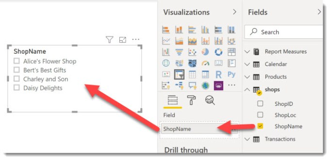

You can select a single value in the slicer just by clicking. You can select multiple items by holding down the Ctrl key. To clear the slicer click the eraser icon in the top right.

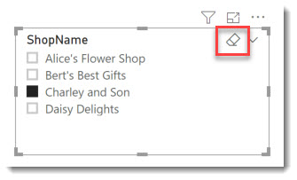

### Selection Options

Our slicer tick list can be tweaked in various ways to make the report fit different requirements. These options can be found in Formatting (click on the paint roller) and Selection Controls.

Single select will turn the selection boxes into round radio buttons. Only one item can now be selected and there is always one item selected, i.e. you can no longer select all.

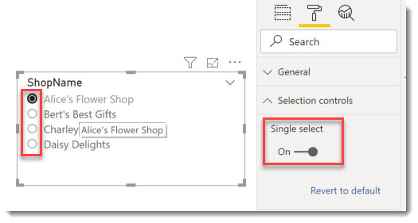

Turning off Multi-select with CTRL will no longer require the ctrl key to be selected to select multiple options. This does mean you need to un-select items to remove filters. This is great for touch screens. You also get little ticks in the boxes.

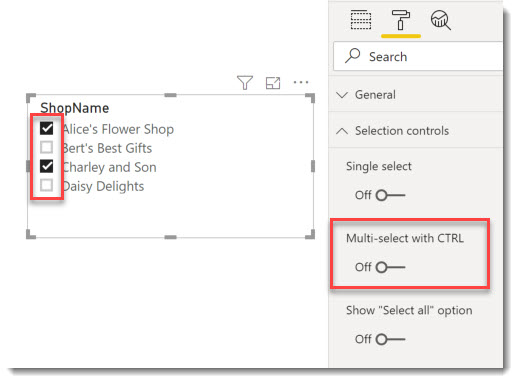

Show “select all” adds an option at the top of the list that will toggle turning them all on or off. Showing the “Select all” is great for when report readers will want all excluding one. Some report readers find the concept of selecting none gives you all a hard one to get their head around.

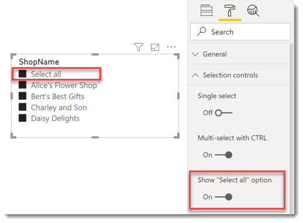

### Button Slicers

When there are only a few options in a list can be effective to change from a list to buttons. This option is not the most intuitive but easy to find when you know how.

Select Format – General and change the Orientation from Vertical to Horizontal and you get buttons!

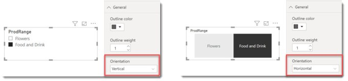

### Dropdown Slicers

When a list of options is long the tick list takes up too much screen space and becomes hard work to use. So we can change a tick list into a drop down.

In the top right hand corner of the slicer box there is a drop down, which only shows when your cursor is over the slicer. On a simple list slicer this drop down offers List or Dropdown. Selecting Dropdown will reduce the list into a smaller drop down.

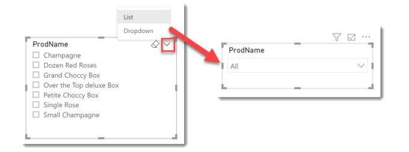

### Adding Search

When a slicer has lots of options it can be useful to add a search box to the slicer. The most common place to add this is probably the drop-down but it can be added to almost any slicer.

Click on the three dots at the top of the slicer window, or the the bottom if your slicer is at the top of the page! Select Search. This will add a search box to the top of the slicer options and will filter the options to match any text.

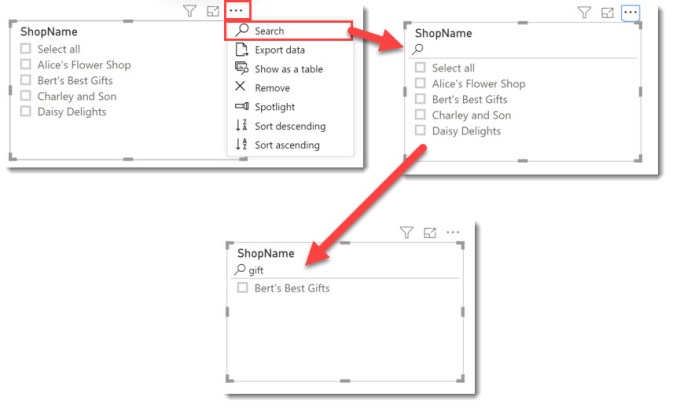

### Range Slicer

Dates and numbers don’t work well for a list so when you add a number or date column to a slicer it will default to a range slicer. This slicer has two handles that allow you to modify the range selected.

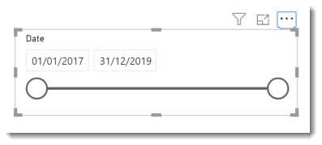

Clicking the top right drop down will offer Between, Before and After as different range options as well as converting to List or Dropdown.

### Conclusion

There are many options for slicers, you need to know your audience and which slicers they will prefer. So make sure it is obvious to your users what they are filtering. If you need slicers to filter slicers take a look at Cascading slicers.

## More Power BI Posts

- [Conditional Formatting Update](https://hatfullofdata.blog/power-bi-conditional-formatting-update/)

- [Data Refresh Date](https://hatfullofdata.blog/power-bi-data-refresh-date/)

- [Using Inactive Relationships in a Measure](https://hatfullofdata.blog/power-bi-inactive-relationships-in-a-measure/)

- [DAX CrossFilter Function](https://hatfullofdata.blog/power-bi-dax-crossfilter-function/)

- [COALESCE Function to Remove Blanks](https://hatfullofdata.blog/power-bi-coalesce-function-to-remove-blanks/)

- [Personalize Visuals](https://hatfullofdata.blog/power-bi-personalize-visuals/)

- [Gradient Legends](https://hatfullofdata.blog/power-bi-gradient-legends/)

- [Endorse a Dataset as Promoted or Certified](https://hatfullofdata.blog/power-bi-endorse-a-dataset/)

- [Q&A Synonyms Update](https://hatfullofdata.blog/power-bi-qa-synonyms-update/)

- [Import Text Using Examples](https://hatfullofdata.blog/power-bi-import-text-using-examples/)

- [Paginated Report Resources](https://hatfullofdata.blog/paginated-report-resources/)

- [Refreshing Datasets Automatically with Power BI Dataflows](https://hatfullofdata.blog/refreshing-datasets-automatically-with-dataflow/)

- [Charticulator](https://hatfullofdata.blog/charticulator-simple-custom-chart/)

- [Dataverse Connector – July 2022 Update](https://hatfullofdata.blog/power-bi-dataverse-connector-july-2022-update/)

- [Dataverse Choice Columns](https://hatfullofdata.blog/power-bi-dataverse-choices-and-choice-column/)

- [Switch Dataverse Tenancy](https://hatfullofdata.blog/power-bi-switch-dataverse-tenancy/)

- [Connecting to Google Analytics](https://hatfullofdata.blog/power-bi-connecting-to-google-analytics/)

- [Take Over a Dataset](https://hatfullofdata.blog/power-bi-take-over-a-dataset/)

- [Export Data from Power BI Visuals](https://hatfullofdata.blog/export-data-from-power-bi-visuals/)

- [Embed a Paginated Report](https://hatfullofdata.blog/power-bi-embed-a-paginated-report/)

- [Using SQL on Dataverse for Power BI](https://hatfullofdata.blog/using-sql-on-dataverse-for-power-bi/)

- [Power Platform Solution and Power BI Series](https://hatfullofdata.blog/power-platform-solution-and-power-bi-part-1/)

- [Creating a Custom Smart Narrative](https://hatfullofdata.blog/power-bi-creating-a-custom-smart-narrative/)

- [Power Automate Button in a Power BI Report](https://hatfullofdata.blog/power-automate-button-in-a-power-bi-report/)

## Power BI Series

- [SVG in Power BI series](https://hatfullofdata.blog/svg-in-power-bi-part-1-svg-basics/)

- [Power BI and Project Online series](https://hatfullofdata.blog/power-bi-connecting-to-project-online/)

- [Slicers series](https://hatfullofdata.blog/power-bi-slicers-introduction/)

- [Dataflow series](https://hatfullofdata.blog/power-bi-create-a-dataflow/)

- [Power BI SVG series](https://hatfullofdata.blog/svg-in-power-bi-part-1-svg-basics/)

- [Power Automate and Power BI Rest API series](https://hatfullofdata.blog/power-automate-and-power-bi-rest-api/)

- [Power BI and DevOps series](https://hatfullofdata.blog/devops-data-into-power-bi/)

