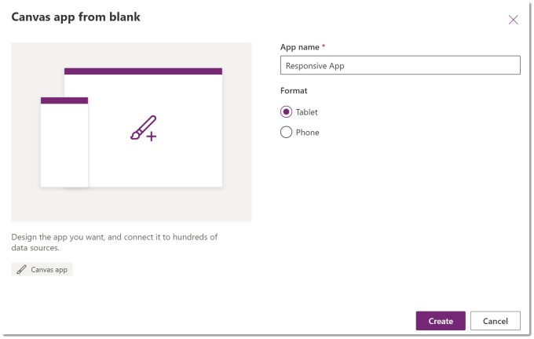
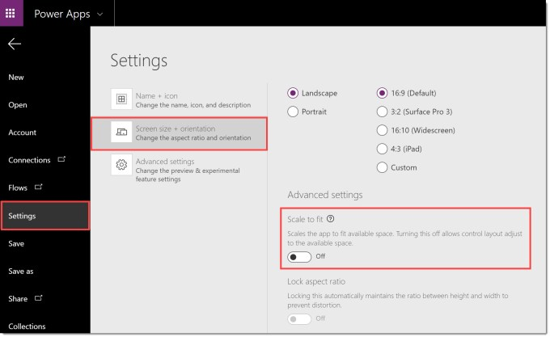
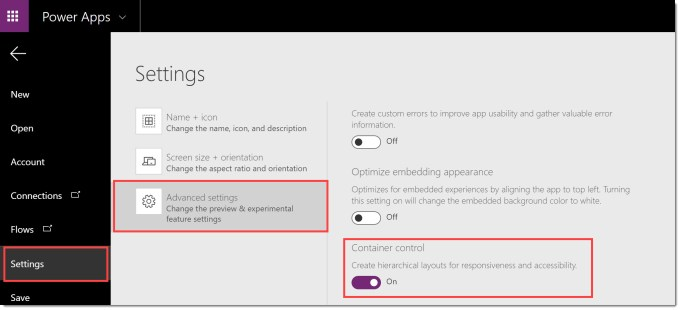
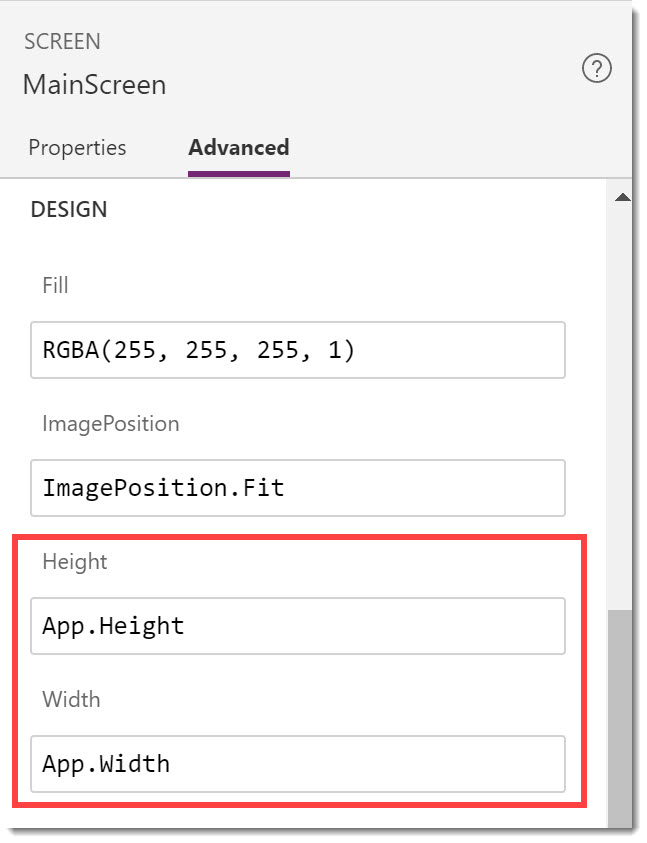

A responsive app resizes the app based on the browser window and moves parts of the app to make the app work in different screen sizes. The most common sizes to handle are monitor, tablet and mobile phone.

### YouTube version

This series is to support my YouTube video.

The posts for this series are

- [Planning a Responsive App](https://hatfullofdata.blog/power-apps-build-a-responsive-app-planning/)
- [Initial setup of the App](https://hatfullofdata.blog/power-apps-build-a-responsive-app-initial-setup/)
- [Adding Dynamic Containers](https://hatfullofdata.blog/power-apps-build-a-responsive-app-adding-dynamic-containers/)
- Dynamic Content

### Create the Responsive App

In the video and for my example I design the app based on a the larger size and then calculate where things will move or transform to become the smaller sized app for a phone for example.

### App Settings

The first change to make inside the app is to turn off Scale to fit which allow us to control sizing etc.

From under the File tab, click on Settings and then Screen size + Orientation. Scroll down to the Advanced settings and turn off Scale to fit.

### Enabling Containers

As of April 2020 containers are still an experimental feature. For the html writers, containers are like the div element. They allow the developer to group items that are sized and positioned within the container, and then specify the size and position of the container. This makes a responsive design possible rather than a very complex design nightmare.

Features can be turn on from File > Settings > Advanced Settings, scroll down and find Containers

### Settings Screen Size

By default the screen height of every screen in an app is set to Max(App.Height, App.DesignHeight). This assumes the app is designed small and the screen should expand. I prefer to do the reverse and design the larger size and work out how to scale down. So I set the screen height and width to be App.Height and App.Width.

### Conclusion

The app is now ready to add containers to fit the plan we created earlier. The next post will be adding the containers.

### Resources

Microsoft have some resources found at

[https://docs.microsoft.com/en-us/powerapps/maker/canvas-apps/create-responsive-layout](https://docs.microsoft.com/en-us/powerapps/maker/canvas-apps/create-responsive-layout)

## More Power Apps Posts

- [Transparency Update](https://hatfullofdata.blog/powerapps-transparency-update/)

- [Using JSON Feature to Save Pictures](https://hatfullofdata.blog/powerapps-using-json-function-to-save-pictures/)

- [AI Builder Object Detect Model](https://hatfullofdata.blog/ai-builder-object-detect-model/)

- [Function Component](https://hatfullofdata.blog/powerapps-function-component/)

- [SVG in Power Apps series](https://hatfullofdata.blog/powerapps-svg-introduction/)

- [12 Days of Components](https://hatfullofdata.blog/power-apps-12-days-of-components/)

- [Build a Responsive App series](https://hatfullofdata.blog/power-apps-build-a-responsive-app-planning/)

- [Embed a Power BI Chart](https://hatfullofdata.blog/power-apps-embed-a-power-bi-chart/)

