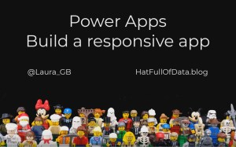
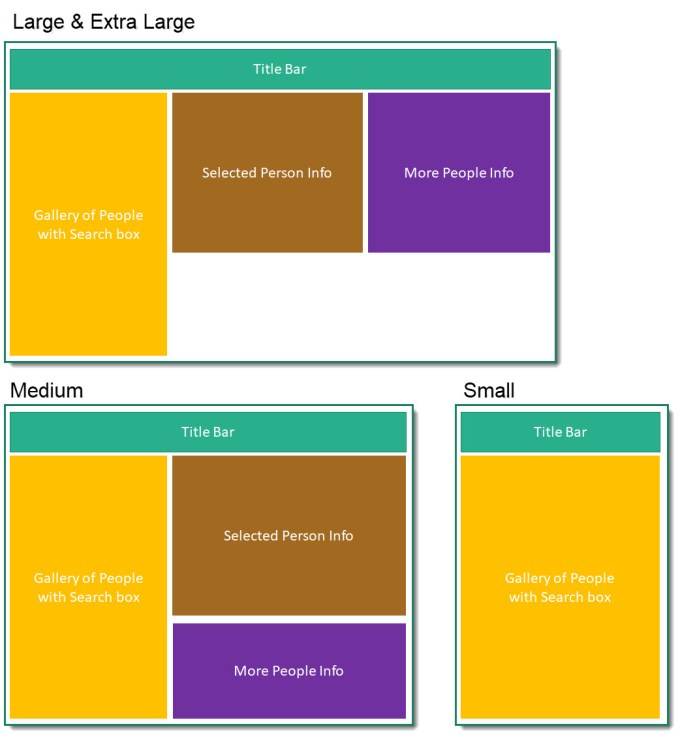

### Introduction

Planning a responsive app is vital. A responsive app resizes the app based on the browser window and moves parts of the app to make the app work in different screen sizes. The most common sizes to handle are monitor, tablet and mobile phone. Just like a choreographer has work out the position of every dancer in a dance you need to work out the position and form of different elements at every screen size.

### YouTube version

This series is to support my YouTube video.

The posts for this series are

- [Planning a Responsive App](https://hatfullofdata.blog/power-apps-build-a-responsive-app-planning/)
- [Initial setup of the App](https://hatfullofdata.blog/power-apps-build-a-responsive-app-initial-setup/)
- [Adding Dynamic Containers](https://hatfullofdata.blog/power-apps-build-a-responsive-app-adding-dynamic-containers/)
- Dynamic Content

### Screen Sizes

Although the app can be made to react to even the smallest screen size change it makes logical sense to work with a few screen sizes and these are based on the width of the screen. The sizes we will work with are small, medium, large and extra large.

### Layout Planning

For this series we will be working with a simple people app that will have three layouts. The Extra Large and Large size have the same layout, the Medium size rearranges the info boxes to be on top of each other and the small hides the info box completely and will have navigation to another screen for the info boxes.

### Further Planning

Each container will need some planning to select how they will look in the different layouts. For example the Gallery in the Large and Extra Large layouts could container less data as you have the info boxes, where as the small only shows the Gallery on the front screen so although its a smaller screen you might want more information in the gallery.

### Conclusion

You need at least a simple wire frame before you start creating the app. Each section of the screen probably needs extra planning but this can be done once you have the app structure working.

### Resources

Microsoft have some resources found at

[https://docs.microsoft.com/en-us/powerapps/maker/canvas-apps/create-responsive-layout](https://docs.microsoft.com/en-us/powerapps/maker/canvas-apps/create-responsive-layout)

## More Power BI Posts

- [Conditional Formatting Update](https://hatfullofdata.blog/power-bi-conditional-formatting-update/)

- [Data Refresh Date](https://hatfullofdata.blog/power-bi-data-refresh-date/)

- [Using Inactive Relationships in a Measure](https://hatfullofdata.blog/power-bi-inactive-relationships-in-a-measure/)

- [DAX CrossFilter Function](https://hatfullofdata.blog/power-bi-dax-crossfilter-function/)

- [COALESCE Function to Remove Blanks](https://hatfullofdata.blog/power-bi-coalesce-function-to-remove-blanks/)

- [Personalize Visuals](https://hatfullofdata.blog/power-bi-personalize-visuals/)

- [Gradient Legends](https://hatfullofdata.blog/power-bi-gradient-legends/)

- [Endorse a Dataset as Promoted or Certified](https://hatfullofdata.blog/power-bi-endorse-a-dataset/)

- [Q&A Synonyms Update](https://hatfullofdata.blog/power-bi-qa-synonyms-update/)

- [Import Text Using Examples](https://hatfullofdata.blog/power-bi-import-text-using-examples/)

- [Paginated Report Resources](https://hatfullofdata.blog/paginated-report-resources/)

- [Refreshing Datasets Automatically with Power BI Dataflows](https://hatfullofdata.blog/refreshing-datasets-automatically-with-dataflow/)

- [Charticulator](https://hatfullofdata.blog/charticulator-simple-custom-chart/)

- [Dataverse Connector – July 2022 Update](https://hatfullofdata.blog/power-bi-dataverse-connector-july-2022-update/)

- [Dataverse Choice Columns](https://hatfullofdata.blog/power-bi-dataverse-choices-and-choice-column/)

- [Switch Dataverse Tenancy](https://hatfullofdata.blog/power-bi-switch-dataverse-tenancy/)

- [Connecting to Google Analytics](https://hatfullofdata.blog/power-bi-connecting-to-google-analytics/)

- [Take Over a Dataset](https://hatfullofdata.blog/power-bi-take-over-a-dataset/)

- [Export Data from Power BI Visuals](https://hatfullofdata.blog/export-data-from-power-bi-visuals/)

- [Embed a Paginated Report](https://hatfullofdata.blog/power-bi-embed-a-paginated-report/)

- [Using SQL on Dataverse for Power BI](https://hatfullofdata.blog/using-sql-on-dataverse-for-power-bi/)

- [Power Platform Solution and Power BI Series](https://hatfullofdata.blog/power-platform-solution-and-power-bi-part-1/)

- [Creating a Custom Smart Narrative](https://hatfullofdata.blog/power-bi-creating-a-custom-smart-narrative/)

- [Power Automate Button in a Power BI Report](https://hatfullofdata.blog/power-automate-button-in-a-power-bi-report/)

## Power BI Series

- [SVG in Power BI series](https://hatfullofdata.blog/svg-in-power-bi-part-1-svg-basics/)

- [Power BI and Project Online series](https://hatfullofdata.blog/power-bi-connecting-to-project-online/)

- [Slicers series](https://hatfullofdata.blog/power-bi-slicers-introduction/)

- [Dataflow series](https://hatfullofdata.blog/power-bi-create-a-dataflow/)

- [Power BI SVG series](https://hatfullofdata.blog/svg-in-power-bi-part-1-svg-basics/)

- [Power Automate and Power BI Rest API series](https://hatfullofdata.blog/power-automate-and-power-bi-rest-api/)

- [Power BI and DevOps series](https://hatfullofdata.blog/devops-data-into-power-bi/)

