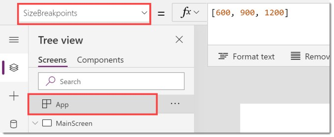
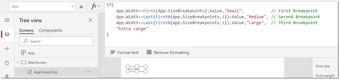
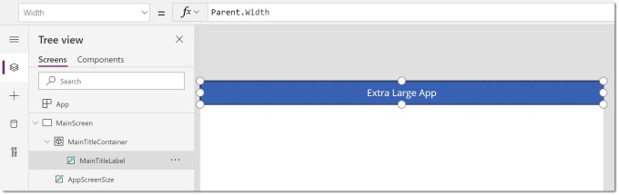
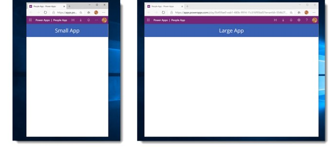
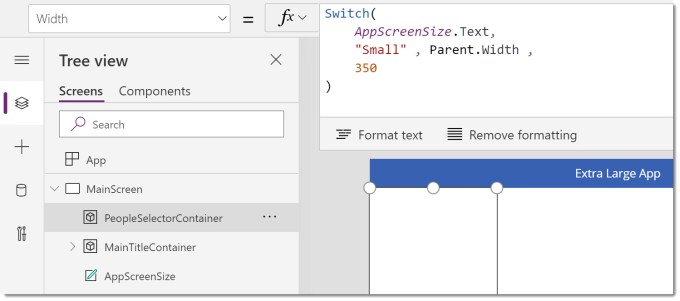
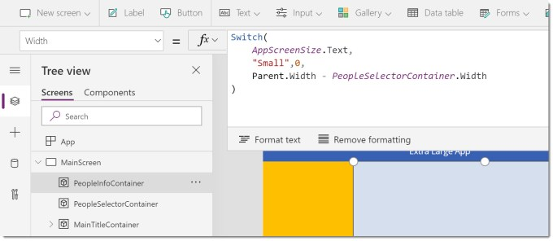
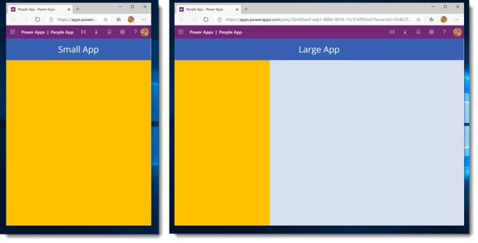
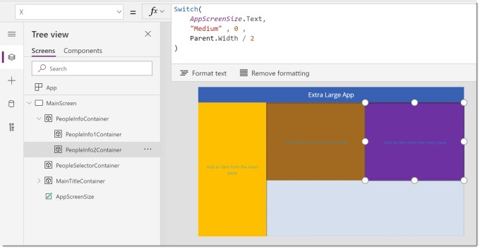
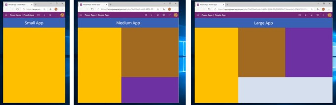

In this post we will use dynamic containers to arrange out content so it moves to the planned location at the different screen sizes. We will need to calculate the screen size and then use it to position and size the containers.

This post assumes you’ve done everything in the first 2 posts.

### YouTube version

This series is to support my YouTube video.

[](https://www.youtube.com/watch?v=UWy5_JRH1FE)

The posts for this series are

- [Planning a Responsive App](https://hatfullofdata.blog/power-apps-build-a-responsive-app-planning/)
- [Initial setup of the App](https://hatfullofdata.blog/power-apps-build-a-responsive-app-initial-setup/)
- [Adding Dynamic Containers](https://hatfullofdata.blog/power-apps-build-a-responsive-app-adding-dynamic-containers/)
- Dynamic Content

### Calculate Screen Size

In order to make the calculations simple we are going to add a label called AppScreenSize which contains a calculation to classify the screen size to one of small, medium, large and extra large.

For this we are going to use a property of the App object, SizeBreakpoints. It contains a list of numbers for the dividing points of the screen sizes. So under 600 will be small, 600 to 900 will be medium, 900 to 1200 will be large and above 1200 will be extra large.



We then add a label, renamed to AppScreenSize and change the text property to the following formula.



```xml

```

Copy CodeCopiedUse a different Browser
```xml
If(
    App.Width

Now the label shows “Extra Large”.

### Adding Title Bar Container

In my example the title bar is the same for every screen size so is the simplest to position and size. It will start in the top left hand corner so x,y will be 0,0. The height is going to be 80 and the width needs to fit the full screen width. The screen is the parent of the container so we can use Parent.Width.

Within the container I’ve placed a text label that will start in 0,0 and the width and height match are Parent.Width and Parent.Height. I also set the text to be AppScreenSize.Text & ” App”. Finally I formatted the text label.



#### MainTitleContainer

X0Y0Height80WidthParent.Width

### First Test

The app is now ready to save and publish. The main test is to check the app resizes correctly and the title bar changes.



## Adding Dynamic Containers

Now we are going to add the containers that will move based on the screen size. In total there are 4 containers to add. The left hand side people selector, the right hand side people information which will contain the final 2 containers that sit side by side in large and extra large and above each other on a medium screen.

The next container we add is the container down the left hand side. It needs to fit in below the title bar container and fill to the bottom of the screen. For the small screen size the width will be the whole screen width, for all other sizes it will be 350 wide.



#### PeopleSelectorContainer

X0YMainTitleContainer.HeightHeightParent.Height-MainTitleContainer.HeightWidthSwitch(
    AppScreenSize.Text,
    "Small" , Parent.Width ,
    350
)

The next container is the People Info container for the right hand side of the screen. This will fill the remaining part of the screen for all sizes except small when it will be 0 width and not seen.

Note I coloured the containers just so we could see the sizes.



#### PeopleInfoContainer

XPeopleSelectorContainer.WidthYMainTitleContainer.HeightHeightParent.Height-MainTitleContainer.HeightWidthSwitch(
    AppScreenSize.Text,
    "Small" , 0 ,
    Parent.Width - PeopleSelectorContainer.Width
)

### Second Test

With the two dynamic containers added we can publish and test again to make sure the PeopleSelector resizes to full screen for the small size and the PeopleInfoContainer takes up the right hand side when for any size except small.



### Nested Dynamic Containers

The last two containers will be child containers of the PeopleInfoContainer. For Large and Extra Large screen size they will sit side by side, for Medium screen size they will be one above the other, and for Small it won’t matter because the parent container will be 0 width.



#### PeopleInfo1Container

XPeopleSelectorContainer.WidthYMainTitleContainer.HeightHeight400WidthSwitch(
    AppScreenSize.Text,
    "Medium" , Parent.Width ,
    Parent.Width /2
)

#### PeopleInfo2Container

XSwitch(
    AppScreenSize.Text,
    "Medium" , Parent.Width ,
    Parent.Width /2
)YSwitch(
    AppScreenSize.Text,
    "Medium" , PeopleInfo1Container.Height ,
    0
)HeightSwitch(
    AppScreenSize.Text,
    "Medium" , Parent.Height - PeopleInfo1Container.Height ,
    PeopleInfo1Container.Height
)WidthSwitch(
    AppScreenSize.Text,
    "Medium" , Parent.Width ,
    Parent.Width /2
)

## Final Test

We now have 4 dynamic containers that should all be responsive to the screen size, so we save and publish.



## Conclusion

Responsive design takes time, lots of time. This is why good web coders are paid the rate they are paid, it is a skilled job. Building an app to be fully responsive will take time. I hope this post gives you enough to get going along with the resources from Microsoft.

### Resources

Microsoft have some resources found at

[https://docs.microsoft.com/en-us/powerapps/maker/canvas-apps/create-responsive-layout](https://docs.microsoft.com/en-us/powerapps/maker/canvas-apps/create-responsive-layout)

## More Power Apps Posts

- [Transparency Update](https://hatfullofdata.blog/powerapps-transparency-update/)

- [Using JSON Feature to Save Pictures](https://hatfullofdata.blog/powerapps-using-json-function-to-save-pictures/)

- [AI Builder Object Detect Model](https://hatfullofdata.blog/ai-builder-object-detect-model/)

- [Function Component](https://hatfullofdata.blog/powerapps-function-component/)

- [SVG in Power Apps series](https://hatfullofdata.blog/powerapps-svg-introduction/)

- [12 Days of Components](https://hatfullofdata.blog/power-apps-12-days-of-components/)

- [Build a Responsive App series](https://hatfullofdata.blog/power-apps-build-a-responsive-app-planning/)

- [Embed a Power BI Chart](https://hatfullofdata.blog/power-apps-embed-a-power-bi-chart/)

