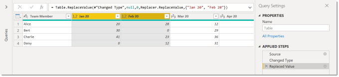
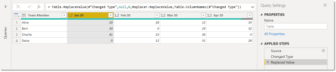
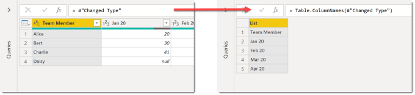
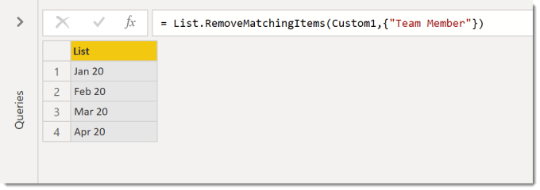
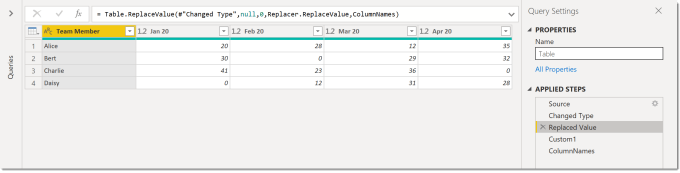

Today’s challenge was to replace the values on all the columns in the query when I know the columns will change so I don’t want to name them.

### Quick Answer

For those who don’t want the long explanation. Do replace values on at least one column to get the replace step. In the example below the previous step is #’Changed Type’ and the columns are Jan 20 and Feb 20.

Copy CodeCopiedUse a different Browser
```xml
= Table.ReplaceValue(#"Changed Type",null,0,Replacer.ReplaceValue,{"Jan 20", "Feb 20"})
```

Remove the {…} section and replace it with Table.ColumnNames(Previous Step)

Copy CodeCopiedUse a different Browser
```xml
= Table.ReplaceValue(#"Changed Type",null,0,Replacer.ReplaceValue,Table.ColumnNames(#"Changed Type"))
```





### Longer Answer

Replace values is a powerful tool for coping with null values and errors. When you select multiple columns and select Replaces values a step is written in that includes a list of column names, eg {“column1″,”column2″,”column3”}. If your data structure changes that step will either break because a column is missing or will not include a new column.

The function Table.ColumnNames(StepName) returns a list of column names from the named step. To see this result and filter the list right click on a step and select Insert Step After. Edit the new step to be Table.ColumnNames(StepName)



The list of column names can be filtered, even though there is no drop down arrow. Right click on the value to remove and select Remove Item.



If I then rename this step to ColumnNames I can then use that step name in a replace step.



### Note

Yes the Replaced Value step is refering to a calculation that comes after it (yup its wacky). If you reorder the steps by dragging them Power Query will decide to change the code so steps refer to the new previous step.

### References

[Microsoft Docs Table.ColumnNames](https://docs.microsoft.com/en-us/powerquery-m/table-columnnames)

## More Power Query Posts

- [Custom Handwritten Function](https://hatfullofdata.blog/power-query-handwritten-function/)

- [Multi-step Function](https://hatfullofdata.blog/power-query-multi-step-function/)

- [Replace Values for Whole Table](https://hatfullofdata.blog/power-query-replace-values-for-whole-table/)

- [AI Insights Error](https://hatfullofdata.blog/power-query-ai-insights-error/)

- [VBA to Edit a Parameter Value](https://hatfullofdata.blog/excel-power-query-vba-to-edit-a-parameter-value/)

- [Dynamic Data Source and Web.Contents()](https://hatfullofdata.blog/power-query-dynamic-data-source-and-web-content/)

- [Get Previous Row Data](https://hatfullofdata.blog/power-query-get-previous-row-data/)

- [Creating New Parameters](https://hatfullofdata.blog/power-query-creating-new-parameters/)

- [Fixing Missing Columns Dynamically](https://hatfullofdata.blog/power-query-fixing-missing-columns-dynamically/)

- [Handling Null Values Properly](https://hatfullofdata.blog/power-query-handling-null-values/)

