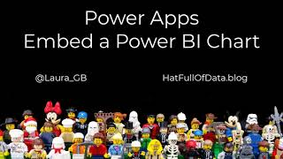
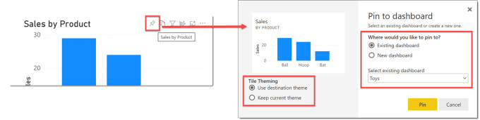
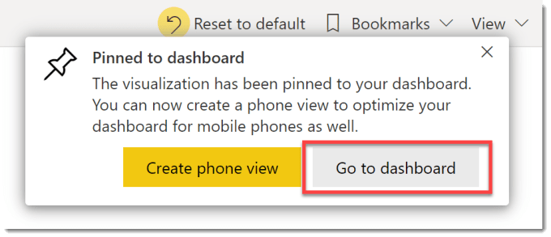
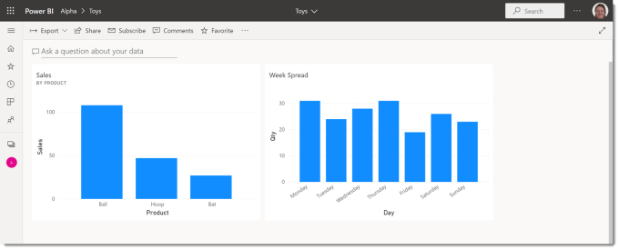
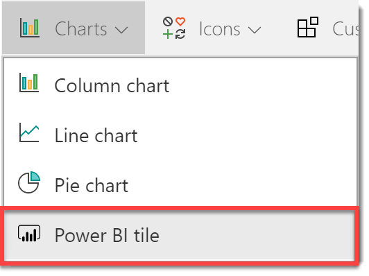
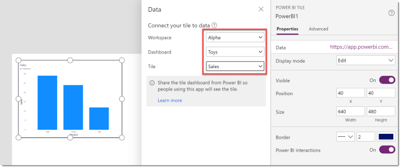
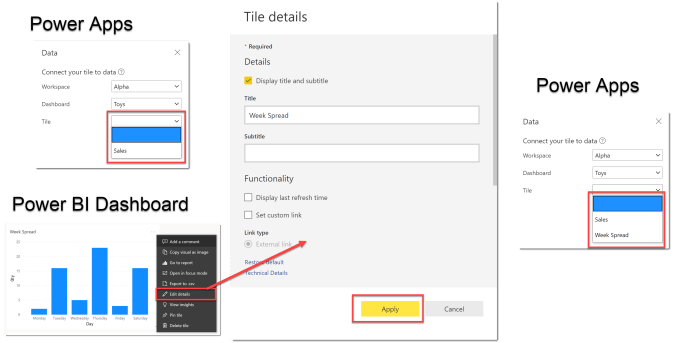
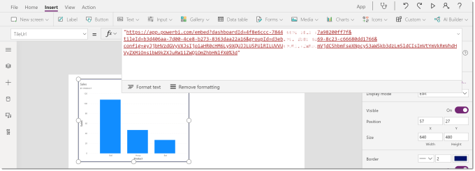
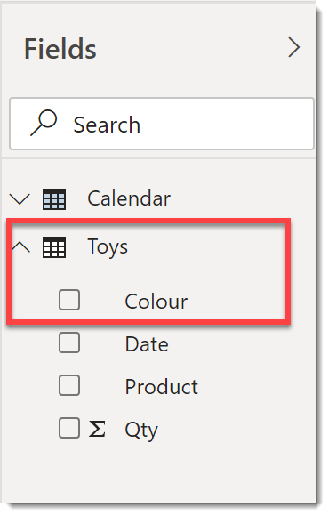
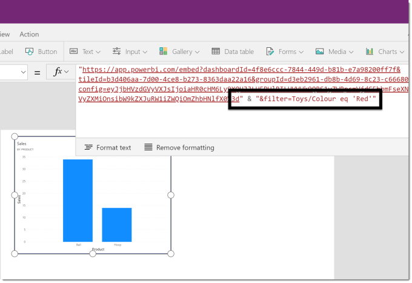

This post covers how to embed a Power BI chart from a published report into a Power App, handling a tile that doesn’t appear and then filtering the embedded chart.

### YouTube Video

[](https://youtu.be/M-rGoq_Lf3Q)

### Creating the Chart Tile

The report must be published to a workspace that the app users will have access to. When you open in the Power BI service in the visual header is a pin, clicking this will prompt to “Pin” your visual to a dashboard.



When the dialog appears select either an Existing dashboard or a New dashboard. If you are using Themes do remember to select Keep current theme on the left hand side. Click Pin to finish pinning your chart to the dashboard.



When the visual has been pinned you will get a notification in the top right of the browser window with a button to navigate you to the dashboard. The dashboard can also be found in the workspace list. On the dashboard you can see the pinned tiles.



### Embed a Power BI Chart



Within your Power App, from the Insert ribbon under Chart, select Power BI Tile. This will open a pane to select the Workspace, Dashboard and Tile. When selected the chart will appear in your app.



### Fixing the missing Chart

When I first did this no charts appeared. So a few google searches later I found Power Apps is looking for a title to be set. All of my charts had altered titles. When I tried a chart that just had the automatic title, it worked. A little more digging and I found you can set the title of a tile on a dashboard. Just opening the editor and pressing Apply fixed the problem.

If you have a missing chart try the following:Open the dashboard. On the tile that Power Apps does not see, in the top right hand corner are 3 dots, click to open an options menu. From the menu select Edit details.In the Tile details pane click Apply.Save and refresh your Power App and try re-adding your tile.



The above fix has worked for every problem I’ve had so far. Please add comments if it doesn’t work for you.

### Filtering the Chart

Power BI is powerful because charts can be sliced easily. When you only have a single chart from a report you don’t have the option to include slicers and filters. If you examine the Power BI control in Power Apps you will see the TileUrl property for the control is a long url.





An extra parameter can be added to this url to filter the chart. The filter is written as an OData filter. You need to know the table and field names to write the filter. In this example if I look back in the Power BI report in Desktop I can see the Colour field is from the Toys table.

So the filter string to filter to Red will be:

```xml
"&filter=Toys/Colour eq 'Red'"
```



The colour could come from a drop down or a variable. Remember to include the single quotes needed around the filter value. Also spacing is important so don’t add any extras!

### Conclusion to Embed a Power BI Chart

Embedding a Power BI Tile is a great addition to a Power App but it does have limitations. The dataset behind the Power BI report will need to be refreshed to reflect any changes and refreshed are limited to 8 times a day or 48 times in a premium workspace.

## More Power Apps Posts

- [Transparency Update](https://hatfullofdata.blog/powerapps-transparency-update/)

- [Using JSON Feature to Save Pictures](https://hatfullofdata.blog/powerapps-using-json-function-to-save-pictures/)

- [AI Builder Object Detect Model](https://hatfullofdata.blog/ai-builder-object-detect-model/)

- [Function Component](https://hatfullofdata.blog/powerapps-function-component/)

- [SVG in Power Apps series](https://hatfullofdata.blog/powerapps-svg-introduction/)

- [12 Days of Components](https://hatfullofdata.blog/power-apps-12-days-of-components/)

- [Build a Responsive App series](https://hatfullofdata.blog/power-apps-build-a-responsive-app-planning/)

- [Embed a Power BI Chart](https://hatfullofdata.blog/power-apps-embed-a-power-bi-chart/)

