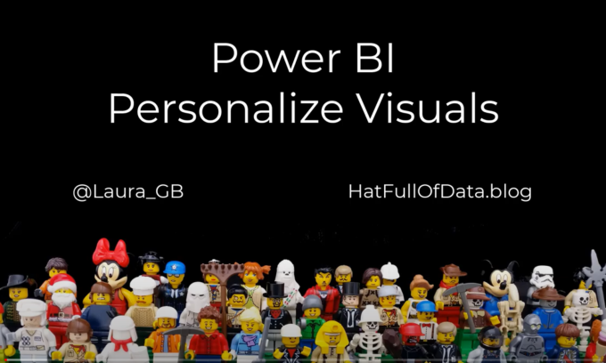
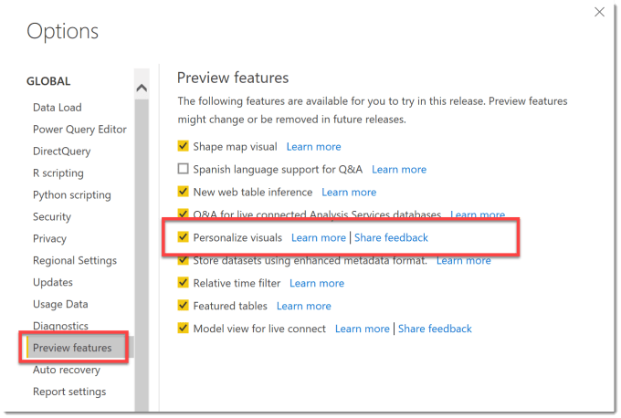
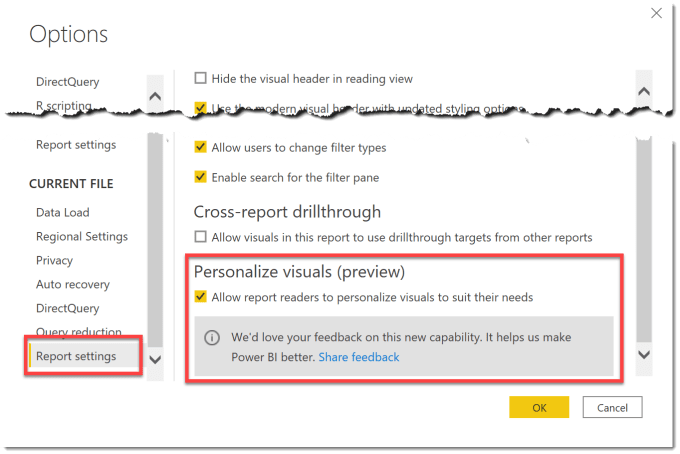
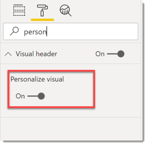
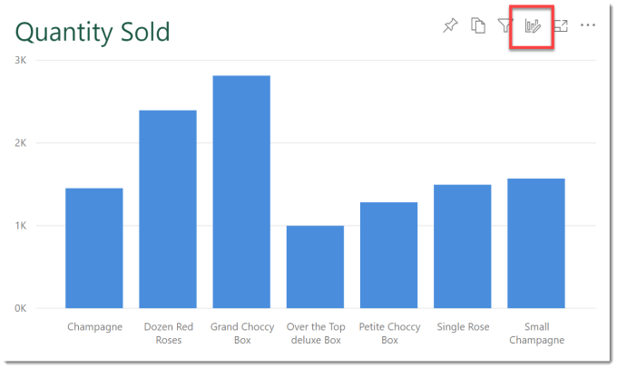
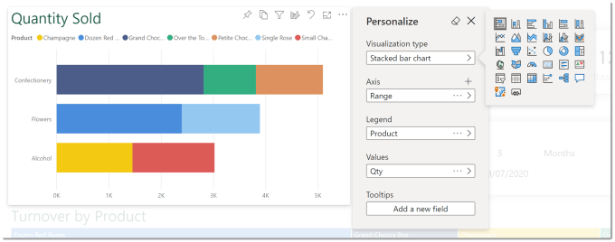
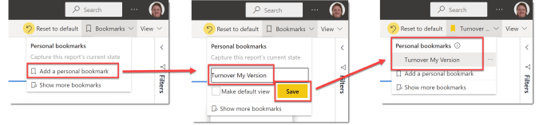
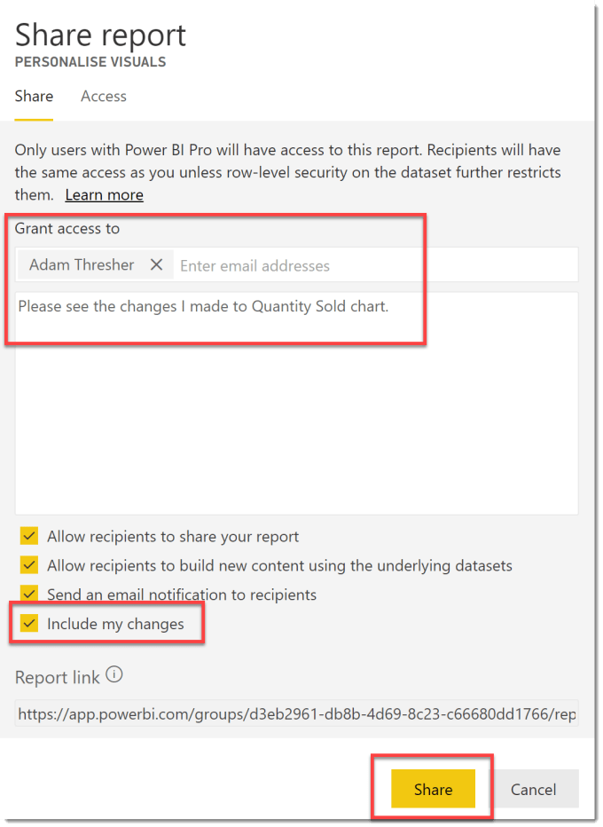

In the May 2020 Power BI Desktop update they introduced the idea of allowing a reader of a report to personalize visuals and bookmarking these changes. This post walks through how to enable it for a report and how to enable and disable for each visual.

### YouTube Version

### Turning On Personalize Visuals

At the point of writing this blog post personalise visuals is still in preview so you need to head to File – Options & Settings – Options, and then from the Options dialog select Preview Features and turn on Personalize Visuals. This may require a Power BI restart.

Secondly you will need to turn on personalising visuals for your current report. So in Options, under Current File select Report Settings. The last option in there is Personalize Visuals, you need to tick Allow report readers to personalize visuals.

### Adjusting Individual Visuals

By default, once Personalize Visuals has been turned on in a report, all visuals in the report can be personalised. You can disable it on any visual by selecting the visual, then looking under Format and searching for person and turning it off.

### Personalize Visuals in a Published Report

To personalize a visual in a published report, click on the personalize button in the visual header.

The then Personalize pane will open up next to the visual and the chart type and fields used can be changed.  A reader will not be able to change the formatting of the visual.

### Saving Personalisations as a Bookmark

Any changes made to visuals in reports can be saved as a personal bookmark. In the top right hand corner of the browser window click Bookmarks and then Add a personal bookmark. Enter in the name of the bookmark and click Save.

Access the list of bookmarks by clicking on the drop down in the top right hand corner.

### Sharing your changes with another person

One great way to give feedback to a report designer would be to show them the personalizations you’ve done to their report. If you have person to share you can click the Share button at the top of the report.

Enter their details and add a message if required. Tick Include my changes and then click Share. They will receive an email giving them a link that includes the changes you made to the visuals.

### Conclusion

This feature is great when different report readers want to adjust what the original designer did or different charts to be tried out. I know designers who will not want anyone to change anything and designers who perhaps will be more tolerant.

## More Power BI Posts

- [Conditional Formatting Update](https://hatfullofdata.blog/power-bi-conditional-formatting-update/)

- [Data Refresh Date](https://hatfullofdata.blog/power-bi-data-refresh-date/)

- [Using Inactive Relationships in a Measure](https://hatfullofdata.blog/power-bi-inactive-relationships-in-a-measure/)

- [DAX CrossFilter Function](https://hatfullofdata.blog/power-bi-dax-crossfilter-function/)

- [COALESCE Function to Remove Blanks](https://hatfullofdata.blog/power-bi-coalesce-function-to-remove-blanks/)

- [Personalize Visuals](https://hatfullofdata.blog/power-bi-personalize-visuals/)

- [Gradient Legends](https://hatfullofdata.blog/power-bi-gradient-legends/)

- [Endorse a Dataset as Promoted or Certified](https://hatfullofdata.blog/power-bi-endorse-a-dataset/)

- [Q&A Synonyms Update](https://hatfullofdata.blog/power-bi-qa-synonyms-update/)

- [Import Text Using Examples](https://hatfullofdata.blog/power-bi-import-text-using-examples/)

- [Paginated Report Resources](https://hatfullofdata.blog/paginated-report-resources/)

- [Refreshing Datasets Automatically with Power BI Dataflows](https://hatfullofdata.blog/refreshing-datasets-automatically-with-dataflow/)

- [Charticulator](https://hatfullofdata.blog/charticulator-simple-custom-chart/)

- [Dataverse Connector – July 2022 Update](https://hatfullofdata.blog/power-bi-dataverse-connector-july-2022-update/)

- [Dataverse Choice Columns](https://hatfullofdata.blog/power-bi-dataverse-choices-and-choice-column/)

- [Switch Dataverse Tenancy](https://hatfullofdata.blog/power-bi-switch-dataverse-tenancy/)

- [Connecting to Google Analytics](https://hatfullofdata.blog/power-bi-connecting-to-google-analytics/)

- [Take Over a Dataset](https://hatfullofdata.blog/power-bi-take-over-a-dataset/)

- [Export Data from Power BI Visuals](https://hatfullofdata.blog/export-data-from-power-bi-visuals/)

- [Embed a Paginated Report](https://hatfullofdata.blog/power-bi-embed-a-paginated-report/)

- [Using SQL on Dataverse for Power BI](https://hatfullofdata.blog/using-sql-on-dataverse-for-power-bi/)

- [Power Platform Solution and Power BI Series](https://hatfullofdata.blog/power-platform-solution-and-power-bi-part-1/)

- [Creating a Custom Smart Narrative](https://hatfullofdata.blog/power-bi-creating-a-custom-smart-narrative/)

- [Power Automate Button in a Power BI Report](https://hatfullofdata.blog/power-automate-button-in-a-power-bi-report/)

## Power BI Series

- [SVG in Power BI series](https://hatfullofdata.blog/svg-in-power-bi-part-1-svg-basics/)

- [Power BI and Project Online series](https://hatfullofdata.blog/power-bi-connecting-to-project-online/)

- [Slicers series](https://hatfullofdata.blog/power-bi-slicers-introduction/)

- [Dataflow series](https://hatfullofdata.blog/power-bi-create-a-dataflow/)

- [Power BI SVG series](https://hatfullofdata.blog/svg-in-power-bi-part-1-svg-basics/)

- [Power Automate and Power BI Rest API series](https://hatfullofdata.blog/power-automate-and-power-bi-rest-api/)

- [Power BI and DevOps series](https://hatfullofdata.blog/devops-data-into-power-bi/)

