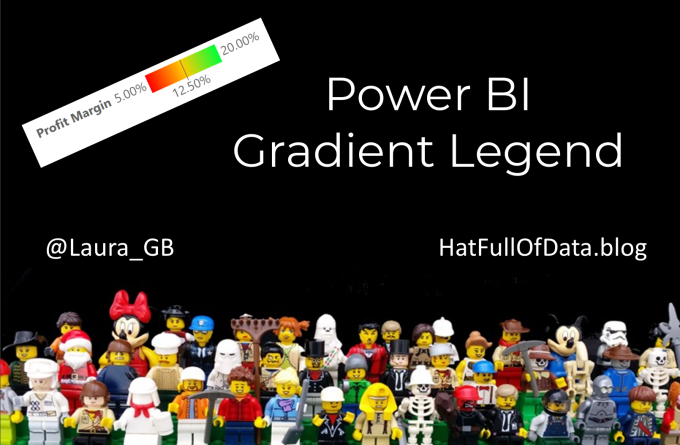
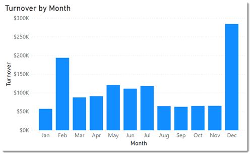
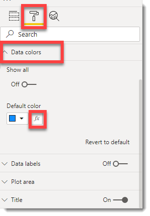
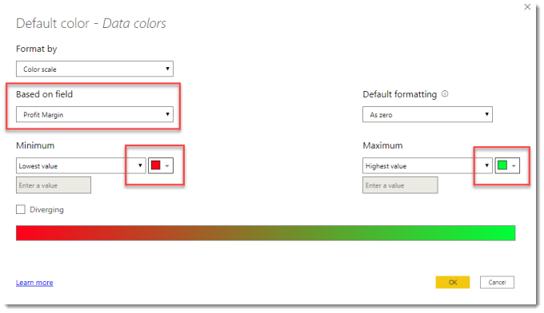
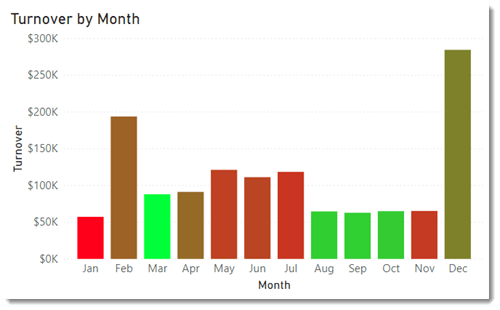
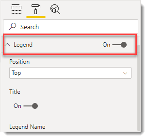
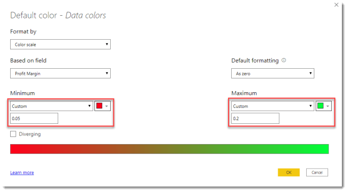
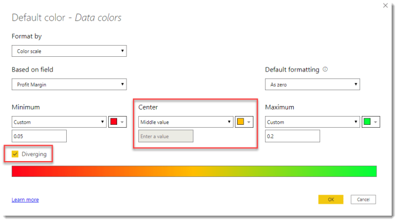
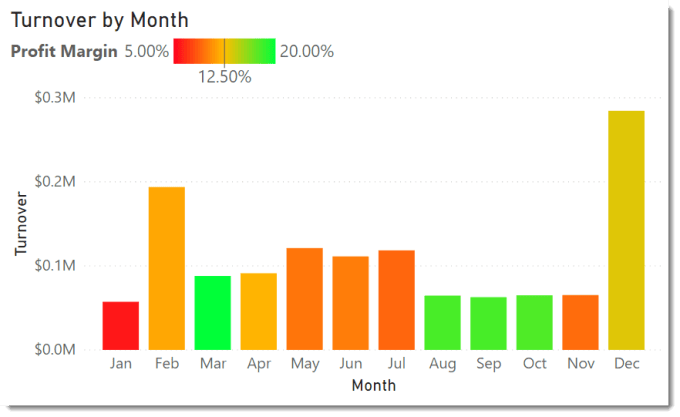

### Introduction

In the July 2020 update to Power BI Microsoft introduced a new feature of Gradient Legends to help annotate the colours used in a colour scale conditional formatting. When conditional formatting is applied to a visual it is important to make sure the reader of the report understands what the different colours on the report mean. Is purple good? Is orange ok?

### YouTube Version

### Adding Conditional Formatting

In this chart we have Turnover plotted for every month as a bar chart. The sales manager now wants to colour each bar based on the profit margin.

They select the chart and select the format section of the visualization pane. Under data colours they click the fx button next to the colour to open the conditional formatting dialog box.

Then the sales manager changes the field selected to the measure already setup of Profit Margin. They then can change the colours for the minimum and maximum values before pressing OK to apply the formatting.

### View Legend

Not all visuals have the legend turned on by default. The legend can be turned on in the visualizations pane.

### Changing Values in Gradient Legends

The min and max values will be calculated based on the data. These can be adjusted by returning to the conditional formatting dialog box, via visualizations pane and data colours and clicking on the fx button.

Then for the min and max values change from Auto to custom for the value and type in the values. If a plotted value is below the minimum it will be the minimum colour and the same is for maximum. In this example we have just gone to the nearest 5%.

### Adding a middle colour

A mid-way third colour can added to the colour scale and that will update the legend to match.

Return back to the conditional formatting of the column colour and tick the diverging box. This will now add a third colour. After you click okay, the legend will now be updated to show all the values.

### Conclusion

For those who use colour scale conditional formatting this is a great addition to make their story on the dashboard crystal clear. Adding gradient legends is crucial to annotate charts clearly.

## More Power BI Posts

- [Conditional Formatting Update](https://hatfullofdata.blog/power-bi-conditional-formatting-update/)

- [Data Refresh Date](https://hatfullofdata.blog/power-bi-data-refresh-date/)

- [Using Inactive Relationships in a Measure](https://hatfullofdata.blog/power-bi-inactive-relationships-in-a-measure/)

- [DAX CrossFilter Function](https://hatfullofdata.blog/power-bi-dax-crossfilter-function/)

- [COALESCE Function to Remove Blanks](https://hatfullofdata.blog/power-bi-coalesce-function-to-remove-blanks/)

- [Personalize Visuals](https://hatfullofdata.blog/power-bi-personalize-visuals/)

- [Gradient Legends](https://hatfullofdata.blog/power-bi-gradient-legends/)

- [Endorse a Dataset as Promoted or Certified](https://hatfullofdata.blog/power-bi-endorse-a-dataset/)

- [Q&A Synonyms Update](https://hatfullofdata.blog/power-bi-qa-synonyms-update/)

- [Import Text Using Examples](https://hatfullofdata.blog/power-bi-import-text-using-examples/)

- [Paginated Report Resources](https://hatfullofdata.blog/paginated-report-resources/)

- [Refreshing Datasets Automatically with Power BI Dataflows](https://hatfullofdata.blog/refreshing-datasets-automatically-with-dataflow/)

- [Charticulator](https://hatfullofdata.blog/charticulator-simple-custom-chart/)

- [Dataverse Connector – July 2022 Update](https://hatfullofdata.blog/power-bi-dataverse-connector-july-2022-update/)

- [Dataverse Choice Columns](https://hatfullofdata.blog/power-bi-dataverse-choices-and-choice-column/)

- [Switch Dataverse Tenancy](https://hatfullofdata.blog/power-bi-switch-dataverse-tenancy/)

- [Connecting to Google Analytics](https://hatfullofdata.blog/power-bi-connecting-to-google-analytics/)

- [Take Over a Dataset](https://hatfullofdata.blog/power-bi-take-over-a-dataset/)

- [Export Data from Power BI Visuals](https://hatfullofdata.blog/export-data-from-power-bi-visuals/)

- [Embed a Paginated Report](https://hatfullofdata.blog/power-bi-embed-a-paginated-report/)

- [Using SQL on Dataverse for Power BI](https://hatfullofdata.blog/using-sql-on-dataverse-for-power-bi/)

- [Power Platform Solution and Power BI Series](https://hatfullofdata.blog/power-platform-solution-and-power-bi-part-1/)

- [Creating a Custom Smart Narrative](https://hatfullofdata.blog/power-bi-creating-a-custom-smart-narrative/)

- [Power Automate Button in a Power BI Report](https://hatfullofdata.blog/power-automate-button-in-a-power-bi-report/)

## Power BI Series

- [SVG in Power BI series](https://hatfullofdata.blog/svg-in-power-bi-part-1-svg-basics/)

- [Power BI and Project Online series](https://hatfullofdata.blog/power-bi-connecting-to-project-online/)

- [Slicers series](https://hatfullofdata.blog/power-bi-slicers-introduction/)

- [Dataflow series](https://hatfullofdata.blog/power-bi-create-a-dataflow/)

- [Power BI SVG series](https://hatfullofdata.blog/svg-in-power-bi-part-1-svg-basics/)

- [Power Automate and Power BI Rest API series](https://hatfullofdata.blog/power-automate-and-power-bi-rest-api/)

- [Power BI and DevOps series](https://hatfullofdata.blog/devops-data-into-power-bi/)

