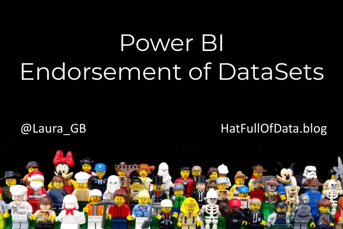
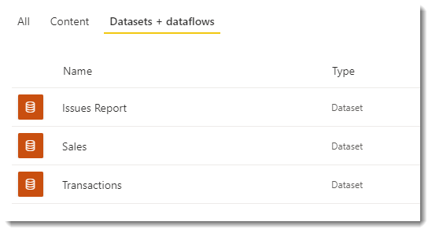
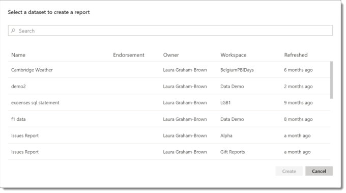
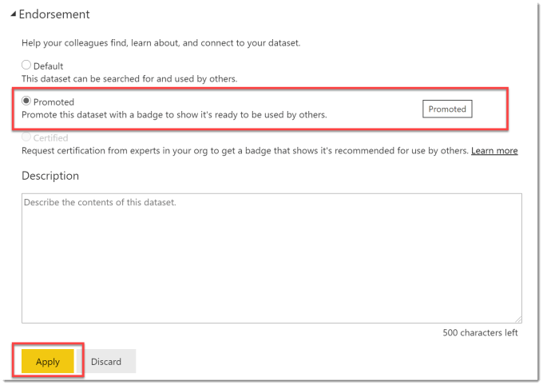
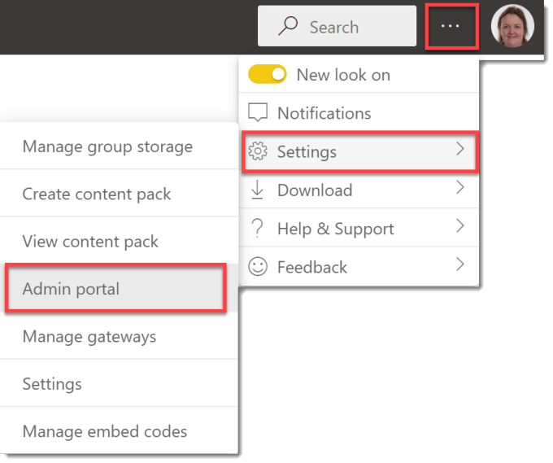
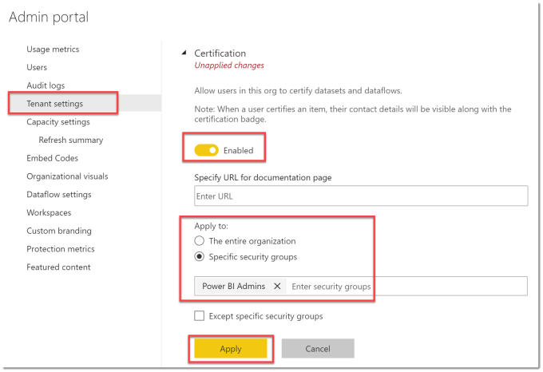
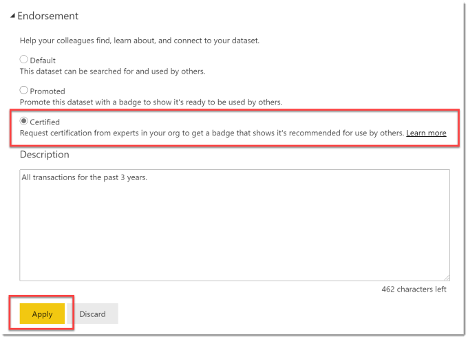
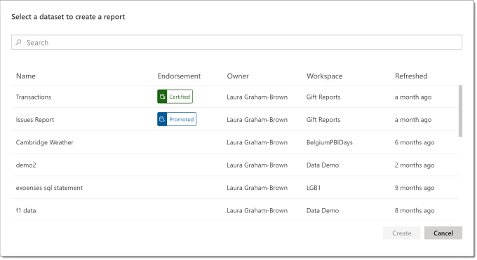

Connecting to an existing dataset is highly recommended if the data is the same. In order to encourage report builders to select the right datasets you can endorse a dataset as promoted or certified.

### YouTube

### Connecting to a Dataset

When a report writer looks at a workspace they can see the datasets available in that workspace. When the report writer goes to Power BI desktop and selects Power BI datasets they are given an alphabetical list of datasets from all the workspaces they have access to.

There are two types of endorsement, promoted which any dataset owner can apply and certified that only selected people can apply. These datasets will appear at the top of the list of datasets when connecting.

### Endorse a Dataset as Promoted

In the workspace, click on the ellipse menu on the dataset and select Settings. The last option in settings is Endorsement, expand this to see the options. Click on Promoted and click apply.

### Enabling Certification

By default users cannot endorse a dataset as certified. This is more restricted to keep the certified label use limited to datasets that have been checked. The Certified option will be greyed out for most users.

If you are a Power BI Admin you will be able to set up who can certify a dataset in the Admin Portal. From any dataset in the Power BI website, click on the three dots in the top right of the window, select Settings and then Admin portal.

In the Admin Portal, select Tenant settings and then scroll down to find Certification. Expanding that section reveals a toggle button enable Certification. Once enabled, you can select who it applies to by entering in a security group. Click Apply to save your changes. It can take up to 15 minutes for the changes to take effect.

Note : A company that has guidance on certification of a dataset, can add the url to that guidance in the documentation page box. Any dataset owner can then click on Learn more to see your company guidance.

### Endorse a Dataset as Certified

In the workspace, click on the ellipse menu on the dataset and select Settings. The last option in settings is Endorsement, expand this to see the options. Click on Certified and click apply.

### Updated Connecting to a Dataset

Now when a report writer, from Power BI desktop, wants to connect to a dataset they will be offered certified datasets, then promoted datasets, with all other datasets listed afterwards.

### Conclusion

One dataset to maintain and refresh is the best option, so anything that gets users to connect to the correct dataset is a great idea. Two levels of endorsing works quite well. Dataset owners promote their own datasets. Companies certify datasets that they have checked out.

## More Power BI Posts

- [Conditional Formatting Update](https://hatfullofdata.blog/power-bi-conditional-formatting-update/)

- [Data Refresh Date](https://hatfullofdata.blog/power-bi-data-refresh-date/)

- [Using Inactive Relationships in a Measure](https://hatfullofdata.blog/power-bi-inactive-relationships-in-a-measure/)

- [DAX CrossFilter Function](https://hatfullofdata.blog/power-bi-dax-crossfilter-function/)

- [COALESCE Function to Remove Blanks](https://hatfullofdata.blog/power-bi-coalesce-function-to-remove-blanks/)

- [Personalize Visuals](https://hatfullofdata.blog/power-bi-personalize-visuals/)

- [Gradient Legends](https://hatfullofdata.blog/power-bi-gradient-legends/)

- [Endorse a Dataset as Promoted or Certified](https://hatfullofdata.blog/power-bi-endorse-a-dataset/)

- [Q&A Synonyms Update](https://hatfullofdata.blog/power-bi-qa-synonyms-update/)

- [Import Text Using Examples](https://hatfullofdata.blog/power-bi-import-text-using-examples/)

- [Paginated Report Resources](https://hatfullofdata.blog/paginated-report-resources/)

- [Refreshing Datasets Automatically with Power BI Dataflows](https://hatfullofdata.blog/refreshing-datasets-automatically-with-dataflow/)

- [Charticulator](https://hatfullofdata.blog/charticulator-simple-custom-chart/)

- [Dataverse Connector – July 2022 Update](https://hatfullofdata.blog/power-bi-dataverse-connector-july-2022-update/)

- [Dataverse Choice Columns](https://hatfullofdata.blog/power-bi-dataverse-choices-and-choice-column/)

- [Switch Dataverse Tenancy](https://hatfullofdata.blog/power-bi-switch-dataverse-tenancy/)

- [Connecting to Google Analytics](https://hatfullofdata.blog/power-bi-connecting-to-google-analytics/)

- [Take Over a Dataset](https://hatfullofdata.blog/power-bi-take-over-a-dataset/)

- [Export Data from Power BI Visuals](https://hatfullofdata.blog/export-data-from-power-bi-visuals/)

- [Embed a Paginated Report](https://hatfullofdata.blog/power-bi-embed-a-paginated-report/)

- [Using SQL on Dataverse for Power BI](https://hatfullofdata.blog/using-sql-on-dataverse-for-power-bi/)

- [Power Platform Solution and Power BI Series](https://hatfullofdata.blog/power-platform-solution-and-power-bi-part-1/)

- [Creating a Custom Smart Narrative](https://hatfullofdata.blog/power-bi-creating-a-custom-smart-narrative/)

- [Power Automate Button in a Power BI Report](https://hatfullofdata.blog/power-automate-button-in-a-power-bi-report/)

## Power BI Series

- [SVG in Power BI series](https://hatfullofdata.blog/svg-in-power-bi-part-1-svg-basics/)

- [Power BI and Project Online series](https://hatfullofdata.blog/power-bi-connecting-to-project-online/)

- [Slicers series](https://hatfullofdata.blog/power-bi-slicers-introduction/)

- [Dataflow series](https://hatfullofdata.blog/power-bi-create-a-dataflow/)

- [Power BI SVG series](https://hatfullofdata.blog/svg-in-power-bi-part-1-svg-basics/)

- [Power Automate and Power BI Rest API series](https://hatfullofdata.blog/power-automate-and-power-bi-rest-api/)

- [Power BI and DevOps series](https://hatfullofdata.blog/devops-data-into-power-bi/)

