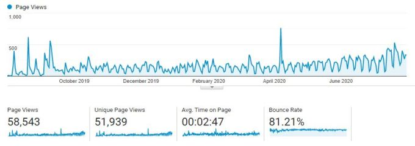
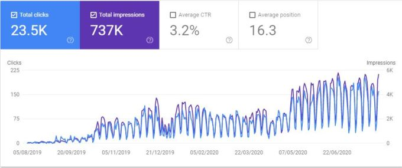
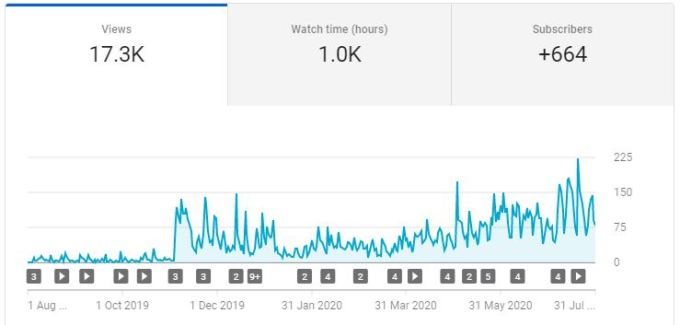

At the end of July 2019 I decided to posting more regularly to my own blog and on the 5th August 2019 I posted my first video on YouTube. This post is to say thank you to anyone reading this and any other post or watching a video.

I remember being highly amused when I got 25 subscribers and when people I respected in the community re-tweeted my links to blog posts and YouTube videos. I find it amazing that in July 2020 I had almost 9,000 page views of my blog and over 3,400 views of my videos. They can’t all be my dad, can they?

So I would like to thank you, the people who read my blog posts, watched my videos, subscribed, re-tweeted and even tweeted their own tweets regarding my content. I’ve been unbearably happy when my posts have been included in community leader round-ups. It has now become a passion of mine to blog and record videos and every like, comment or smile I get is what I do it for.

If you haven’t yet found my YouTube channel it is at[https://www.youtube.com/lauragbpowerplatform](https://www.youtube.com/lauragbpowerplatform)

### The Data

But let’s be honest really I like the numbers. The pretty charts that show numbers going up, the ways you can track what is going on it is all fascinating for a data geek like me. Without even loading data into Power BI I can get charts and see progress.

Page views on my blog from Google Analytics

Google Search Console Results

YouTube views

I am no expert on Google analytics and promoting sites etc. Megan Walker has done a great series on setting it up and [click here to open it](https://meganvwalker.com/category/google-analytics/)

### Advice

When I first started my blog I got one piece of advice from a friend, Pieter Veenstra who has a very successful blog [SharePains](https://sharepains.com/)

Every time you are asked a technical question, write a blog post as the answer.

Pieter Veenstra 2019

I’ve not managed to follow that completly but it has meant I always have topics to blog or record about. I haven’t got organised enough to promise a post every week or a video every week. One pattern I will endeavour to follow though is every video gets a supporting blog post.

So to pass the advice on, if you get asked technical questions, start a blog or YouTube channel.

## Thank You to everyone!

