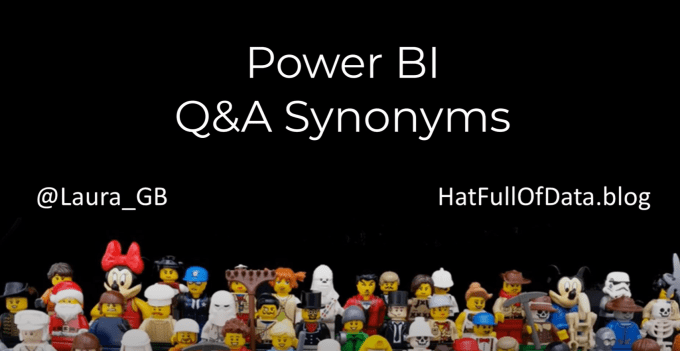
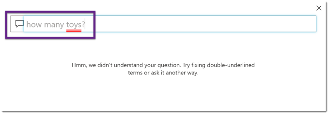
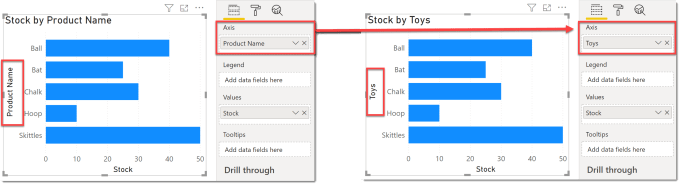
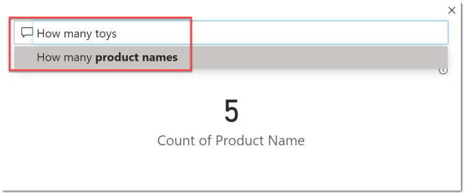
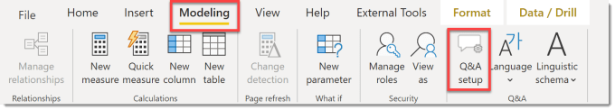
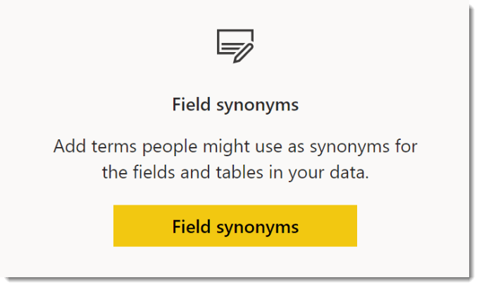
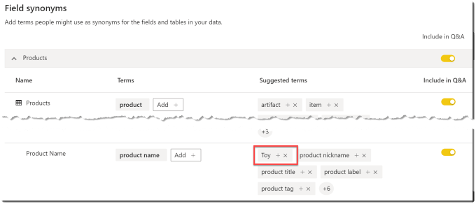
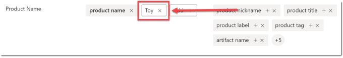
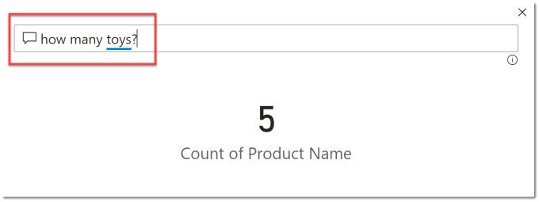

Q&A is a great tool for report readers to ask questions regarding the data behind the report. The natural language interpretation is improving all the time and can be improved by using Q&A synonyms. The July 2020 Power BI update added a new way to add synonyms to a report.

### YouTube Version

### Without Q&A Synonyms

On report I have added a Q&A button to allow a report reader to open a dialog to ask a question. Different people will use different terms for the same thing. A word that is not recognised will be underlined in red.

### Adding a Q&A Synonym by a rename

A synonym is an alternative word with the same meaning. In the example report the table is called Products with a Product Name column, but the products are toys. Therefore “Toy” in the context this report is a synonym of “Product”.

The July 2020 update introduced a new method to add a synonym to the report. When a field is renamed in the visualisation pane a suggested synonym term is created.

With the suggested synonym term created the natural language interpretation will now understand Toy means Product Name. When the question is asked using Toy the question using Product Name will be suggested.

After a few moments it will quickly show you a slight alternative with what question the current result is. It will also underline the word Toys in a orange dotted line.

### Modifying Q&A Synonyms

The Q&A setup button is on the Modelling ribbon tab. When the dialog opens, click on Field Synonyms to see the synonyms. Expand the relevant table and you will see the synonyms applies to each column.

The Q&A setup button is on the Modelling ribbon tab. When the dialog opens, click on Field Synonyms to see the synonyms. Expand the relevant table and you will see the synonyms applies to each column.

In my example you can see Toy has been added to the Product Name column in the suggested terms. This means alternative questions will be offered if Toy is used in a question.

Click the X to remove a term. When you click the + the term will be promoted to a Term. Visually it will move to the left.

## Re-asking the Question

Once the Q&A synonym has been promoted to a term rather than a suggested term, you no longer get another question offered.

### Conclusion

Q&A is an under used feature in Power BI. As report writers we assume we know best, and our report consumers’ questions have all been answered. We should add Q&A buttons, educate our users in how to use it and then collect the stats on questions asked, but that is for another blog post!

## More Power BI Posts

- [Conditional Formatting Update](https://hatfullofdata.blog/power-bi-conditional-formatting-update/)

- [Data Refresh Date](https://hatfullofdata.blog/power-bi-data-refresh-date/)

- [Using Inactive Relationships in a Measure](https://hatfullofdata.blog/power-bi-inactive-relationships-in-a-measure/)

- [DAX CrossFilter Function](https://hatfullofdata.blog/power-bi-dax-crossfilter-function/)

- [COALESCE Function to Remove Blanks](https://hatfullofdata.blog/power-bi-coalesce-function-to-remove-blanks/)

- [Personalize Visuals](https://hatfullofdata.blog/power-bi-personalize-visuals/)

- [Gradient Legends](https://hatfullofdata.blog/power-bi-gradient-legends/)

- [Endorse a Dataset as Promoted or Certified](https://hatfullofdata.blog/power-bi-endorse-a-dataset/)

- [Q&A Synonyms Update](https://hatfullofdata.blog/power-bi-qa-synonyms-update/)

- [Import Text Using Examples](https://hatfullofdata.blog/power-bi-import-text-using-examples/)

- [Paginated Report Resources](https://hatfullofdata.blog/paginated-report-resources/)

- [Refreshing Datasets Automatically with Power BI Dataflows](https://hatfullofdata.blog/refreshing-datasets-automatically-with-dataflow/)

- [Charticulator](https://hatfullofdata.blog/charticulator-simple-custom-chart/)

- [Dataverse Connector – July 2022 Update](https://hatfullofdata.blog/power-bi-dataverse-connector-july-2022-update/)

- [Dataverse Choice Columns](https://hatfullofdata.blog/power-bi-dataverse-choices-and-choice-column/)

- [Switch Dataverse Tenancy](https://hatfullofdata.blog/power-bi-switch-dataverse-tenancy/)

- [Connecting to Google Analytics](https://hatfullofdata.blog/power-bi-connecting-to-google-analytics/)

- [Take Over a Dataset](https://hatfullofdata.blog/power-bi-take-over-a-dataset/)

- [Export Data from Power BI Visuals](https://hatfullofdata.blog/export-data-from-power-bi-visuals/)

- [Embed a Paginated Report](https://hatfullofdata.blog/power-bi-embed-a-paginated-report/)

- [Using SQL on Dataverse for Power BI](https://hatfullofdata.blog/using-sql-on-dataverse-for-power-bi/)

- [Power Platform Solution and Power BI Series](https://hatfullofdata.blog/power-platform-solution-and-power-bi-part-1/)

- [Creating a Custom Smart Narrative](https://hatfullofdata.blog/power-bi-creating-a-custom-smart-narrative/)

- [Power Automate Button in a Power BI Report](https://hatfullofdata.blog/power-automate-button-in-a-power-bi-report/)

## Power BI Series

- [SVG in Power BI series](https://hatfullofdata.blog/svg-in-power-bi-part-1-svg-basics/)

- [Power BI and Project Online series](https://hatfullofdata.blog/power-bi-connecting-to-project-online/)

- [Slicers series](https://hatfullofdata.blog/power-bi-slicers-introduction/)

- [Dataflow series](https://hatfullofdata.blog/power-bi-create-a-dataflow/)

- [Power BI SVG series](https://hatfullofdata.blog/svg-in-power-bi-part-1-svg-basics/)

- [Power Automate and Power BI Rest API series](https://hatfullofdata.blog/power-automate-and-power-bi-rest-api/)

- [Power BI and DevOps series](https://hatfullofdata.blog/devops-data-into-power-bi/)

