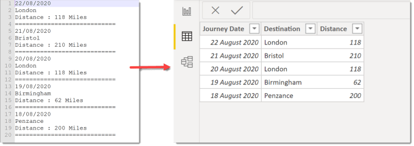
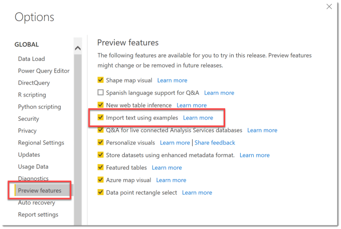
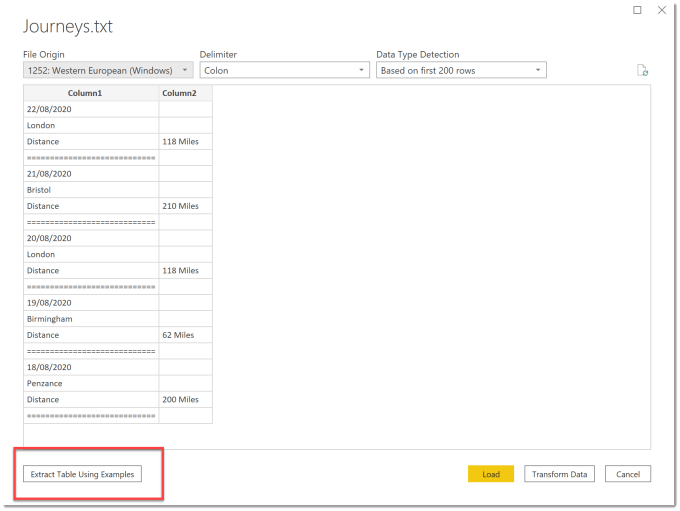
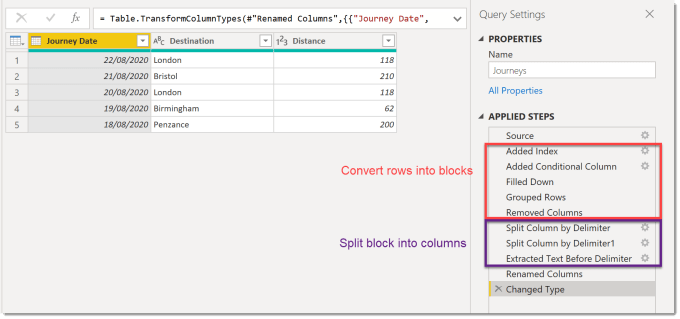
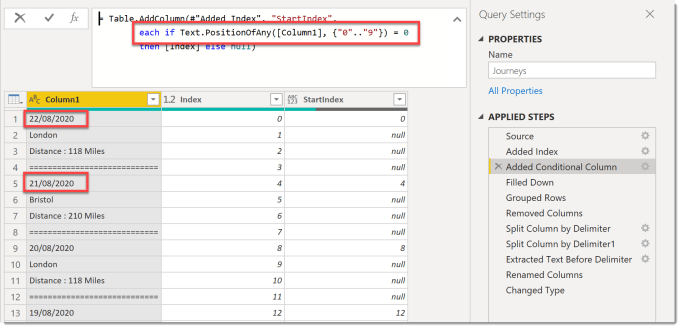
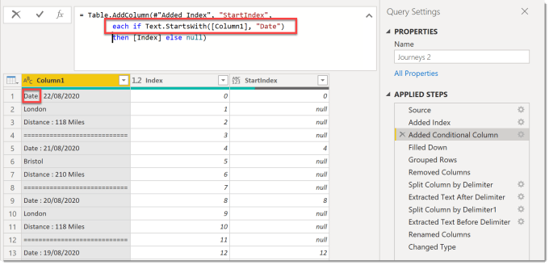
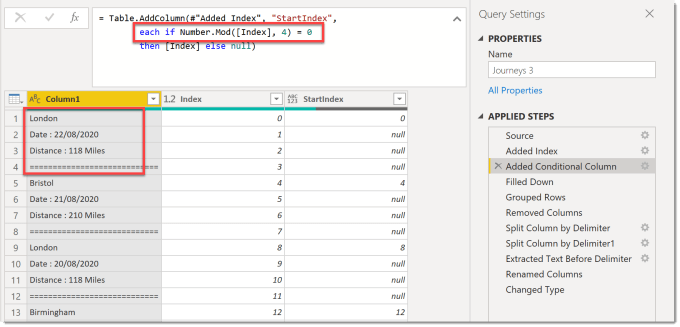

Import text using examples was introduced in the 2020 August update for Power BI. It writes the Power Query steps to transform a non-tabular text file into a table.

### YouTube Version

[https://youtu.be/6h7g-CwkeVg](https://youtu.be/6h7g-CwkeVg)

### Enabling the Feature

At the point of writing this blog post this feature is still in preview. The feature is enabled in File – Options in Preview features. It will like most features move to being enabled for everyone at some point.

### Example Import text using Examples

For this example I have a very simple text file as shown in first picture in this post. It contains the details of journeys on different days. So when I select Get Data – Text/CSV and select the file, the dialog that shows a preview of the data in the file has a new button.

When the button is clicked a new dialog opens a dialog box with a data preview showing and an empty table. This means we need to enter in some answers into the table so a pattern can be calculated how to transform the data. When you start to type in a value it will suggest possible values.

A column is renamed by double clicking on the column title and entering a new name.

With only one value it cannot calculate the pattern required. When I have added more values it can determine the pattern. It often needs less values in future columns. In this example 2 dates were needed for the first column and then only one value for the remaining columns.

In the above example the Distance column was only part of the row of data. It calculates the ways to split the data. After this and all the columns have been added, we click Transform Data to see the Power Query steps that the import feature have been written.

### Looking at the Power Query

So the magic behind this new feature is it writes a 10+ step query for you with a pretty good pattern for doing this. So the 5 steps after the source are working out how many rows make a block of data and grouping that data into one block. The next chunk of steps are splitting that block into separate columns.

### How does import text using example decide the block length?

This for me is the clever part. Step three where it adds the conditional column is the crucial step. So I looked at three slightly different versions of the text file to see how it changes.

#### Example 1

In this example each of the blocks start with a date, which means the line starts with a number. Step 3 uses a test to see if in position 0 there is a number. So for this example, we could have as many rows as we liked in a block as long as the first row is the only row starting with a number.

#### Example 2

In this example the blocks start with the word “Date”. Step 3 looks for the line starting with “Date” as the first line. This is pattern is a great one as it works fine for different length blocks as long as the only lines starting with “Date”.

#### Example 3

In this example there is no easy way to identify the top row of the data. This means the only pattern it can determine is by length of the block so it guesses 4. This works if the data is in same length blocks.

### Conclusion

I like the new import text using examples feature and I can see places where it will get used. I hope it gets progressed to recognise more patterns and be more flexible. When it works it stops the report writer needing to put together the Power Query steps to do the transform.

## More Power BI Posts

- [Conditional Formatting Update](https://hatfullofdata.blog/power-bi-conditional-formatting-update/)

- [Data Refresh Date](https://hatfullofdata.blog/power-bi-data-refresh-date/)

- [Using Inactive Relationships in a Measure](https://hatfullofdata.blog/power-bi-inactive-relationships-in-a-measure/)

- [DAX CrossFilter Function](https://hatfullofdata.blog/power-bi-dax-crossfilter-function/)

- [COALESCE Function to Remove Blanks](https://hatfullofdata.blog/power-bi-coalesce-function-to-remove-blanks/)

- [Personalize Visuals](https://hatfullofdata.blog/power-bi-personalize-visuals/)

- [Gradient Legends](https://hatfullofdata.blog/power-bi-gradient-legends/)

- [Endorse a Dataset as Promoted or Certified](https://hatfullofdata.blog/power-bi-endorse-a-dataset/)

- [Q&A Synonyms Update](https://hatfullofdata.blog/power-bi-qa-synonyms-update/)

- [Import Text Using Examples](https://hatfullofdata.blog/power-bi-import-text-using-examples/)

- [Paginated Report Resources](https://hatfullofdata.blog/paginated-report-resources/)

- [Refreshing Datasets Automatically with Power BI Dataflows](https://hatfullofdata.blog/refreshing-datasets-automatically-with-dataflow/)

- [Charticulator](https://hatfullofdata.blog/charticulator-simple-custom-chart/)

- [Dataverse Connector – July 2022 Update](https://hatfullofdata.blog/power-bi-dataverse-connector-july-2022-update/)

- [Dataverse Choice Columns](https://hatfullofdata.blog/power-bi-dataverse-choices-and-choice-column/)

- [Switch Dataverse Tenancy](https://hatfullofdata.blog/power-bi-switch-dataverse-tenancy/)

- [Connecting to Google Analytics](https://hatfullofdata.blog/power-bi-connecting-to-google-analytics/)

- [Take Over a Dataset](https://hatfullofdata.blog/power-bi-take-over-a-dataset/)

- [Export Data from Power BI Visuals](https://hatfullofdata.blog/export-data-from-power-bi-visuals/)

- [Embed a Paginated Report](https://hatfullofdata.blog/power-bi-embed-a-paginated-report/)

- [Using SQL on Dataverse for Power BI](https://hatfullofdata.blog/using-sql-on-dataverse-for-power-bi/)

- [Power Platform Solution and Power BI Series](https://hatfullofdata.blog/power-platform-solution-and-power-bi-part-1/)

- [Creating a Custom Smart Narrative](https://hatfullofdata.blog/power-bi-creating-a-custom-smart-narrative/)

- [Power Automate Button in a Power BI Report](https://hatfullofdata.blog/power-automate-button-in-a-power-bi-report/)

## Power BI Series

- [SVG in Power BI series](https://hatfullofdata.blog/svg-in-power-bi-part-1-svg-basics/)

- [Power BI and Project Online series](https://hatfullofdata.blog/power-bi-connecting-to-project-online/)

- [Slicers series](https://hatfullofdata.blog/power-bi-slicers-introduction/)

- [Dataflow series](https://hatfullofdata.blog/power-bi-create-a-dataflow/)

- [Power BI SVG series](https://hatfullofdata.blog/svg-in-power-bi-part-1-svg-basics/)

- [Power Automate and Power BI Rest API series](https://hatfullofdata.blog/power-automate-and-power-bi-rest-api/)

- [Power BI and DevOps series](https://hatfullofdata.blog/devops-data-into-power-bi/)

