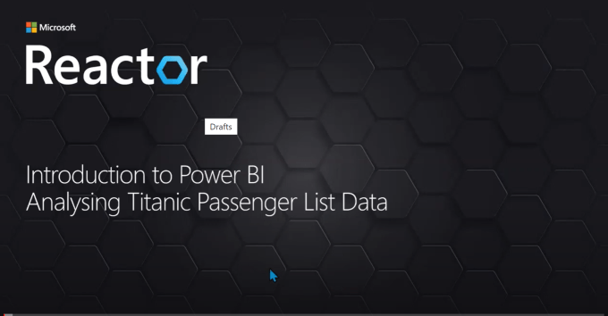
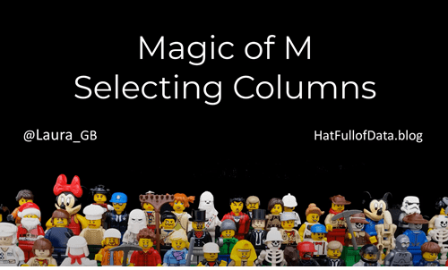
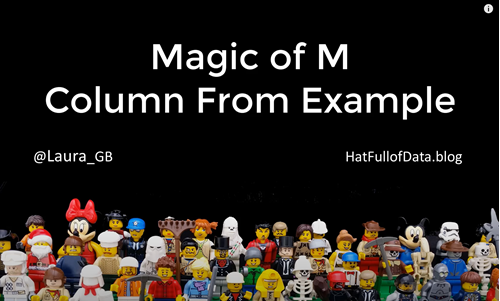
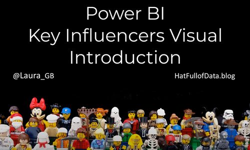
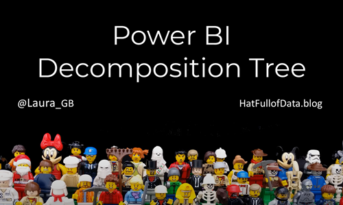

This is a post to support my session at the Reactor on 12th October 2020. The session was aimed at newcomers to Power BI and the AI visuals. Below is a link to the video on Reactor’s YouTube channel

### Data Sources

The session uses 2 data sources, the passenger list for the Titanic and an Excel file to add some extra information such as port locations.

[https://hatfullofdata.blog/wp-content/uploads/2020/10/TitanicLocations.xlsx](https://hatfullofdata.blog/wp-content/uploads/2020/10/TitanicLocations.xlsx)

[https://hatfullofdata.blog/wp-content/uploads/2020/10/titanicdata.csv](https://hatfullofdata.blog/wp-content/uploads/2020/10/titanicdata.csv)

### Transformations

The passenger list data requires some transformations to make it easier to work with. The two main skills demo’d are Column by Example and Selecting columns. These are covered in these 2 videos.

### Page Background

In order to make page layout easy I use page backgrounds created in PowerPoint. This idea I got from Chris Hammill’s brilliant blog post found at [https://alluringbi.com/2019/10/21/background-concepts-for-power-bi/](https://alluringbi.com/2019/10/21/background-concepts-for-power-bi/)

### AI Visuals

In this demo I use 3 AI visuals Key Influencers, Decomposition Tree and Smart Narrative. Here are videos to help you get started with those visuals.

## London Reactor Posts

- [Power BI Introduction](https://hatfullofdata.blog/reactor-power-bi-introduction-resources/)

- [Weather Report Resources](https://hatfullofdata.blog/power-bi-introduction-weather-report-resources/)

- [Use AI Visuals to Analyse Titanic Data](https://hatfullofdata.blog/power-bi-analyse-titanic-data-with-ai-visuals/)

- [Christmas Carol Text Analysis](https://hatfullofdata.blog/reactor-christmas-carol-text-analysis/)

- [Last Year’s Sales](https://hatfullofdata.blog/power-bi-reactor-last-years-sales/)

- [Tea & Biscuits](https://hatfullofdata.blog/power-bi-tea-biscuits-session-reactor/)

