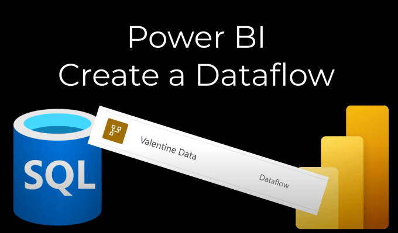
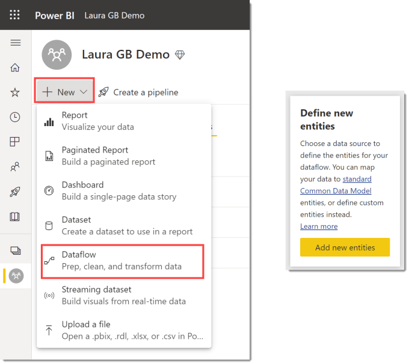
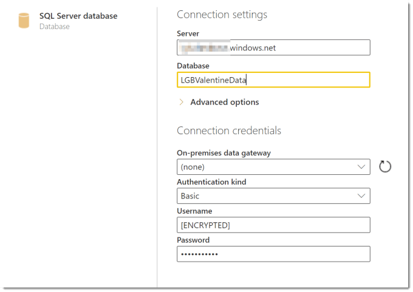
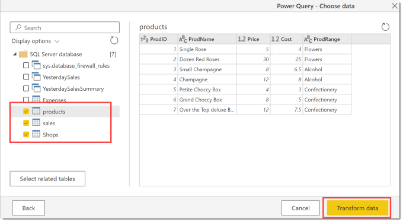
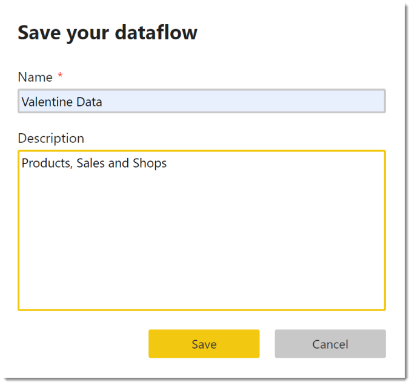
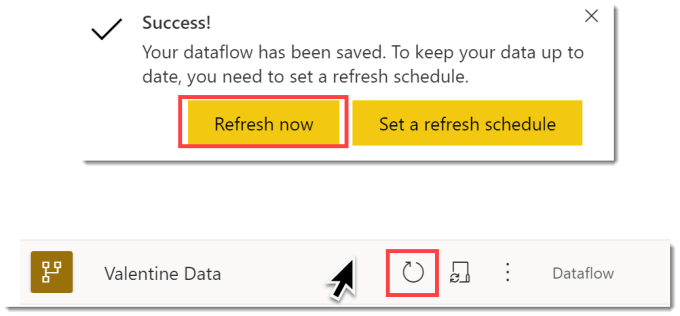
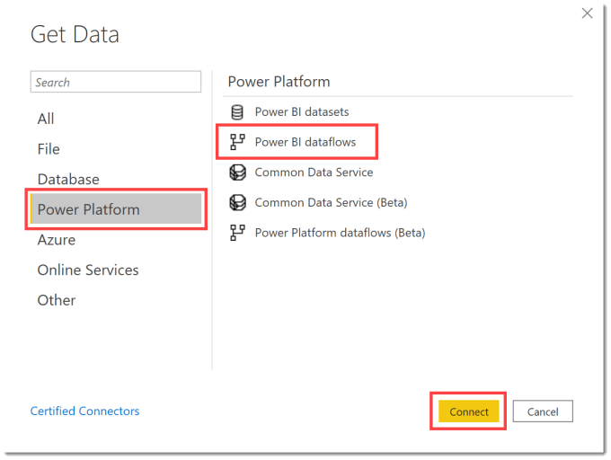
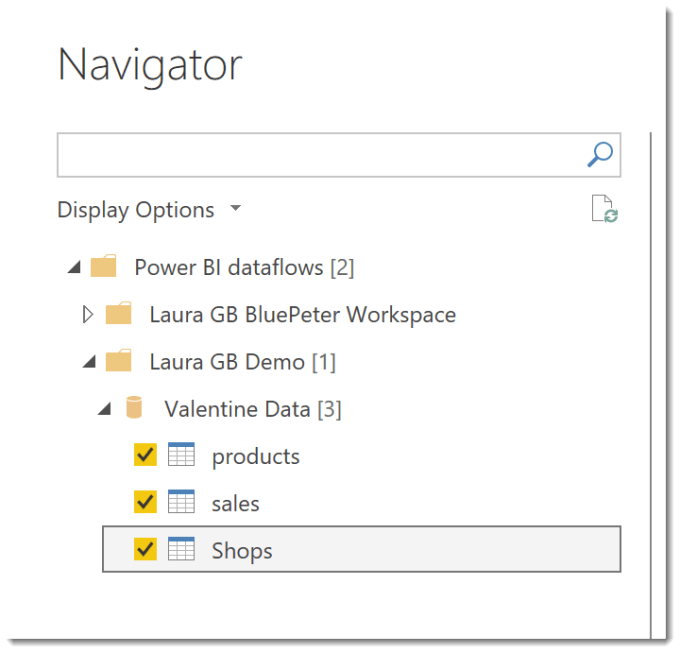

This post is a quick guide to create a dataflow and connect to a dataflow. Dataflows are a great way to give your report writers reusable data source that includes any complex transformations required and doesn’t require unique data logins for every report writer. It just requires access to the workspace that contains your dataflow.

### Dataflow Series

This post is part of a series on dataflows.

- [Create a Dataflow](https://hatfullofdata.blog/power-bi-create-a-dataflow/)

- [Set up Dataflow Refresh](https://hatfullofdata.blog/power-bi-scheduled-refresh-dataflow/)

- [Endorsement](https://hatfullofdata.blog/power-bi-dataflows-endorsement-as-promoted-and-certified/)

- [Diagram View](https://hatfullofdata.blog/power-bi-dataflow-new-diagram-view/)

- [Refresh History](https://hatfullofdata.blog/power-bi-dataflow-refresh-history/)

- [Create Dataflow from Export JSON File](https://hatfullofdata.blog/power-bi-create-dataflow-from-export/)

- Incremental Refresh

### YouTube Version

### Create a Dataflow

Staring in the workspace online in the Power BI service, click on New and then select Dataflow.

In the next screen click on Add new entities button to start creating your dataflow.

The next screen lists all the data sources supported for dataflows. Select your data source. There is a search box in the top right if required. In this example I selected SQL Server database, although I could have picked Azure SQL Server.

As soon as you click in the data source, you will be prompted to enter in connection settings. When complete click Next to continue.

You will then be prompted to select the tables or views to add to the dataflow. You can see previews if that helps. When ready select Transform data button.

This will open an online version of Power Query. Add the transforms you need to each query. When you have finished click Save & close to finish creating your dataflow.

It will then prompt you for a name for your dataflow and an optional description.

### Refresh the Dataflow

Although you saw data in the dataflow as you were building it, its not there until you refresh. You get a message for a short while when you save it asking if you want to refresh in the top right hand corner. If you miss that you can return to the workspace and when you hover your mouse point over the dataflow the refresh icon appears.

### Connect to a Dataflow

A report, in Power BI desktop, can connect to the dataflow as a data source. Click on Get Data to open the dialog, click Power Platform to filter the options and then select Power BI dataflows. Click Connect to start the connection to dataflows.

When the Navigator dialog appears, expand the correct workspace and dataflow to select the tables. Click Load to load the data into your report. You can click transform to add extra transformations into your data if required.

### Note on Refreshes

If a report is based on a dataflow, the dataflow needs to refresh before the report refreshes. Care needs to be taken on setting refreshes to co-ordinate correctly.

### Conclusion

Dataflows are a great part of the data reporting structure that can reduce the hit on databases, reduce the number of accounts accessing the data and give the report writers clean well structured data to build their reports on.

## More Power BI Posts

- [Conditional Formatting Update](https://hatfullofdata.blog/power-bi-conditional-formatting-update/)

- [Data Refresh Date](https://hatfullofdata.blog/power-bi-data-refresh-date/)

- [Using Inactive Relationships in a Measure](https://hatfullofdata.blog/power-bi-inactive-relationships-in-a-measure/)

- [DAX CrossFilter Function](https://hatfullofdata.blog/power-bi-dax-crossfilter-function/)

- [COALESCE Function to Remove Blanks](https://hatfullofdata.blog/power-bi-coalesce-function-to-remove-blanks/)

- [Personalize Visuals](https://hatfullofdata.blog/power-bi-personalize-visuals/)

- [Gradient Legends](https://hatfullofdata.blog/power-bi-gradient-legends/)

- [Endorse a Dataset as Promoted or Certified](https://hatfullofdata.blog/power-bi-endorse-a-dataset/)

- [Q&A Synonyms Update](https://hatfullofdata.blog/power-bi-qa-synonyms-update/)

- [Import Text Using Examples](https://hatfullofdata.blog/power-bi-import-text-using-examples/)

- [Paginated Report Resources](https://hatfullofdata.blog/paginated-report-resources/)

- [Refreshing Datasets Automatically with Power BI Dataflows](https://hatfullofdata.blog/refreshing-datasets-automatically-with-dataflow/)

- [Charticulator](https://hatfullofdata.blog/charticulator-simple-custom-chart/)

- [Dataverse Connector – July 2022 Update](https://hatfullofdata.blog/power-bi-dataverse-connector-july-2022-update/)

- [Dataverse Choice Columns](https://hatfullofdata.blog/power-bi-dataverse-choices-and-choice-column/)

- [Switch Dataverse Tenancy](https://hatfullofdata.blog/power-bi-switch-dataverse-tenancy/)

- [Connecting to Google Analytics](https://hatfullofdata.blog/power-bi-connecting-to-google-analytics/)

- [Take Over a Dataset](https://hatfullofdata.blog/power-bi-take-over-a-dataset/)

- [Export Data from Power BI Visuals](https://hatfullofdata.blog/export-data-from-power-bi-visuals/)

- [Embed a Paginated Report](https://hatfullofdata.blog/power-bi-embed-a-paginated-report/)

- [Using SQL on Dataverse for Power BI](https://hatfullofdata.blog/using-sql-on-dataverse-for-power-bi/)

- [Power Platform Solution and Power BI Series](https://hatfullofdata.blog/power-platform-solution-and-power-bi-part-1/)

- [Creating a Custom Smart Narrative](https://hatfullofdata.blog/power-bi-creating-a-custom-smart-narrative/)

- [Power Automate Button in a Power BI Report](https://hatfullofdata.blog/power-automate-button-in-a-power-bi-report/)

## Power BI Series

- [SVG in Power BI series](https://hatfullofdata.blog/svg-in-power-bi-part-1-svg-basics/)

- [Power BI and Project Online series](https://hatfullofdata.blog/power-bi-connecting-to-project-online/)

- [Slicers series](https://hatfullofdata.blog/power-bi-slicers-introduction/)

- [Dataflow series](https://hatfullofdata.blog/power-bi-create-a-dataflow/)

- [Power BI SVG series](https://hatfullofdata.blog/svg-in-power-bi-part-1-svg-basics/)

- [Power Automate and Power BI Rest API series](https://hatfullofdata.blog/power-automate-and-power-bi-rest-api/)

- [Power BI and DevOps series](https://hatfullofdata.blog/devops-data-into-power-bi/)

