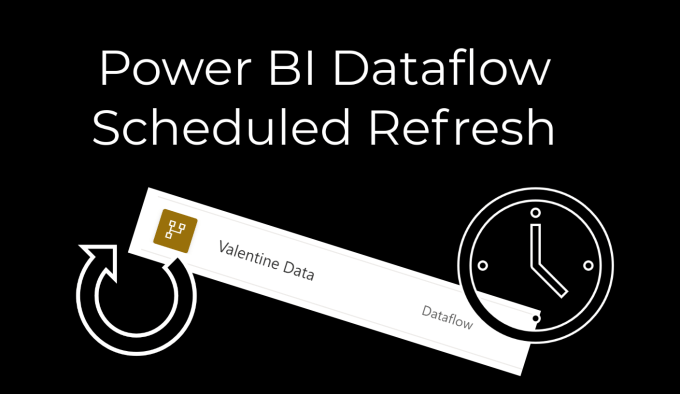
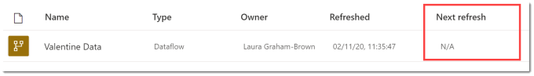
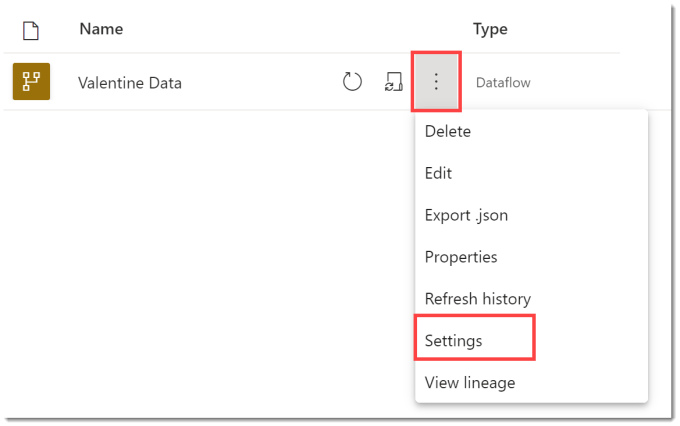
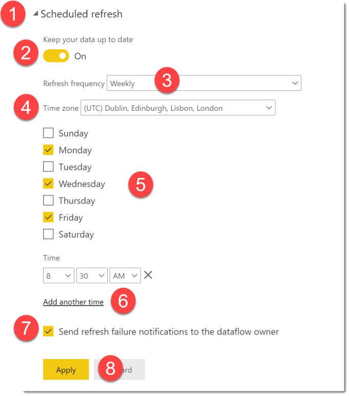
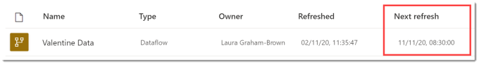

Most dataflows needs to have scheduled refresh setup so that the data will be up to date ready for the reports connecting to it. This post walks through the basic steps to set up the refresh.

### Dataflow Series

This post is part of a series on dataflows.

- [Create a Dataflow](https://hatfullofdata.blog/power-bi-create-a-dataflow/)

- [Set up Dataflow Refresh](https://hatfullofdata.blog/power-bi-scheduled-refresh-dataflow/)

- [Endorsement](https://hatfullofdata.blog/power-bi-dataflows-endorsement-as-promoted-and-certified/)

- [Diagram View](https://hatfullofdata.blog/power-bi-dataflow-new-diagram-view/)

- [Refresh History](https://hatfullofdata.blog/power-bi-dataflow-refresh-history/)

- [Create Dataflow from Export JSON File](https://hatfullofdata.blog/power-bi-create-dataflow-from-export/)

- Incremental Refresh

### YouTube Version

### Setup Scheduled Refresh

In the workspace containing the dataflow, there is no Next Refresh on the dataflow. Therefore the dataflow will not refresh automatically.

Click on the three dots on the dataflow row, they appear when your mouse hovers over the row. Select Settings from the options.

- Expand Scheduled refresh.

- Click on the toggle to turn on scheduled refresh.

- Select refresh frequency, daily means every day, weekly means you can select which day of the week.

- Select your time zone.

- If you have selected weekly, select days.

- Click on Add another time and enter the hour, minutes and am or pm for every time you want the refresh to happen.

- Leave the tick so you you will be notified if the dataflow refresh fails.

- Click Apply.

Once the above has been completed, we can now return to the workspace. The dataflow now has a Next Refresh date and time for next Wednesday at 8:30am.

### Conclusion

It always fascinates me how people are not confident in setting up the refreshes of datasets and dataflows. Hopefully this quick simple guide will give enough confidence to setup the refreshes to happen without people logging into Power BI to refresh the dataset or dataflow manually.

## More Power BI Posts

- [Conditional Formatting Update](https://hatfullofdata.blog/power-bi-conditional-formatting-update/)

- [Data Refresh Date](https://hatfullofdata.blog/power-bi-data-refresh-date/)

- [Using Inactive Relationships in a Measure](https://hatfullofdata.blog/power-bi-inactive-relationships-in-a-measure/)

- [DAX CrossFilter Function](https://hatfullofdata.blog/power-bi-dax-crossfilter-function/)

- [COALESCE Function to Remove Blanks](https://hatfullofdata.blog/power-bi-coalesce-function-to-remove-blanks/)

- [Personalize Visuals](https://hatfullofdata.blog/power-bi-personalize-visuals/)

- [Gradient Legends](https://hatfullofdata.blog/power-bi-gradient-legends/)

- [Endorse a Dataset as Promoted or Certified](https://hatfullofdata.blog/power-bi-endorse-a-dataset/)

- [Q&A Synonyms Update](https://hatfullofdata.blog/power-bi-qa-synonyms-update/)

- [Import Text Using Examples](https://hatfullofdata.blog/power-bi-import-text-using-examples/)

- [Paginated Report Resources](https://hatfullofdata.blog/paginated-report-resources/)

- [Refreshing Datasets Automatically with Power BI Dataflows](https://hatfullofdata.blog/refreshing-datasets-automatically-with-dataflow/)

- [Charticulator](https://hatfullofdata.blog/charticulator-simple-custom-chart/)

- [Dataverse Connector – July 2022 Update](https://hatfullofdata.blog/power-bi-dataverse-connector-july-2022-update/)

- [Dataverse Choice Columns](https://hatfullofdata.blog/power-bi-dataverse-choices-and-choice-column/)

- [Switch Dataverse Tenancy](https://hatfullofdata.blog/power-bi-switch-dataverse-tenancy/)

- [Connecting to Google Analytics](https://hatfullofdata.blog/power-bi-connecting-to-google-analytics/)

- [Take Over a Dataset](https://hatfullofdata.blog/power-bi-take-over-a-dataset/)

- [Export Data from Power BI Visuals](https://hatfullofdata.blog/export-data-from-power-bi-visuals/)

- [Embed a Paginated Report](https://hatfullofdata.blog/power-bi-embed-a-paginated-report/)

- [Using SQL on Dataverse for Power BI](https://hatfullofdata.blog/using-sql-on-dataverse-for-power-bi/)

- [Power Platform Solution and Power BI Series](https://hatfullofdata.blog/power-platform-solution-and-power-bi-part-1/)

- [Creating a Custom Smart Narrative](https://hatfullofdata.blog/power-bi-creating-a-custom-smart-narrative/)

- [Power Automate Button in a Power BI Report](https://hatfullofdata.blog/power-automate-button-in-a-power-bi-report/)

## Power BI Series

- [SVG in Power BI series](https://hatfullofdata.blog/svg-in-power-bi-part-1-svg-basics/)

- [Power BI and Project Online series](https://hatfullofdata.blog/power-bi-connecting-to-project-online/)

- [Slicers series](https://hatfullofdata.blog/power-bi-slicers-introduction/)

- [Dataflow series](https://hatfullofdata.blog/power-bi-create-a-dataflow/)

- [Power BI SVG series](https://hatfullofdata.blog/svg-in-power-bi-part-1-svg-basics/)

- [Power Automate and Power BI Rest API series](https://hatfullofdata.blog/power-automate-and-power-bi-rest-api/)

- [Power BI and DevOps series](https://hatfullofdata.blog/devops-data-into-power-bi/)

