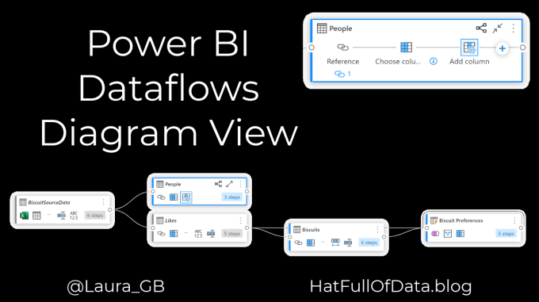
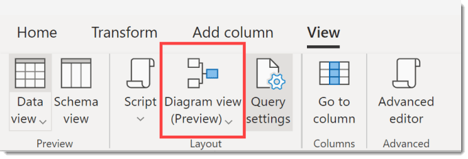
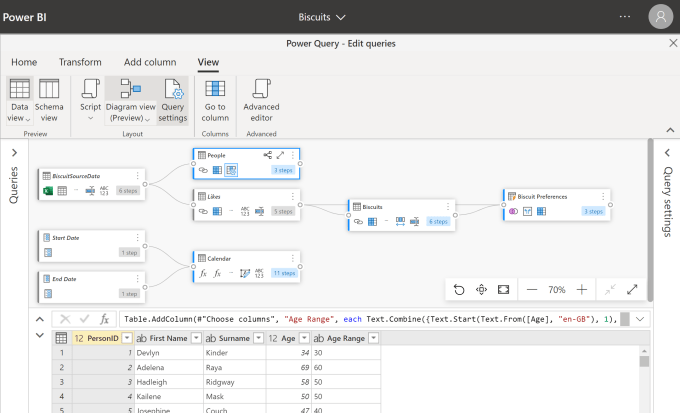
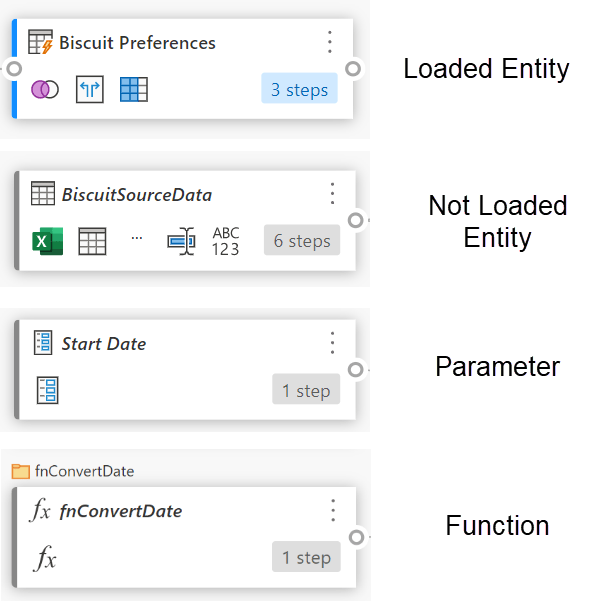
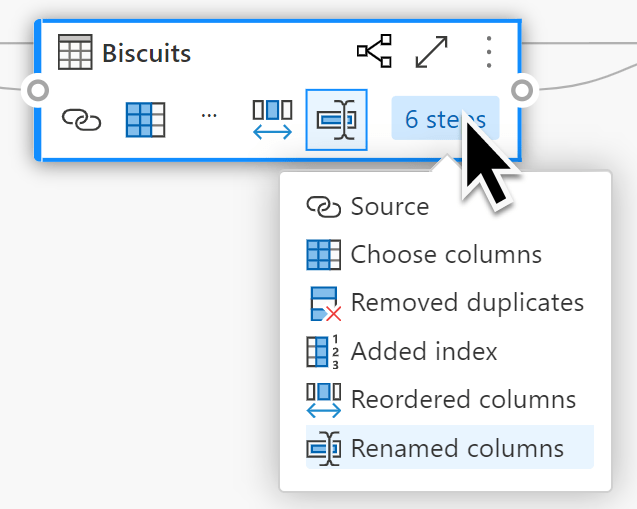
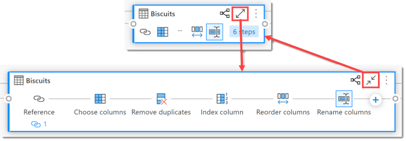
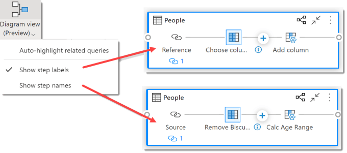
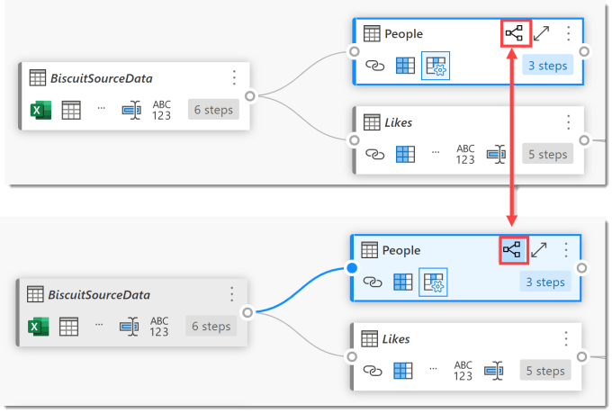
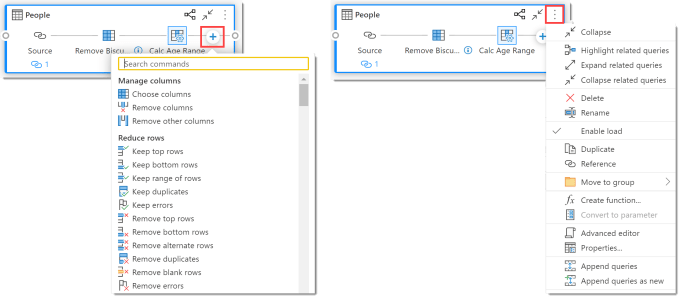

In November 2020 a new diagram view was introduced to the online Power Query editor. The new feature produces a brilliant diagram of how the queries and parameters relate within the dataflow.

### Dataflow Series

This post is part of a series on dataflows.

- [Create a Dataflow](https://hatfullofdata.blog/power-bi-create-a-dataflow/)

- [Set up Dataflow Refresh](https://hatfullofdata.blog/power-bi-scheduled-refresh-dataflow/)

- [Endorsement](https://hatfullofdata.blog/power-bi-dataflows-endorsement-as-promoted-and-certified/)

- [Diagram View](https://hatfullofdata.blog/power-bi-dataflow-new-diagram-view/)

- [Refresh History](https://hatfullofdata.blog/power-bi-dataflow-refresh-history/)

- [Create Dataflow from Export JSON File](https://hatfullofdata.blog/power-bi-create-dataflow-from-export/)

- Incremental Refresh

### YouTube Version

### Displaying Diagram View

When editing your dataflow, click on the View ribbon tab and select Diagram View. The diagram view will appear between the ribbon and the formula bar.

### Object Types Shown in Diagram View

The entities with a blue border are loaded entities, i.e. listed when connecting and the entities with a grey border are not loaded, so they refresh but are not exposed to the report builder. Parameters and functions have a relevant symbols in the top left and a grey border.

### Query Steps Preview

If you hover your mouse pointer over the step counter, it will display a list of the query steps.

### Expanding Display View boxes

In the top right corner of each query and function box there is a double-headed arrow button. Click this button to expand the query and show all the steps. The button is a toggle to switch between collapsed and expanded views.

If multiple queries are expanded, you can collapse all query boxes by using the toolbar in the bottom right of the canvas. It has collapse all and expand all buttons.

### Displaying Step Names

By default an expanded query displays step labels, i.e. the name of the action being applied. You can display the names of the steps by clicking on arrow below Diagram view button and selecting Show step names.

### Related Queries

Related queries can be highlighted using the model diagram button in the top right of the query box. It will highlight all related objects blue or grey based on their borders. In a complex dataflow this can be useful to understand the complexities.

### Adding Steps

When a query is selected and expanded it displays a plus sign. Clicking on the plus button displays a list of possible steps to add, it will be based on the column you have selected. There is a search box to assist in finding the right step.

Clicking on the three dots in the top right hand corner offer multiple query steps to add to the query plus some other options.

### Conclusion

Diagram view is a great addition to the online dataflow editor. Diagrams are a great way to explain a structure and this should help explain transforms within a dataflow. Personally I doubt I will be using the plus button to add steps, but then I am not the target audience.

## More Power BI Posts

- [Conditional Formatting Update](https://hatfullofdata.blog/power-bi-conditional-formatting-update/)

- [Data Refresh Date](https://hatfullofdata.blog/power-bi-data-refresh-date/)

- [Using Inactive Relationships in a Measure](https://hatfullofdata.blog/power-bi-inactive-relationships-in-a-measure/)

- [DAX CrossFilter Function](https://hatfullofdata.blog/power-bi-dax-crossfilter-function/)

- [COALESCE Function to Remove Blanks](https://hatfullofdata.blog/power-bi-coalesce-function-to-remove-blanks/)

- [Personalize Visuals](https://hatfullofdata.blog/power-bi-personalize-visuals/)

- [Gradient Legends](https://hatfullofdata.blog/power-bi-gradient-legends/)

- [Endorse a Dataset as Promoted or Certified](https://hatfullofdata.blog/power-bi-endorse-a-dataset/)

- [Q&A Synonyms Update](https://hatfullofdata.blog/power-bi-qa-synonyms-update/)

- [Import Text Using Examples](https://hatfullofdata.blog/power-bi-import-text-using-examples/)

- [Paginated Report Resources](https://hatfullofdata.blog/paginated-report-resources/)

- [Refreshing Datasets Automatically with Power BI Dataflows](https://hatfullofdata.blog/refreshing-datasets-automatically-with-dataflow/)

- [Charticulator](https://hatfullofdata.blog/charticulator-simple-custom-chart/)

- [Dataverse Connector – July 2022 Update](https://hatfullofdata.blog/power-bi-dataverse-connector-july-2022-update/)

- [Dataverse Choice Columns](https://hatfullofdata.blog/power-bi-dataverse-choices-and-choice-column/)

- [Switch Dataverse Tenancy](https://hatfullofdata.blog/power-bi-switch-dataverse-tenancy/)

- [Connecting to Google Analytics](https://hatfullofdata.blog/power-bi-connecting-to-google-analytics/)

- [Take Over a Dataset](https://hatfullofdata.blog/power-bi-take-over-a-dataset/)

- [Export Data from Power BI Visuals](https://hatfullofdata.blog/export-data-from-power-bi-visuals/)

- [Embed a Paginated Report](https://hatfullofdata.blog/power-bi-embed-a-paginated-report/)

- [Using SQL on Dataverse for Power BI](https://hatfullofdata.blog/using-sql-on-dataverse-for-power-bi/)

- [Power Platform Solution and Power BI Series](https://hatfullofdata.blog/power-platform-solution-and-power-bi-part-1/)

- [Creating a Custom Smart Narrative](https://hatfullofdata.blog/power-bi-creating-a-custom-smart-narrative/)

- [Power Automate Button in a Power BI Report](https://hatfullofdata.blog/power-automate-button-in-a-power-bi-report/)

## Power BI Series

- [SVG in Power BI series](https://hatfullofdata.blog/svg-in-power-bi-part-1-svg-basics/)

- [Power BI and Project Online series](https://hatfullofdata.blog/power-bi-connecting-to-project-online/)

- [Slicers series](https://hatfullofdata.blog/power-bi-slicers-introduction/)

- [Dataflow series](https://hatfullofdata.blog/power-bi-create-a-dataflow/)

- [Power BI SVG series](https://hatfullofdata.blog/svg-in-power-bi-part-1-svg-basics/)

- [Power Automate and Power BI Rest API series](https://hatfullofdata.blog/power-automate-and-power-bi-rest-api/)

- [Power BI and DevOps series](https://hatfullofdata.blog/devops-data-into-power-bi/)

