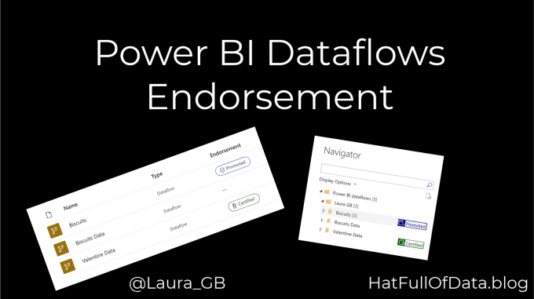
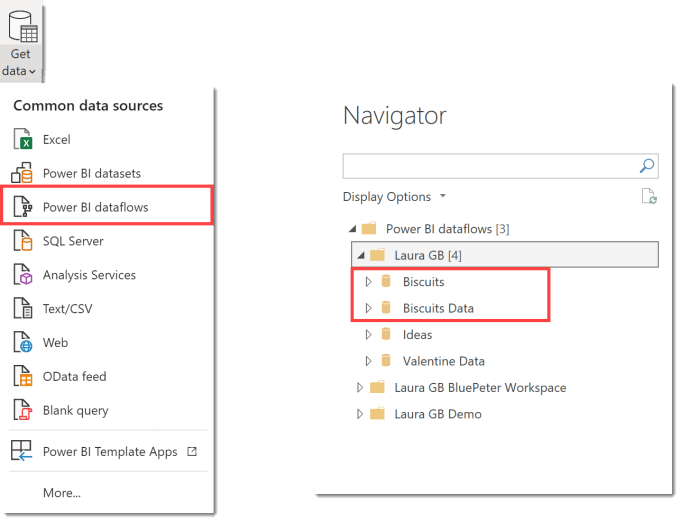
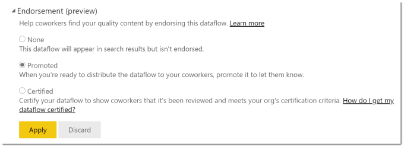
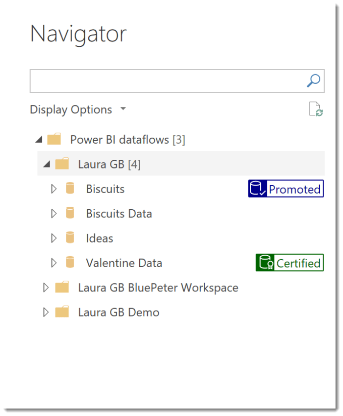

Inform your users as to which dataflow to use by using Endorsement. This allows you to label a dataflow as promoted or certified.

### Dataflow Series

This post is part of a series on dataflows.

- [Create a Dataflow](https://hatfullofdata.blog/power-bi-create-a-dataflow/)

- [Set up Dataflow Refresh](https://hatfullofdata.blog/power-bi-scheduled-refresh-dataflow/)

- [Endorsement](https://hatfullofdata.blog/power-bi-dataflows-endorsement-as-promoted-and-certified/)

- [Diagram View](https://hatfullofdata.blog/power-bi-dataflow-new-diagram-view/)

- [Refresh History](https://hatfullofdata.blog/power-bi-dataflow-refresh-history/)

- [Create Dataflow from Export JSON File](https://hatfullofdata.blog/power-bi-create-dataflow-from-export/)

- Incremental Refresh

### YouTube Version

### Before Endorsement

When a report builder selects dataflow as the data source, the list of dataflows only shows the title of the dataflows. It gives no indication of the last refresh date or owner so if there are similar names your report builders could easily pick the incorrect dataflow.

In the above example there is Biscuits and Biscuit Data and no information to help a report builder decide which dataflow is the correct one.

### Adding Endorsement

Endorsement has to happen in workspace. Click on the three dots next to the dataflow and select Settings. In settings, expand the Endorsement section to see three options.

- None – default setting with no endorsement.

- Promoted – this level can be added by the dataflow owner.

- Certified – this level can only be added by owners who have been given permission by the tenancy admins. Details of how an admin can add be found in [Endorse a dataset post](https://hatfullofdata.blog/power-bi-endorse-a-dataset/).

Once you have selected the level, click Apply to save it.

### After Endorsement

Now when a user selects dataflow as their connector they will see the same list of dataflows but they will be tagged as Promoted or Certified.

### Conclusion

When someone has done the hard work to create a dataflow to assist the users in building reports it is important to let your users know which dataflow is the one to use.

## More Power BI Posts

- [Conditional Formatting Update](https://hatfullofdata.blog/power-bi-conditional-formatting-update/)

- [Data Refresh Date](https://hatfullofdata.blog/power-bi-data-refresh-date/)

- [Using Inactive Relationships in a Measure](https://hatfullofdata.blog/power-bi-inactive-relationships-in-a-measure/)

- [DAX CrossFilter Function](https://hatfullofdata.blog/power-bi-dax-crossfilter-function/)

- [COALESCE Function to Remove Blanks](https://hatfullofdata.blog/power-bi-coalesce-function-to-remove-blanks/)

- [Personalize Visuals](https://hatfullofdata.blog/power-bi-personalize-visuals/)

- [Gradient Legends](https://hatfullofdata.blog/power-bi-gradient-legends/)

- [Endorse a Dataset as Promoted or Certified](https://hatfullofdata.blog/power-bi-endorse-a-dataset/)

- [Q&A Synonyms Update](https://hatfullofdata.blog/power-bi-qa-synonyms-update/)

- [Import Text Using Examples](https://hatfullofdata.blog/power-bi-import-text-using-examples/)

- [Paginated Report Resources](https://hatfullofdata.blog/paginated-report-resources/)

- [Refreshing Datasets Automatically with Power BI Dataflows](https://hatfullofdata.blog/refreshing-datasets-automatically-with-dataflow/)

- [Charticulator](https://hatfullofdata.blog/charticulator-simple-custom-chart/)

- [Dataverse Connector – July 2022 Update](https://hatfullofdata.blog/power-bi-dataverse-connector-july-2022-update/)

- [Dataverse Choice Columns](https://hatfullofdata.blog/power-bi-dataverse-choices-and-choice-column/)

- [Switch Dataverse Tenancy](https://hatfullofdata.blog/power-bi-switch-dataverse-tenancy/)

- [Connecting to Google Analytics](https://hatfullofdata.blog/power-bi-connecting-to-google-analytics/)

- [Take Over a Dataset](https://hatfullofdata.blog/power-bi-take-over-a-dataset/)

- [Export Data from Power BI Visuals](https://hatfullofdata.blog/export-data-from-power-bi-visuals/)

- [Embed a Paginated Report](https://hatfullofdata.blog/power-bi-embed-a-paginated-report/)

- [Using SQL on Dataverse for Power BI](https://hatfullofdata.blog/using-sql-on-dataverse-for-power-bi/)

- [Power Platform Solution and Power BI Series](https://hatfullofdata.blog/power-platform-solution-and-power-bi-part-1/)

- [Creating a Custom Smart Narrative](https://hatfullofdata.blog/power-bi-creating-a-custom-smart-narrative/)

- [Power Automate Button in a Power BI Report](https://hatfullofdata.blog/power-automate-button-in-a-power-bi-report/)

## Power BI Series

- [SVG in Power BI series](https://hatfullofdata.blog/svg-in-power-bi-part-1-svg-basics/)

- [Power BI and Project Online series](https://hatfullofdata.blog/power-bi-connecting-to-project-online/)

- [Slicers series](https://hatfullofdata.blog/power-bi-slicers-introduction/)

- [Dataflow series](https://hatfullofdata.blog/power-bi-create-a-dataflow/)

- [Power BI SVG series](https://hatfullofdata.blog/svg-in-power-bi-part-1-svg-basics/)

- [Power Automate and Power BI Rest API series](https://hatfullofdata.blog/power-automate-and-power-bi-rest-api/)

- [Power BI and DevOps series](https://hatfullofdata.blog/devops-data-into-power-bi/)

