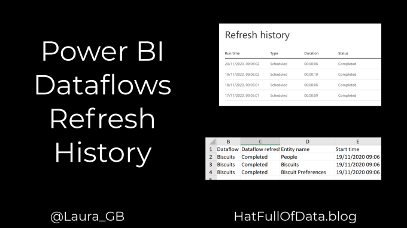
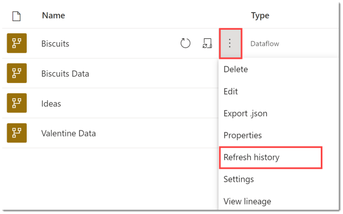
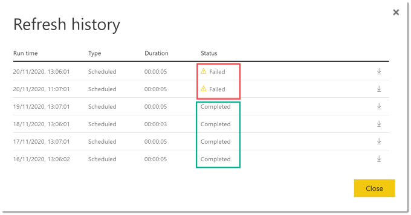
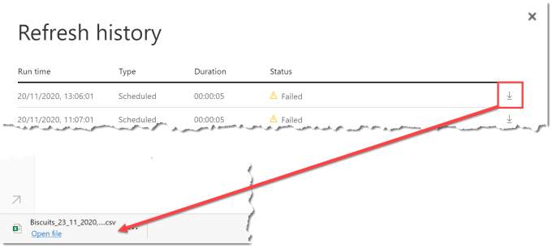
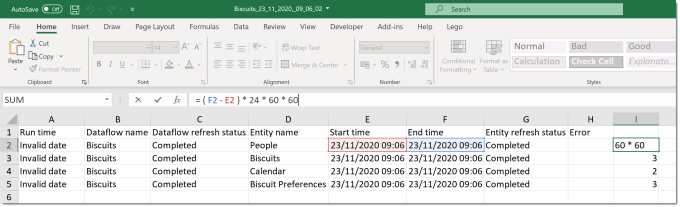
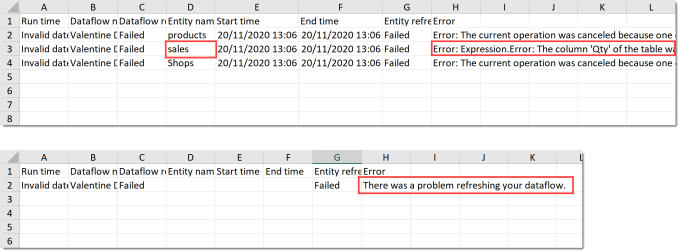

You can find out which entity took the longest to refresh or which entity caused the error in a failed refresh by looking at the refresh history of your dataflow in the Power BI workspace.

### Dataflow Series

This post is part of a series on dataflows.

- [Create a Dataflow](https://hatfullofdata.blog/power-bi-create-a-dataflow/)

- [Set up Dataflow Refresh](https://hatfullofdata.blog/power-bi-scheduled-refresh-dataflow/)

- [Endorsement](https://hatfullofdata.blog/power-bi-dataflows-endorsement-as-promoted-and-certified/)

- [Diagram View](https://hatfullofdata.blog/power-bi-dataflow-new-diagram-view/)

- [Refresh History](https://hatfullofdata.blog/power-bi-dataflow-refresh-history/)

- [Create Dataflow from Export JSON File](https://hatfullofdata.blog/power-bi-create-dataflow-from-export/)

- Incremental Refresh

### YouTube Version

### Refresh History List

In the workspace, click on the three dots next to the dataflow and from the menu select Refresh History. This will open a dialog that has a row for every refresh.

Every refresh will show when it happened, how long it took and if it completed or failed. In the above image we can see the last 2 refreshes failed but the 4 previous refreshes completed.

### Refresh History Files

The details of the refresh for each entity that loads from the dataflow can be found by downloading the csv file. You can download the csv file for a refresh by clicking on the down arrow on the right of each refresh row.

### Calculating the Refresh Time

Excel will happily open the CSV file. The first column might say Invalid Date this is due to the Power BI service trying to treat a dd/mm/yyyy formatted date as mm/dd/yyyy. I have reported the issue to Microsoft.

A simple calculation of (End Time – Start Time) will give you the duration in days so in this example I then multiplied it 24*60*60 to give seconds. Adjust the calculation to minutes or hours to fit your durations.

### Showing Errors

If you download the file of a failed refresh you will either get a single line why the whole refresh failed or details of which entity failed. there are occasions when the error is not clear, for example the second one shown.

In the first example the sales entity has failed due to a problem with the “Qty” column. This causes the other entities’ refreshes to be cancelled.

### Conclusion

The Refresh History is an important part of understanding how a dataflow is performing. Hopefully at some point there will be an API to fetch the history directly, last time I looked there wasn’t.

## More Power BI Posts

- [Conditional Formatting Update](https://hatfullofdata.blog/power-bi-conditional-formatting-update/)

- [Data Refresh Date](https://hatfullofdata.blog/power-bi-data-refresh-date/)

- [Using Inactive Relationships in a Measure](https://hatfullofdata.blog/power-bi-inactive-relationships-in-a-measure/)

- [DAX CrossFilter Function](https://hatfullofdata.blog/power-bi-dax-crossfilter-function/)

- [COALESCE Function to Remove Blanks](https://hatfullofdata.blog/power-bi-coalesce-function-to-remove-blanks/)

- [Personalize Visuals](https://hatfullofdata.blog/power-bi-personalize-visuals/)

- [Gradient Legends](https://hatfullofdata.blog/power-bi-gradient-legends/)

- [Endorse a Dataset as Promoted or Certified](https://hatfullofdata.blog/power-bi-endorse-a-dataset/)

- [Q&A Synonyms Update](https://hatfullofdata.blog/power-bi-qa-synonyms-update/)

- [Import Text Using Examples](https://hatfullofdata.blog/power-bi-import-text-using-examples/)

- [Paginated Report Resources](https://hatfullofdata.blog/paginated-report-resources/)

- [Refreshing Datasets Automatically with Power BI Dataflows](https://hatfullofdata.blog/refreshing-datasets-automatically-with-dataflow/)

- [Charticulator](https://hatfullofdata.blog/charticulator-simple-custom-chart/)

- [Dataverse Connector – July 2022 Update](https://hatfullofdata.blog/power-bi-dataverse-connector-july-2022-update/)

- [Dataverse Choice Columns](https://hatfullofdata.blog/power-bi-dataverse-choices-and-choice-column/)

- [Switch Dataverse Tenancy](https://hatfullofdata.blog/power-bi-switch-dataverse-tenancy/)

- [Connecting to Google Analytics](https://hatfullofdata.blog/power-bi-connecting-to-google-analytics/)

- [Take Over a Dataset](https://hatfullofdata.blog/power-bi-take-over-a-dataset/)

- [Export Data from Power BI Visuals](https://hatfullofdata.blog/export-data-from-power-bi-visuals/)

- [Embed a Paginated Report](https://hatfullofdata.blog/power-bi-embed-a-paginated-report/)

- [Using SQL on Dataverse for Power BI](https://hatfullofdata.blog/using-sql-on-dataverse-for-power-bi/)

- [Power Platform Solution and Power BI Series](https://hatfullofdata.blog/power-platform-solution-and-power-bi-part-1/)

- [Creating a Custom Smart Narrative](https://hatfullofdata.blog/power-bi-creating-a-custom-smart-narrative/)

- [Power Automate Button in a Power BI Report](https://hatfullofdata.blog/power-automate-button-in-a-power-bi-report/)

## Power BI Series

- [SVG in Power BI series](https://hatfullofdata.blog/svg-in-power-bi-part-1-svg-basics/)

- [Power BI and Project Online series](https://hatfullofdata.blog/power-bi-connecting-to-project-online/)

- [Slicers series](https://hatfullofdata.blog/power-bi-slicers-introduction/)

- [Dataflow series](https://hatfullofdata.blog/power-bi-create-a-dataflow/)

- [Power BI SVG series](https://hatfullofdata.blog/svg-in-power-bi-part-1-svg-basics/)

- [Power Automate and Power BI Rest API series](https://hatfullofdata.blog/power-automate-and-power-bi-rest-api/)

- [Power BI and DevOps series](https://hatfullofdata.blog/devops-data-into-power-bi/)

