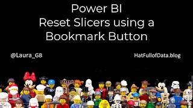
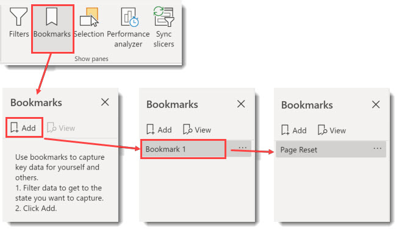
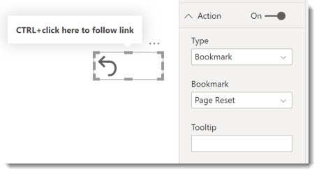
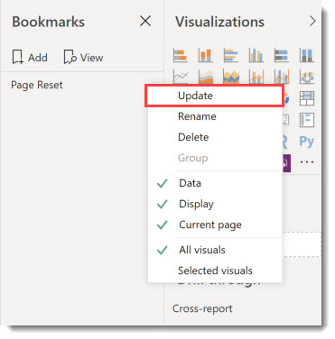

When your report has a bunch of slicers and charts that can also add filters to the page resetting back to no filters can be painful. So we need a quick way to reset slicers. This post walks through the steps of creating a bookmark and the using that bookmark to reset the page by clicking a button.



### Introduction

This post will walk through the stages to add a reset button to a report. It comes in 2 parts, firstly create a bookmark that removes filters and then to add button that applies the bookmark as its action.

### YouTube Version

### Create Bookmark

Bookmarks include the current status of slicers on the current page. So the first job is to clear all the slicers and make sure to selections on charts is filtering the data.

- From the View ribbon, select Bookmarks

- Click on the Add button and a bookmark will appear.

- Double click on the bookmark to rename it

The bookmark can be tested by selecting some options on the slicers and then clicking on the bookmark name and the slicer options should be cleared.

You can now close the Bookmarks pane.

### Adding Reset Button

A bookmark action can be added to a Button, Shape or Image. Select one from the Insert ribbon tab. In the format of the button / shape / image click the Action to be on, change the Type to be Bookmark anf the Bookmark to be the bookmark you created.

When viewing the report in Power BI desktop you need to hold the CTRL key when you click the button. In the Power BI Service, i.e. where your report is published you will not need the CTRL key.

You can add a message into the the Tooltip to assist your report consumers.

### Updating Bookmarks

When you add new slicers or reformat your slicers it is always a good idea to update your bookmarks. Open the bookmarks pane from the View ribbon tab. Click on the … next to the bookmark name and select Update.

### Conclusion to Reset Slicers

It is important that your report is easy to use. Adding a button so you are able to reset slicers is a good step towards that.

