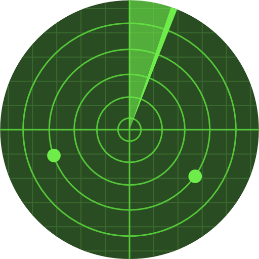

The buzz of being nominated for an MVP is great, adding the community activities you do with passion all working towards what is built up to being a huge a goal. Hopefully eventually you get the email we’ve all seen in social media to say you’ve been awarded an MVP. You put out the messages saying how humbled, honoured, happy and other words beginning to h and everyone celebrates with you, you get followed, connected to by people you’ve never heard of and you stick the blue badge everywhere. For me that happened 1st December 2019.

You’re now a member of a community of people who do some amazing things and work extremely hard to make the Microsoft user community what it is. Behind the scenes there is huge amount of work most people never see. Congratulations, life goal achieved.

Then I fell apart. The community is huge, everyone else seemed to know what they were doing and where they were going and I didn’t. Maybe I wasn’t really invited, maybe I shouldn’t be there atall. Maybe no-one wants me here.

Why didn’t I reach out to my friends in the community? Anxiety.Why didn’t I reach out to my amazing MVP  co-ordinator in the UK? Up to being awarded the MVP in my head she had been the judge I sure as heck wasn’t going to admit she might be wrong.Why did I just hide away? Anxiety

When a community is a busy vibrant community it is fantastic when you know where things are and you’ve found your seat… Until that point for the anxious amongst us, it is as scary as hell. Imagine a scared puppy at Oxford Circus in the pre-Christmas rush, that was me.

I was rescued, Claire my MVP co-ordinator was great when I admitted I was struggling. Various friends helped me out, then a community friend was my sanity and stopped me giving up. I was about to resign my MVP. Thankfully he got his MVP a few days ago, he totally gets the we rise by building up others. A smile, a simple “are you okay?”, stepping back to expand a circle wider to welcome people in, remembering someone’s name, saying hello, were simple actions that helped me. And I hope I do in return for others.

So why write this post? It is not my normal how-to post. I’m aware that I am not alone in struggling with the social side of community. I wanted to make sure people knew they weren’t alone if they felt anxious. More importantly I wanted to reach out to community members to have their radar up for the person who might be struggling. My anxiety is mild, it is real but most of the time few know it exists. I have no history to cause my anxiety, I’m employed, happy family, life is good. Anxiety is just part of my makeup.

My desire to be an MVP was to be a member of the community. What I’ve learnt is I was already a member and people around me wanted me there. No badges required. Okay I’ve learnt that logically, still a way to go to learn that emotionally. I’m not 100% “okay”, I doubt I ever will be, but this is who I am. My anxiety is part of the real me; if I was “fixed” would I be me?

