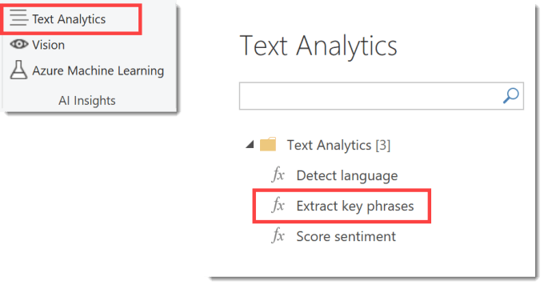
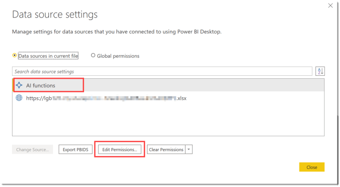
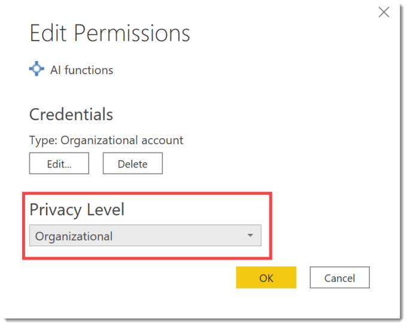

AI Insights in Power Query is a great Premium feature in Power BI. An AI Insights Error can occur if you are not fully aware of the settings you need to check. This foxed me for 2+ hours today. So I hope this post helps someone not waste the 2 hours like me.

From the Add Columns ribbon I selected Text Analytics and then in the Text Analytics I selected Extract key phrases, but this is true for any of the AI functions.

It thought for a while, and I assumed it was processing. And then it gave this error. I tried every combination of what I could do to get rid of the error.

The issue is when you do an AI function it creates a data source with a Public privacy level. So if your data that you are analysing has a different privacy level you get the error above.

### Fixing Privacy Levels

This issue has a really quick fix once you realise what it is caused by. On the home ribbon in Power Query, click on Data source setting. This opens the Data Source setting dialog box.

Click on each data source and click on Edit Permissions. Change the privacy level to be the same, I use Organizational usually.

When you have checked all your data sources you can click close in the Data Source Settings dialog and refresh your data to get rid of the error.

### Conclusion on AI Insights Errors

This is a classic case of when you know the cause it’s easy to fix. I hope it helped.

## More Power Query Posts

- [Custom Handwritten Function](https://hatfullofdata.blog/power-query-handwritten-function/)

- [Multi-step Function](https://hatfullofdata.blog/power-query-multi-step-function/)

- [Replace Values for Whole Table](https://hatfullofdata.blog/power-query-replace-values-for-whole-table/)

- [AI Insights Error](https://hatfullofdata.blog/power-query-ai-insights-error/)

- [VBA to Edit a Parameter Value](https://hatfullofdata.blog/excel-power-query-vba-to-edit-a-parameter-value/)

- [Dynamic Data Source and Web.Contents()](https://hatfullofdata.blog/power-query-dynamic-data-source-and-web-content/)

- [Get Previous Row Data](https://hatfullofdata.blog/power-query-get-previous-row-data/)

- [Creating New Parameters](https://hatfullofdata.blog/power-query-creating-new-parameters/)

- [Fixing Missing Columns Dynamically](https://hatfullofdata.blog/power-query-fixing-missing-columns-dynamically/)

- [Handling Null Values Properly](https://hatfullofdata.blog/power-query-handling-null-values/)

