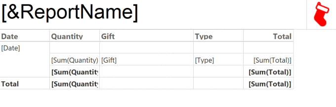

## Important Update!

On 14th Nov 2022 Microsoft announced that Paginated reports will no longer require premium capacity and can be created with a Power BI Pro license.

Here is a link to the article [https://powerbi.microsoft.com/en-us/blog/announcing-support-for-paginated-reports-in-power-bi-pro/](https://powerbi.microsoft.com/en-us/blog/announcing-support-for-paginated-reports-in-power-bi-pro/)

### Introduction

Here are resources to help you learn how to use Paginated reports. You will need a premium capacity or Premium per user license. If you have any extra resources or questions please reach out to me on Twitter [@Laura_GB](https://twitter.com/Laura_GB).

#### Install Report Builder

Install from the Microsoft Store if you can or download

[https://www.microsoft.com/en-us/download/details.aspx?id=58158](https://www.microsoft.com/en-us/download/details.aspx?id=58158)

#### 12 Days of Paginated Reports

[https://www.youtube.com/playlist?list=PLclDw3xU_tI5bypr74FnLuLGTyuTfKpV1](https://www.youtube.com/playlist?list=PLclDw3xU_tI5bypr74FnLuLGTyuTfKpV1)

#### Paginated Reports in a Day

[https://docs.microsoft.com/en-us/power-bi/learning-catalog/paginated-reports-online-course](https://docs.microsoft.com/en-us/power-bi/learning-catalog/paginated-reports-online-course)

#### Chris Finlan YouTube

[https://www.youtube.com/channel/UCLjMvjuVkfGYwChTlPLFT7A](https://www.youtube.com/channel/UCLjMvjuVkfGYwChTlPLFT7A)

#### Next Step BI

[https://www.nextstepbi.com/](https://www.nextstepbi.com/)

#### Paul Turley’s Paginated Recipe Book

[https://sqlserverbi.blog/paginated-report-recipes-2020-2021/](https://sqlserverbi.blog/paginated-report-recipes-2020-2021/)

#### Guy in a Cube Paginated Report Videos

[https://www.youtube.com/c/GuyinaCube/search?query=paginated%20reports](https://www.youtube.com/c/GuyinaCube/search?query=paginated%20reports)

#### Greyskull Analytics Videos

[https://www.youtube.com/playlist?list=PLxEdrLBTSSr4R0OqcE8l4ETgU_0ZHDjk7](https://www.youtube.com/playlist?list=PLxEdrLBTSSr4R0OqcE8l4ETgU_0ZHDjk7)

## More Power BI Posts

- [Conditional Formatting Update](https://hatfullofdata.blog/power-bi-conditional-formatting-update/)

- [Data Refresh Date](https://hatfullofdata.blog/power-bi-data-refresh-date/)

- [Using Inactive Relationships in a Measure](https://hatfullofdata.blog/power-bi-inactive-relationships-in-a-measure/)

- [DAX CrossFilter Function](https://hatfullofdata.blog/power-bi-dax-crossfilter-function/)

- [COALESCE Function to Remove Blanks](https://hatfullofdata.blog/power-bi-coalesce-function-to-remove-blanks/)

- [Personalize Visuals](https://hatfullofdata.blog/power-bi-personalize-visuals/)

- [Gradient Legends](https://hatfullofdata.blog/power-bi-gradient-legends/)

- [Endorse a Dataset as Promoted or Certified](https://hatfullofdata.blog/power-bi-endorse-a-dataset/)

- [Q&A Synonyms Update](https://hatfullofdata.blog/power-bi-qa-synonyms-update/)

- [Import Text Using Examples](https://hatfullofdata.blog/power-bi-import-text-using-examples/)

- [Paginated Report Resources](https://hatfullofdata.blog/paginated-report-resources/)

- [Refreshing Datasets Automatically with Power BI Dataflows](https://hatfullofdata.blog/refreshing-datasets-automatically-with-dataflow/)

- [Charticulator](https://hatfullofdata.blog/charticulator-simple-custom-chart/)

- [Dataverse Connector – July 2022 Update](https://hatfullofdata.blog/power-bi-dataverse-connector-july-2022-update/)

- [Dataverse Choice Columns](https://hatfullofdata.blog/power-bi-dataverse-choices-and-choice-column/)

- [Switch Dataverse Tenancy](https://hatfullofdata.blog/power-bi-switch-dataverse-tenancy/)

- [Connecting to Google Analytics](https://hatfullofdata.blog/power-bi-connecting-to-google-analytics/)

- [Take Over a Dataset](https://hatfullofdata.blog/power-bi-take-over-a-dataset/)

- [Export Data from Power BI Visuals](https://hatfullofdata.blog/export-data-from-power-bi-visuals/)

- [Embed a Paginated Report](https://hatfullofdata.blog/power-bi-embed-a-paginated-report/)

- [Using SQL on Dataverse for Power BI](https://hatfullofdata.blog/using-sql-on-dataverse-for-power-bi/)

- [Power Platform Solution and Power BI Series](https://hatfullofdata.blog/power-platform-solution-and-power-bi-part-1/)

- [Creating a Custom Smart Narrative](https://hatfullofdata.blog/power-bi-creating-a-custom-smart-narrative/)

- [Power Automate Button in a Power BI Report](https://hatfullofdata.blog/power-automate-button-in-a-power-bi-report/)

## Power BI Series

- [SVG in Power BI series](https://hatfullofdata.blog/svg-in-power-bi-part-1-svg-basics/)

- [Power BI and Project Online series](https://hatfullofdata.blog/power-bi-connecting-to-project-online/)

- [Slicers series](https://hatfullofdata.blog/power-bi-slicers-introduction/)

- [Dataflow series](https://hatfullofdata.blog/power-bi-create-a-dataflow/)

- [Power BI SVG series](https://hatfullofdata.blog/svg-in-power-bi-part-1-svg-basics/)

- [Power Automate and Power BI Rest API series](https://hatfullofdata.blog/power-automate-and-power-bi-rest-api/)

- [Power BI and DevOps series](https://hatfullofdata.blog/devops-data-into-power-bi/)

